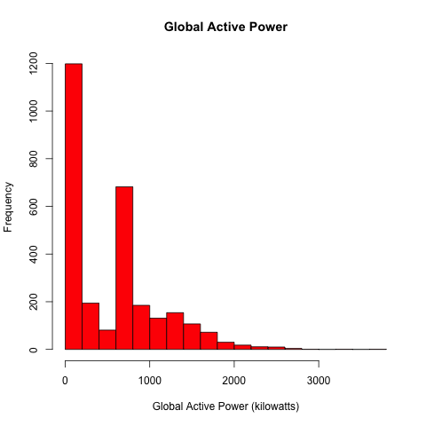
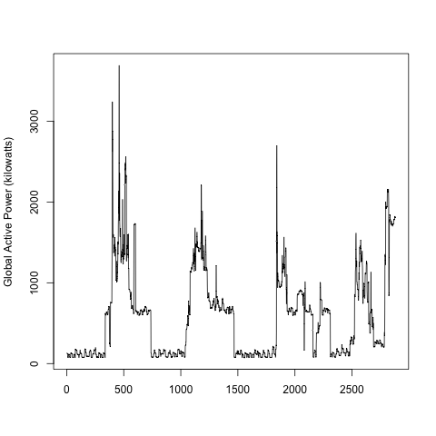
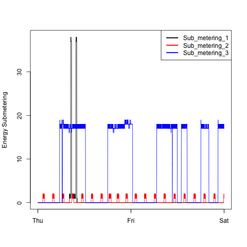
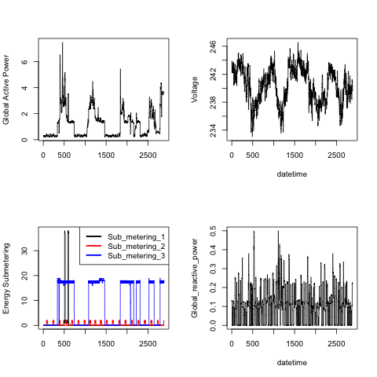

Exploratory Data Analysis Course Project 1
================

###### Johns Hopkins Data Science Specialization : Course 4 : Project 1

### Condensed R Script & Plot Output

Loading and unzipping the data file…

``` r
if(!file.exists("./Data")) {dir.create("./Data")}
url <- "https://d396qusza40orc.cloudfront.net/exdata%2Fdata%2Fhousehold_power_consumption.zip"
download.file(url, "./Data/EPData.zip", method = "curl")
unzip("./Data/EPData.zip", list = TRUE)
```

Reading in & cleaning the data next…

``` r
df <- read.table("./Data/household_power_consumption.txt", sep=";", header = TRUE, na.strings="?")
clean_df <- df[df$Date %in% c("1/2/2007","2/2/2007") ,]
clean_df$Date_time <- dmy_hms(apply(clean_df[,1:2], 1, paste, collapse=" "))
```

Now we’re able to create Plot \#1…

``` r
png("plot1.png", width = 480, height = 480)
hist(as.numeric(clean_df$Global_active_power), 
     col = "red",
     xlab = "Global Active Power (kilowatts)",
     main = "Global Active Power")
dev.off()
```



And onto Plot \#2…

``` r
png("plot2.png", width=480, height=480)
plot(as.numeric(clean_df$Global_active_power), 
     type="l", xlab="", 
     ylab="Global Active Power (kilowatts)")
dev.off()
```



And Plot \#3…

``` r
png("plot3.png", width=480, height=480)
with(clean_df, {plot(Sub_metering_1 ~ Date_time, 
                    type= "l", 
                    xlab= "", 
                    ylab= "Energy Submetering")
lines(Sub_metering_2 ~ Date_time, col = "red")
lines(Sub_metering_3 ~ Date_time, col = "blue")
})
legend("topright", c("Sub_metering_1", "Sub_metering_2", "Sub_metering_3"), 
       col = c("black", "red", "blue"), lty = 1, lwd = 2.5)
dev.off()
```



And finally Plot \#4…

``` r
png("plot4.png", width=480, height=480)
par(mfrow = c(2, 2)) 

with(clean_df, {plot(Global_active_power, 
                     type="l", xlab="", 
                     ylab="Global Active Power", 
                     cex=0.2)

plot(Voltage, type="l", xlab="datetime", ylab="Voltage")

plot(Sub_metering_1, type="l", ylab="Energy Submetering", xlab="")
lines(Sub_metering_2, type="l", col="red")
lines(Sub_metering_3, type="l", col="blue")
legend("topright", c("Sub_metering_1", "Sub_metering_2", "Sub_metering_3"), 
       lty=, lwd=2.5, col=c("black", "red", "blue"), bty="o")

plot(Global_reactive_power, type="l", xlab="datetime", ylab="Global_reactive_power")
})
dev.off()
```



Project complete\!
