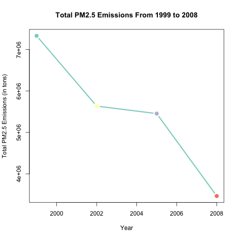
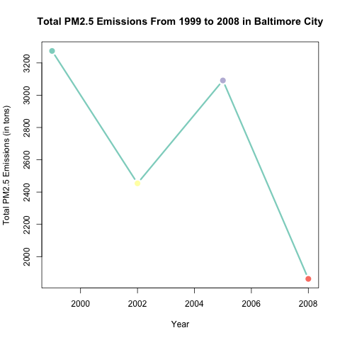
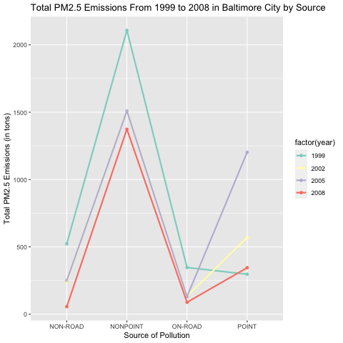
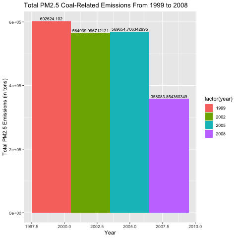
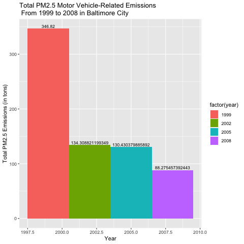
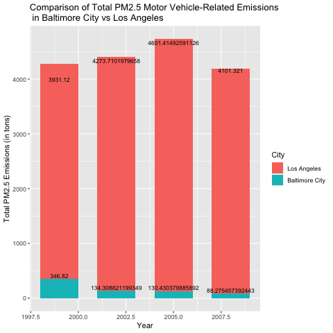

Exploratory Data Analysis Project 2
================

###### Johns Hopkins Data Science Specialization : Course 4 : Week 4 : Project 2

## Condensed R Script & Plot Outputs

Before attempting to answer the project questions as specified in the
assignment instructions, let’s do some initial setup. First, load the
necessary libraries…

``` r
library(dplyr)
library(RColorBrewer)
library(ggplot2)
```

Next, load and unzip the file also provided in the assignment
instructions…

``` r
if(!file.exists("./Data")) {dir.create("./Data")}
url <- "https://d396qusza40orc.cloudfront.net/exdata%2Fdata%2FNEI_data.zip"
download.file(url, "./Data/FPMData.zip", method = "curl")
unzip("./Data/FPMData.zip", list = TRUE)
```

Then read in the rds files…

``` r
##PM2.5 Emissions Data
NEI <- readRDS("./Data/FPMData/summarySCC_PM25.rds")
##Source Classification Code Table
SCC <- readRDS("./Data/FPMData/Source_Classification_Code.rds")
```

Now we’re ready to take a look at the project questions\!

#### Question 1:

*Have total emissions from PM2.5 decreased in the United States from
1999 to 2008? Using the base plotting system, make a plot showing the
total PM2.5 emission from all sources for each of the years 1999, 2002,
2005, and 2008.*

Subsetting the data and then plotting a line graph with the results…

``` r
#subsetting data
pmtotal <- NEI %>% select(year, Emissions) %>%
    group_by(year) %>%
    summarise(Total = sum(Emissions))

#plotting total emissions by year
png(filename = "plot1.png")
with(pmtotal, plot(year, Total,
     type = "b",
     main = "Total PM2.5 Emissions From 1999 to 2008",
     xlab = "Year",
     ylab = "Total PM2.5 Emissions (in tons)",
     col = brewer.pal(5, "Set3"),
     cex = 1.5,
     pch = 16,
     lwd = 3))
dev.off()
```



By looking at the above plot, we can tell that total emissions rates
have indeed steadily decreased across the years\!

#### Question 2:

*Have total emissions from PM2.5 decreased in the Baltimore City,
Maryland (fips == “24510”) from 1999 to 2008? Use the base plotting
system to make a plot answering this question.*

Subsetting the data and plotting the results…

``` r
#subsetting data
pmmaryland <- NEI %>% filter(fips == "24510") %>%
    select(year, Emissions) %>%
    group_by(year) %>%
    summarise(Total = sum(Emissions))

#plotting total emissions by year in Baltimore City
png(filename = "plot2.png")
with(pmmaryland, plot(year, Total,
                   type = "b",
                   main = "Total PM2.5 Emissions From 1999 to 2008 in Baltimore City",
                   xlab = "Year",
                   ylab = "Total PM2.5 Emissions (in tons)",
                   col = brewer.pal(5, "Set3"),
                   cex = 1.5,
                   pch = 16,
                   lwd = 3))
dev.off()
```



Although there’s an increase in emissions from 2002 to 2005, there is an
overall decrease in emissions from 1999 to 2008 in Baltimore City\!

#### Question 3:

*Of the four types of sources indicated by the type(point, nonpoint,
onroad, nonroad) variable, which of these four sources have seen
decreases in emissions from 1999–2008 for Baltimore City? Which have
seen increases in emissions from 1999–2008? Use the ggplot2 plotting
system to make a plot answer this question.*

Subsetting the data and plotting the results…

``` r
#subsetting data
pmtype <- NEI %>% filter(fips == "24510") %>%
    select(year, Emissions, type) %>%
    group_by(year, type) %>%
    summarise(Total = sum(Emissions))

#plotting total emissions by year in Baltimore City by pollutant source type
png(filename = "plot3.png")
plot <- ggplot(pmtype, aes(type, Total, group= year, color = factor(year)))
plot + geom_point(alpha = 3) +
    geom_line(size = 1) +
    labs(title = "Total PM2.5 Emissions From 1999 to 2008 in Baltimore City by Source") +
    labs(x = "Source of Pollution") +
    labs(y = "Total PM2.5 Emissions (in tons)") +
    scale_color_brewer(palette = "Set3")
dev.off()
```



There is an overall decrease in total emissions across all pollutant
sources from 1999 to 2008 in Baltimore, Maryland, except for the “point”
pollutant source, which had a lower total emission load in 1999 than all
the following years\!

#### Question 4:

*Across the United States, how have emissions from coal
combustion-related sources changed from 1999–2008?*

Subsetting the data and plotting the results…

``` r
#subsetting data
merged_df <- merge(NEI, SCC, by="SCC")
coal  <- grepl("coal", merged_df$Short.Name, ignore.case=TRUE)
clean_df <- merged_df[coal, ]

pmcoal <- clean_df %>% select(year, Emissions) %>%
    group_by(year) %>%
    summarise(Total = sum(Emissions))

#plotting total emissions from coal-related pollutant by year
png(filename = "plot4.png")
plot4 <- ggplot(pmcoal, aes(year, Total, fill = factor(year)))
plot4 + geom_bar(width = 3, stat="identity") +
    geom_text(aes(label = Total), vjust=-0.3, size=3) +
    labs(title = "Total PM2.5 Coal-Related Emissions From 1999 to 2008") +
    labs(x = "Year") +
    labs(y = "Total PM2.5 Emissions (in tons)") +
    scale_color_brewer(palette = "Set3")
dev.off()
```



Following the barplot displayed above, coal-related emissions have had
an overall decrease in total load from 1999 to 2008\!

#### Question 5:

*How have emissions from motor vehicle sources changed from 1999–2008 in
Baltimore City?*

Subsetting the data and plotting the results…

``` r
#subsetting data
pmcars <- NEI %>% filter(fips=="24510" & type=="ON-ROAD") %>%
    select(year, Emissions) %>%
    group_by(year) %>%
    summarise(Total = sum(Emissions))

#plotting total emissions from motor vehicle-related pollutant by year in Baltimore City
png(filename = "plot5.png")
plot5 <- ggplot(pmcars, aes(year, Total, fill = factor(year)))
plot5 + geom_bar(width = 3, stat="identity") +
    geom_text(aes(label = Total), vjust=-0.3, size=3) +
    labs(title = "Total PM2.5 Motor Vehicle-Related Emissions \n From 1999 to 2008 in Baltimore City") +
    labs(x = "Year") +
    labs(y = "Total PM2.5 Emissions (in tons)") +
    scale_color_brewer(palette = "Set3")
dev.off()
```



Following the barplot displayed above, motor vehicle-related emissions
have had a significant decrease in total load from 1999 to 2008\!

#### Question 6:

*Compare emissions from motor vehicle sources in Baltimore City with
emissions from motor vehicle sources in Los Angeles County, California
(fips == “06037”). Which city has seen greater changes over time in
motor vehicle emissions?*

Subsetting the data and plotting the results…

``` r
#subsetting data
pmcomp <- NEI %>% filter((fips=="24510" | fips=="06037") & type=="ON-ROAD") %>%
    select(year, fips, Emissions) %>%
    group_by(fips, year) %>%
    summarise(Total = sum(Emissions))

#plotting total emissions from motor vehicle-related pollutant by year in Baltimore City
png(filename = "plot6.png")
plot6 <- ggplot(pmcomp, aes(year, Total, group=fips, fill = factor(fips)))
plot6 + geom_bar(width = 2, stat="identity") +
    geom_text(aes(label = Total), vjust=-0.3, size=3) +
    scale_fill_discrete(name ="City", labels = c("Los Angeles", "Baltimore City")) +
    labs(title = "Comparison of Total PM2.5 Motor Vehicle-Related Emissions \n in Baltimore City vs Los Angeles") +
    labs(x = "Year") +
    labs(y = "Total PM2.5 Emissions (in tons)") +
    scale_color_brewer(palette = "Set3")
dev.off()
```



Following the barplot displayed above, motor vehicle-related pollutants
have been significantly higher in total emissions across 1999 to 2008 in
Los Angeles compared to Baltimore City\!
