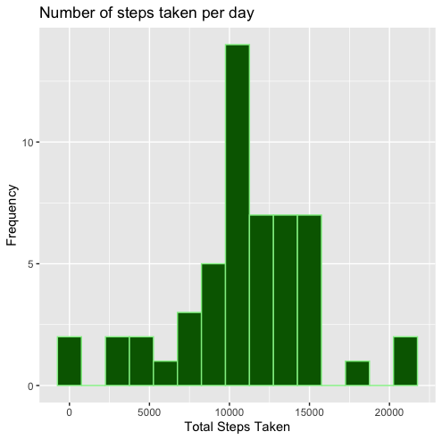
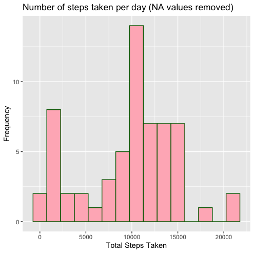
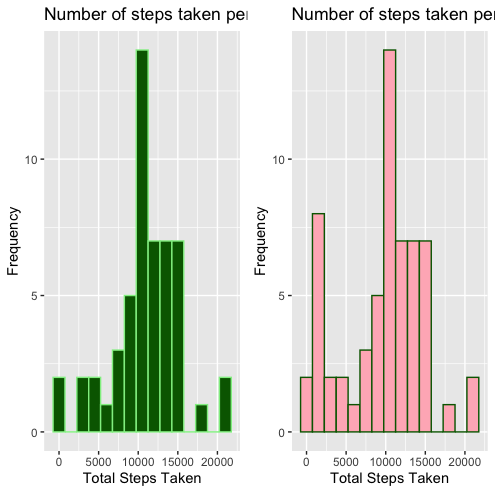
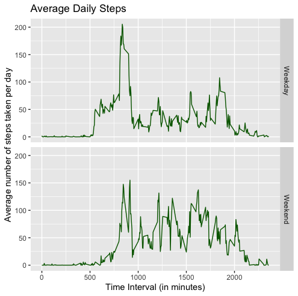

Reproducible Research Project 1
================

##### Johns Hopkins Data Science Specialization : Course 5 : Week 2 : Project 1

## Introduction

This assignment makes use of data from a personal activity monitoring
device, the specifics of which can be found in the project’s README
file. The aim of the project is create reproducible research through use
of publicly available and interpretable analytic code, analytic data,
well-documented analysis steps via markdown file, and the standard means
of the sample distribution. Specifically, we will look at the steps
taken by an individual over the course of 2 months in 5 minute
intervals, the exact analyses of which are as follows:

## Loading and preprocessing the data

First off, we’ll load the ‘tidyverse’ & ‘gridExtra’ packages to make
sure we have all the functionality we’ll need for this particular
project.

    ## ── Attaching packages ─────────────────────────────────────────────────────────────────────── tidyverse 1.3.0 ──

    ## ✓ ggplot2 3.3.0     ✓ purrr   0.3.4
    ## ✓ tibble  3.0.1     ✓ dplyr   0.8.5
    ## ✓ tidyr   1.0.3     ✓ stringr 1.4.0
    ## ✓ readr   1.3.1     ✓ forcats 0.5.0

    ## ── Conflicts ────────────────────────────────────────────────────────────────────────── tidyverse_conflicts() ──
    ## x dplyr::filter() masks stats::filter()
    ## x dplyr::lag()    masks stats::lag()

    ## 
    ## Attaching package: 'lubridate'

    ## The following objects are masked from 'package:dplyr':
    ## 
    ##     intersect, setdiff, union

    ## The following objects are masked from 'package:base':
    ## 
    ##     date, intersect, setdiff, union

    ## 
    ## Attaching package: 'gridExtra'

    ## The following object is masked from 'package:dplyr':
    ## 
    ##     combine

Next, we’ll load the data from the forked repository (found
[HERE]('http://github.com/rdpeng/RepData_PeerAssessment1'). See README
for more details regarding the data) into our local environment.

``` r
zip <- unzip('activity.zip')
df <- read.csv('activity.csv')
head(df) #checking if data has been correctly loaded
```

    ##   steps       date interval
    ## 1    NA 2012-10-01        0
    ## 2    NA 2012-10-01        5
    ## 3    NA 2012-10-01       10
    ## 4    NA 2012-10-01       15
    ## 5    NA 2012-10-01       20
    ## 6    NA 2012-10-01       25

This particular dataset doesn’t require a lot of preprocessing but we’ll
go ahead and convert the ‘date’ variable to the ‘Date’ class so we’ll be
able to use it later on.

``` r
df$date <- ymd(df$date)
```

## What is the mean total number of steps taken per day?

To be able to compute this analysis, we first have to group our data
according to date and, once grouped into its respective days, find the
total sum of steps taken each day. To do so, we’ll take advantage of
dplyr piping in the tidyverse package.

``` r
avsteps <- df %>% group_by(date) %>%
    summarise(total_steps = sum(steps))
```

Next, we’ll visually display the resulting steps data in a histogram via
the ggplot2 package also found in the tidyverse package.

``` r
hist <- ggplot(avsteps, aes(x = total_steps))+
    geom_histogram(binwidth = 1500, color="lightgreen", fill="darkgreen") +
    labs(title = "Number of steps taken per day",
         y = "Frequency", x = "Total Steps Taken")
hist
```



For the final step in this analysis, we want to explicitly print the
mean and median number of steps taken per day using the data previously
grouped by day & graphed above. To do so, simply use the mean() &
median() function.

``` r
meansteps = mean(avsteps$total_steps, na.rm = TRUE)
mediansteps = median(avsteps$total_steps, na.rm = TRUE)

message('Mean total number of steps taken per day: ', round(meansteps, 2))
```

    ## Mean total number of steps taken per day: 10766.19

``` r
message('Median total number of steps taken per day: ', round(mediansteps, 2))
```

    ## Median total number of steps taken per day: 10765

## What is the average daily activity pattern?

Next, we’re going to take a look at the average number of steps taken
per 5-minute interval across all provided days. First, aggregate the
step data according to interval, then take the average value of each

``` r
series <- aggregate(steps ~ interval, df, mean)
head(series)
```

    ##   interval     steps
    ## 1        0 1.7169811
    ## 2        5 0.3396226
    ## 3       10 0.1320755
    ## 4       15 0.1509434
    ## 5       20 0.0754717
    ## 6       25 2.0943396

To visualize the activity pattern across each day, create a time series
plot via ggplot2 with each interval on the x-axis & the average number
of steps on the y-axis.

``` r
plot1 <- ggplot(series) 
plot1 + geom_line(aes(x=interval, y=steps), color = "darkgreen") +
    labs(x = "Time Interval (in minutes)", 
         y = "Average number of steps taken per day", 
         title = "Average Daily Steps")
```


We’re also curious about which of the 5-minute intervals contains the
maximum number of steps on average across all of the days. We’ll use the
data aggregated above to do so via indexing.

``` r
series[series$steps == max(series$steps),]
```

    ##     interval    steps
    ## 104      835 206.1698

## Imputing missing values

We’ve previously been using the data without removing any missing values
(indicated by ‘NA’ in the dataset). Let’s do so now to see how it
affects our previous mean and median step calculations. First, let’s
double check and see how many NA values are in the dataset.

``` r
sum(is.na(df))
```

    ## [1] 2304

That’s quite a few and they all seem to be in the ‘steps’ column. We’ll
replace each NA with the median value of steps per 5-minute interval.
The steps cover a pretty far range in a non-normal distribution, thus we
will pick the median over the mean (median values tend to be less
influenced by outliers) and trim the outer 10% of the data to get a more
representative missing value replacement value that is less likely to
further skew the data when added in.

``` r
#Calculating the median value of steps per 5 minute interval
newsteps <- df %>% group_by(interval) %>% 
    summarise(steps = median(steps, na.rm = TRUE, trim = 0.05)) 
newsteps <- as.data.frame(newsteps)

#Replacing all NA's with calculated median values
cleandf <- full_join(df, newsteps, by = "interval") %>% 
    mutate(steps = ifelse(is.na(steps.x), steps.y, steps.x)) %>% 
    select(date, interval, steps)

#checking cleaned dataframe
sum(is.na(cleandf))
```

    ## [1] 0

Great\! As you can see, all of the NA values have now been replaced.
Let’s check to see if this has any affect on our previous mean &
median calculations. First, we’ll visualize the average number of steps
taken per day just as before but now use our clean dataframe as the
input.

``` r
#grouping the data according to date & finding the sum of steps per day 
avsteps2 <- cleandf %>% group_by(date) %>%
    summarise(total_steps = sum(steps))

#plotting a histogram of the calculated steps per day
hist2 <- ggplot(avsteps2, aes(x = total_steps))+
    geom_histogram(binwidth = 1500, color="darkgreen", fill="lightpink") +
    labs(title = "Number of steps taken per day (NA values removed)",
         y = "Frequency", x = "Total Steps Taken")
hist2
```



It doesn’t look like the distribution has changed much but let’s compare
the plots side-by-side just to be sure.

``` r
grid.arrange(hist, hist2, ncol=2)
```



Awesome, the histograms look nearly identical. Let’s calculate the mean
and median steps per day with the cleaned data and compare to our
previous calculations with the NA’s still included to double check.

``` r
meansteps2 = mean(avsteps2$total_steps, na.rm = TRUE)
mediansteps2 = median(avsteps2$total_steps, na.rm = TRUE)

message('Mean total number of steps taken per day: ', round(meansteps2, 2))
```

    ## Mean total number of steps taken per day: 9503.87

``` r
message('Median total number of steps taken per day: ', round(mediansteps2, 2))
```

    ## Median total number of steps taken per day: 10395

``` r
#creating a table to directly compare values 
values <- matrix(c(meansteps, mediansteps, mediansteps, mediansteps2), ncol = 2, byrow = T)
colnames(values) <- c("Mean of Steps Taken", "Median of Steps Taken")
rownames(values) <- c("Dataset with NA values", "Dataset without NA values")
values <- as.table(values)
values
```

    ##                           Mean of Steps Taken Median of Steps Taken
    ## Dataset with NA values               10766.19              10765.00
    ## Dataset without NA values            10765.00              10395.00

The replacement of the NA values with the median interval values indeed
has not changed the distribution much\!

## Are there differences in activity patterns between weekdays and weekends?

Lastly, let’s take a look at the patterns according to weekdays and
weekends. To do so, we’ll first create a new variable in our cleaned
dataframe called ‘daycategories’ that groups each date into either
‘Weekend’ or ‘Weekday’ according to what day of the week the
measurements were taken on.

``` r
#using weekdays() to change year-month-date into weekdays
cleandf$days <- weekdays(cleandf$date)

#using new 'days' variable to create a factored variable according to weekend or weekday categorization
cleandf$daycategories <- ifelse(cleandf$days %in% c('Saturday', 'Sunday'), 'Weekend', 'Weekday')
cleandf$daycategories <- factor(cleandf$daycategories)
```

Next, we’ll group our data according to interval and day category
(weekend or weekday) to find the average number of steps taken during
each.

``` r
series2 <- cleandf %>% group_by(interval, daycategories) %>%
    summarise(average_steps = mean(steps))
```

Finally, to visually compare the activity patterns of weekdays and
weekends, we’ll create another time series plot using a ggplot2 panel.

``` r
plot2 <- ggplot(series2) 
plot2 + geom_line(aes(x=interval, y=average_steps), color = "darkgreen") +
    facet_grid(daycategories ~ .) +
    labs(x = "Time Interval (in minutes)", 
         y = "Average number of steps taken per day", 
         title = "Average Daily Steps")
```



And we’ve reached the end of the project\! Well done\!
