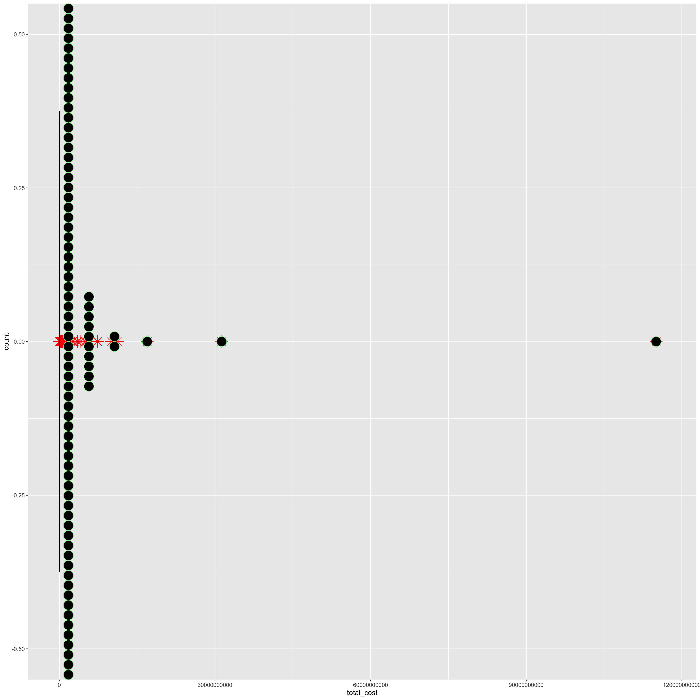
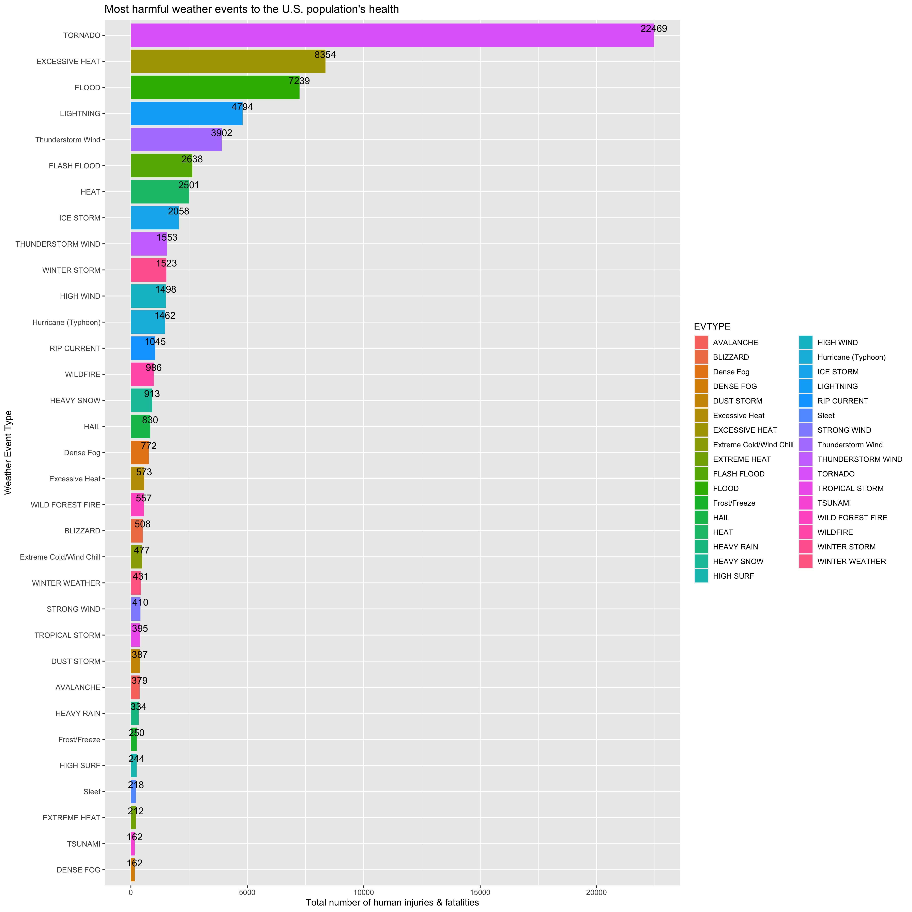
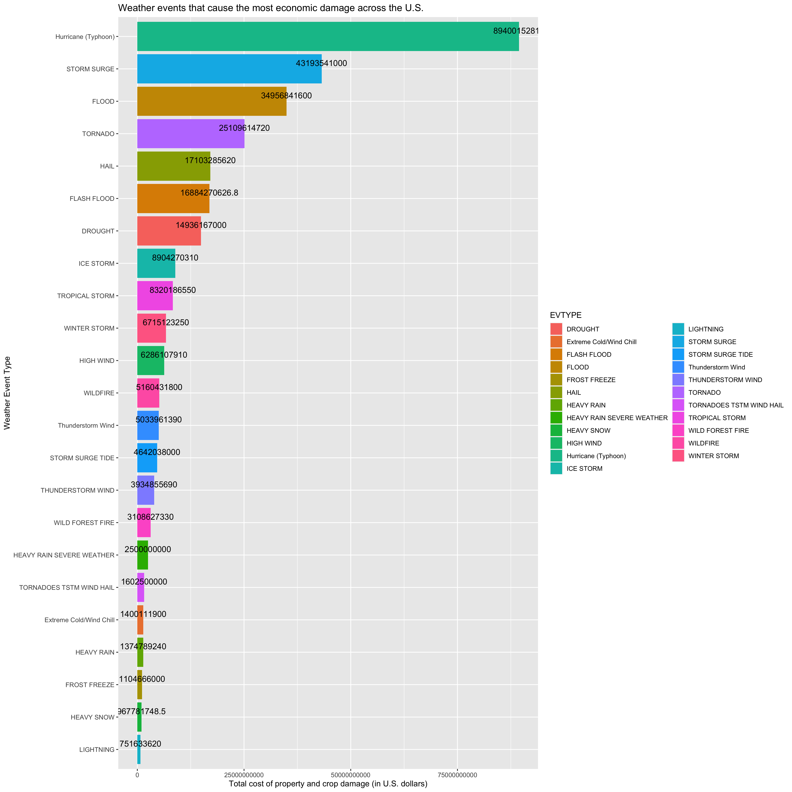

Determining Severe Weather Patterns in the U.S.
================

## Synopsis

These analyses explore the overarching questions: 1) which storm and
severe weather types are most harmful to population health in the U.S.?
and 2) which types of storm and severe weather types have the greatest
economic consequences across the U.S.? Through use of the U.S. National
Oceanic and Atmospheric Administration’s storm database, storm and
severe weather patterns across the U.S. are evaluated and measured
against sums of population injuries, fatalities and economic costs.
Although no specific recommendations are made in the given report,
findings may be helpful in preparation for future resource
prioritization during impending weather events.

``` r
sessionInfo()
```

    ## R version 3.6.2 (2019-12-12)
    ## Platform: x86_64-apple-darwin15.6.0 (64-bit)
    ## Running under: macOS Mojave 10.14.6
    ## 
    ## Matrix products: default
    ## BLAS:   /Library/Frameworks/R.framework/Versions/3.6/Resources/lib/libRblas.0.dylib
    ## LAPACK: /Library/Frameworks/R.framework/Versions/3.6/Resources/lib/libRlapack.dylib
    ## 
    ## locale:
    ## [1] en_US.UTF-8/en_US.UTF-8/en_US.UTF-8/C/en_US.UTF-8/en_US.UTF-8
    ## 
    ## attached base packages:
    ## [1] stats     graphics  grDevices utils     datasets  methods   base     
    ## 
    ## other attached packages:
    ##  [1] naniar_0.5.1    forcats_0.5.0   stringr_1.4.0   dplyr_0.8.5    
    ##  [5] purrr_0.3.4     readr_1.3.1     tidyr_1.0.3     tibble_3.0.1   
    ##  [9] ggplot2_3.3.0   tidyverse_1.3.0
    ## 
    ## loaded via a namespace (and not attached):
    ##  [1] tidyselect_1.1.0 xfun_0.13        haven_2.2.0      lattice_0.20-38 
    ##  [5] colorspace_1.4-1 vctrs_0.3.0      generics_0.0.2   htmltools_0.4.0 
    ##  [9] yaml_2.2.1       rlang_0.4.6      pillar_1.4.4     glue_1.3.1      
    ## [13] withr_2.1.2      DBI_1.1.0        dbplyr_1.4.3     modelr_0.1.8    
    ## [17] readxl_1.3.1     lifecycle_0.2.0  munsell_0.5.0    gtable_0.3.0    
    ## [21] cellranger_1.1.0 rvest_0.3.5      evaluate_0.14    knitr_1.28      
    ## [25] fansi_0.4.1      broom_0.5.6      Rcpp_1.0.4.6     scales_1.1.1    
    ## [29] backports_1.1.5  jsonlite_1.6.1   fs_1.4.1         hms_0.5.3       
    ## [33] digest_0.6.25    stringi_1.4.6    visdat_0.5.3     grid_3.6.2      
    ## [37] cli_2.0.1        tools_3.6.2      magrittr_1.5     crayon_1.3.4    
    ## [41] pkgconfig_2.0.3  ellipsis_0.3.0   xml2_1.3.2       reprex_0.3.0    
    ## [45] lubridate_1.7.8  assertthat_0.2.1 rmarkdown_2.1    httr_1.4.1      
    ## [49] rstudioapi_0.11  R6_2.4.1         nlme_3.1-142     compiler_3.6.2

## Loading and Processing the Raw Data

To begin, we’ll obtain the data on storms and severe weather in the U.S.
from 1950 to November 2011 from the U.S. National Oceanic and
Atmospheric Administration’s (NOAA) storm database in the form of a csv
file compressed via the bzip2 algorithm on the course web site (found
[HERE](https://d396qusza40orc.cloudfront.net/repdata%2Fdata%2FStormData.csv.bz2)).
This database tracks characteristics of major storms and weather events
in the United States, including when and where they occur, as well as
estimates of any fatalities, injuries, and property damage. More
documentation on the database and variables used can be found at in the
[National Weather Service Storm Data
Documentation](https://d396qusza40orc.cloudfront.net/repdata%2Fpeer2_doc%2Fpd01016005curr.pdf)
and the [National Climatic Data Center Storm Events
FAQ](https://d396qusza40orc.cloudfront.net/repdata%2Fpeer2_doc%2FNCDC%20Storm%20Events-FAQ%20Page.pdf).

#### Data Loading

First, we’ll read in the storm and weather data from the raw csv
included in the bzip2 zip file into our local environment. As a csv,
data is delimited with the ‘,’ character. Missing values (identified by
a blank value or ‘NA’ in the original dataset) are all coded as ‘NA’.

``` r
URL <- "https://d396qusza40orc.cloudfront.net/repdata%2Fdata%2FStormData.csv.bz2"
path <- paste0(getwd(), "/StormData.csv.bz2")
#csv <- gsub(pattern = ".bz2", replacement = "", x = path)

if (!file.exists(path)) {
    download.file(url = URL, destfile = path)
    df <- read.csv(path, na.strings = c('', ' ', 'NA'))
}
```

After establishing the local environment path and loading the csv, let’s
take an initial look at the data to determine the dimensions and general
characteristics of the data.

``` r
dim(df)
```

    ## [1] 902297     37

``` r
head(df[ , 1:15])
```

    ##   STATE__           BGN_DATE BGN_TIME TIME_ZONE COUNTY COUNTYNAME STATE  EVTYPE
    ## 1       1  4/18/1950 0:00:00     0130       CST     97     MOBILE    AL TORNADO
    ## 2       1  4/18/1950 0:00:00     0145       CST      3    BALDWIN    AL TORNADO
    ## 3       1  2/20/1951 0:00:00     1600       CST     57    FAYETTE    AL TORNADO
    ## 4       1   6/8/1951 0:00:00     0900       CST     89    MADISON    AL TORNADO
    ## 5       1 11/15/1951 0:00:00     1500       CST     43    CULLMAN    AL TORNADO
    ## 6       1 11/15/1951 0:00:00     2000       CST     77 LAUDERDALE    AL TORNADO
    ##   BGN_RANGE BGN_AZI BGN_LOCATI END_DATE END_TIME COUNTY_END COUNTYENDN
    ## 1         0    <NA>       <NA>     <NA>     <NA>          0         NA
    ## 2         0    <NA>       <NA>     <NA>     <NA>          0         NA
    ## 3         0    <NA>       <NA>     <NA>     <NA>          0         NA
    ## 4         0    <NA>       <NA>     <NA>     <NA>          0         NA
    ## 5         0    <NA>       <NA>     <NA>     <NA>          0         NA
    ## 6         0    <NA>       <NA>     <NA>     <NA>          0         NA

#### Data Processing

Out of the 37 variables in the dataset, only ten (STATE, BGN\_DATE,
END\_DATE, EVTYPE, FATALITIES, INJURIES, PROPDMG, PROPDMGEXP, CROPDMG, &
CROPDMGEXP) were relevant for the following analyses and so we’ll subset
the original dataframe accordingly.

Additionally, as indicated by the code book, NOAA only recorded three
types of severe weather events compared to the 47 it now records. This
will cause the three types of weather (Tornado, Thunderstorm Wind and
Hail) recorded prior to 1993 to be tallied a disproportionate amount
during our analyses. Therefore, to avoid this misrepresentation of event
totals, we’ll reformat the dates to include only the year and filter out
any data prior to 1993.

``` r
df <- df %>% mutate(BGN_DATE = format(as.Date(BGN_DATE, format="%m/%d/%Y %H:%M:%S"),"%Y"), 
                          END_DATE = format(as.Date(END_DATE, format="%m/%d/%Y %H:%M:%S"),"%Y")) %>%
    filter(BGN_DATE >= 1993, END_DATE >= 1993)
```

Now let’s take a look at the missing values (set to ‘NA’ in the dataset.

``` r
colSums(is.na(df))
```

    ##      STATE   BGN_DATE   END_DATE     EVTYPE FATALITIES   INJURIES    PROPDMG 
    ##          0          0          0          0          0          0          0 
    ## PROPDMGEXP    CROPDMG CROPDMGEXP 
    ##     279352          0     377977

The only missing values are in the ‘PROPDMGEXP’ and ‘CROPDMGEXP’
columns, which assign an abbreviated metric of an exponential dollar
amount (ie ‘m’ indicates million, ‘k’ indicates thousand, etc.) to the
numeric dollar amount in the corresponding ‘PROPDMG’ or ‘CROPDMG’ cell.
Let’s check out what’s going on here.

``` r
df_na <- df[is.na(df$PROPDMGEXP) & is.na(df$CROPDMGEXP),]
head(df_na, 10)
```

    ##    STATE BGN_DATE END_DATE                EVTYPE FATALITIES INJURIES PROPDMG
    ## 1     AL     1995     1995                  SNOW          0        0       0
    ## 2     AL     1994     1994 ICE STORM/FLASH FLOOD          0        2       0
    ## 3     AL     1995     1995              SNOW/ICE          0        0       0
    ## 5     AL     1995     1995              SNOW/ICE          0        0       0
    ## 13    AL     1994     1994                  HAIL          0        0       0
    ## 14    AL     1994     1994          FUNNEL CLOUD          0        0       0
    ## 16    AL     1995     1995                  HAIL          0        0       0
    ## 21    AL     1995     1995            HEAVY RAIN          0        4       0
    ## 24    AL     1995     1995                  HAIL          0        0       0
    ## 31    AL     1994     1994                  HAIL          0        0       0
    ##    PROPDMGEXP CROPDMG CROPDMGEXP
    ## 1        <NA>       0       <NA>
    ## 2        <NA>       0       <NA>
    ## 3        <NA>       0       <NA>
    ## 5        <NA>       0       <NA>
    ## 13       <NA>       0       <NA>
    ## 14       <NA>       0       <NA>
    ## 16       <NA>       0       <NA>
    ## 21       <NA>       0       <NA>
    ## 24       <NA>       0       <NA>
    ## 31       <NA>       0       <NA>

It looks like NA’s only occur in the ‘PROPDMGEXP’ and ‘CROPDMGEXP’
columns when there was no monetary damage. Let’s keep this in mind as we
move forward with our data cleaning as these monetary damage-related
columns (PROPDMG & PROPDMGEXP and CROPDMG & CROPDMGEXP) need some more
work before we can use them in our analyses that look at the economic
consequences of each weather event type.

We want the monetary values in the the ‘PROPDMG’ & ‘CROPDMG’ columns to
accurately represent their full dollar amount rather than coefficients
as they are now. To remedy this, we’ll need to merge them with their
respective ‘PROPDMGEXP’ and ‘CROPDMGEXP’ column data in a numerical
format. First, we’ll make the ‘PROPDMGEXP’ and ‘CROPDMGEXP’ metric
labels uniform by making each upper case and removing non-alphanumeric
characters.

``` r
#first make 'PROPDMGEXP' and 'CROPDMGEXP' metric labels uniform
df$PROPDMGEXP <- toupper(df$PROPDMGEXP)
df$CROPDMGEXP <- toupper(df$CROPDMGEXP)

df <- df %>% replace_with_na(replace = list(PROPDMGEXP = c('+', '-', '.', '?'))) %>%
    replace_with_na(replace = list(CROPDMGEXP = c('+', '-', '.', '?')))
```

Now, keep in mind that each label indicates how much the values in the
‘PROPDMG’ & ‘CROPDMG’ columns should be multiplied by and that the
‘NA’ specifications indicate a zero dollar amount of damage. Because
of this, we can substitute any value for ‘NA’ when multiplying the two
columns together (any number times zero is, well, zero). To make our
lives a little easier, let’s go ahead and substitute ‘0’ for ‘NA’ and
then also substitute the other numerical denominations for their
respective labels.

``` r
#NA = 1, h = 100, k = 1,000, m= 1,000,000, b = 1,000,000,000
df$PROPDMGEXP <- replace(df$PROPDMGEXP, is.na(df$PROPDMGEXP), 0)
df$CROPDMGEXP <- replace(df$CROPDMGEXP, is.na(df$CROPDMGEXP), 0)

df$PROPDMGEXP <- plyr::mapvalues(df$PROPDMGEXP, from=c("H", "K", "M", "B"), 
                                                to=c("100", "1000", "1000000", "1000000000"))

df$CROPDMGEXP <- plyr::mapvalues(df$CROPDMGEXP, from=c("H", "K", "M", "B"), 
                                                to=c("100", "1000", "1000000", "1000000000"))

df$PROPDMGEXP <- as.numeric(df$PROPDMGEXP)
df$CROPDMGEXP <- as.numeric(df$CROPDMGEXP)
```

Great, now we can simply multiple each respective column pair together
to create a single, corretly denoted monetary cost for each weather
event. To make a single column for total damage costs, we’ll also sum
the two newly created columns with the correct monetary costs for
property and crop damage expenses into a new column called
‘total\_cost’.

``` r
df <- df %>% mutate(prop_cost = df$PROPDMG * df$PROPDMGEXP, 
                    crop_cost = df$CROPDMGEXP * df$CROPDMG) %>%
    mutate(total_cost = prop_cost + crop_cost)
```

We’re going to make a histogram of this summed monetary damage to detect
any poential outliers or anomalies in the data.

``` r
box<-ggplot(df, aes(x=total_cost)) + 
  geom_boxplot(color="black", 
               outlier.colour="red", outlier.size=6, outlier.shape=8) +
    geom_dotplot(stackdir='center', dotsize=.5, color= 'lightgreen')

ggsave("damageboxplot.png", height = 15, width = 15)
```



According to the point distribution in the boxplot, there are a few
outliers but one stands out in particular. Let’s take a look at the
values over $20,000,000,000.

``` r
outliers <- filter(df, total_cost > 25000000000)
outliers
```

    ##   STATE BGN_DATE END_DATE      EVTYPE FATALITIES INJURIES PROPDMG PROPDMGEXP
    ## 1    LA     2005     2005 STORM SURGE          0        0    31.3 1000000000
    ## 2    CA     2006     2006       FLOOD          0        0   115.0 1000000000
    ##   CROPDMG CROPDMGEXP    prop_cost crop_cost   total_cost
    ## 1     0.0          0  31300000000         0  31300000000
    ## 2    32.5    1000000 115000000000  32500000 115032500000

The total cost for a particular event (a flood in California) is listed
at 115,032,500,000 dollars with no fatalities or injuries and
significantly more than the next closest outlier ($31,300,000,000 for a
storm surge in Louisiana). As all info points to this entry being a
typo, we’ll remove it from our dataset to avoid a misleading inflation
of monetary damage per weather event.

``` r
df <- df[df$total_cost != 115032500000, ]
```

The economic consequence data is now ready for analysis\! The next data
cleaning step here is to narrow down the weather event types (‘EVTYPE’).
Currently there are 985 unique, inconsistently-labeled events listed in
the dataset while the code book reports only 48 unique types in Section
2.1.1. We’ll go ahead and use the 48 listed event types as a template to
make the data a more accurate representation of identified weather
patterns. For reference, here is the list of weather types as per the
code book:

##### Unique Weather Events

“Astronomical Low Tide”, “Astronomical High Tide”, “Avalanche”,
“Blizzard”, “Coastal Flood”, “Cold/Wind Chill”, “Dense Fog”, “Dense
Smoke”, “Drought”, “Dust Devil”, “Dust Storm”, “Excessive Heat”,
“Extreme Cold/Wind Chill”, “Flash Flood”, “Flood”, “Frost/Freeze”,
“Funnel Cloud”, “Freezing Fog”, “Hail”, “Heat”, “Heavy Rain”, “Heavy
Snow”, “High Surf”, “High Wind”, “Hurricane (Typhoon)”, “Ice Storm”,
“Lake-Effect Snow”, “Lakeshore Flood”, “Lightning”, “Marine Hail”,
“Marine High Wind”, “Marine Strong Wind”, “Marine Thunderstorm Wind”,
“Other”, “Rip Current”, “Seiche”, “Sleet”, “Storm Surge/Tide”, “Strong
Wind”, “Thunderstorm Wind”, “Tornado”, “Tropical Depression”, “Tropical
Storm”, “Tsunami”, “Volcanic Ash”, “Waterspout”, “Wildfire”, “Winter
Storm”, “Winter Weather”

``` r
#changing lower case characters to upper, removing non-alphanumeric characters & removing 'and' or plural word patterns in our current dataframe
df <- df %>% mutate(EVTYPE = toupper(EVTYPE), EVTYPE = gsub(pattern = "[^[:alpha:]]+", 
    replacement = " ", x = EVTYPE), EVTYPE = gsub(pattern = "and", replacement = " ", 
    x = EVTYPE, fixed = TRUE), EVTYPE = gsub("S$", "", x = EVTYPE))
```

Now, albeit a little tedious, we’re going to manually change a the
events that still don’t match the code book weather events after this
initial cleaning sweep. For events that we are unsure of in the
dataframe, we’ll have to refer back to the code book event definitions
to make a final decision as to which event they should actually belong.

``` r
df$EVTYPE[df$EVTYPE %in% c('EXTREME WINDCHILL', 'EXTREME COLD', 'UNSEASONABLY COLD', 'UNSEASONABLE COLD', 'COLD', 'CHILL', 'RECORD LOW', 'COOL', 'LOW TEMPERATURE', 'HYPERTHERMIA')] <- 'Extreme Cold/Wind Chill'

df$EVTYPE[df$EVTYPE %in% c('HAIL DAMAGE', 'SMALL HAIL', 'HAILSTORM')] <- 'Hail'

df$EVTYPE[df$EVTYPE %in% c('FREEZE', 'DAMAGING FREEZE', 'EARLY FROST', 'FROST', 'AGRICULTURAL FREEZE', 
                   'HARD FREEZE', 'ICY ROADS', 'GLAZE', 'BLACK ICE')] <- 'Frost/Freeze'

df$EVTYPE[df$EVTYPE %in% c('FREEZING RAIN', 'LIGHT FREEZING RAIN', 'FREEZING DRIZZLE', 'MIXED                                        PRECIPITATION', 'MIXED PRECIP', 'RAIN/SNOW', 'WINTER WEATHER MIX')] <- 'Sleet'
                          
df$EVTYPE[df$EVTYPE %in% c('COLD WEATHER', 'LIGHT SNOW', 'LIGHT SNOWFALL', 'WINTER WEATHER/MIX', 'WINTER                                  WEATHER MIX', 'WINTRY MIX')] <- 'Winter Weather'

df$EVTYPE[df$EVTYPE %in% c('SNOW', 'EXCESSIVE SNOW','HEAVY SNOW SHOWER', 'SNOW SQUALL', 'SNOW SQUALLS')] <- 'Heavy Snow'

df$EVTYPE[df$EVTYPE %in% c('PRECIPITATION', 'RAINFALL', 'TORRENTIAL RAINFALL', 'RAIN', 'UNSEASONAL RAIN', 'UNSEASONABLY WET')]  <- 'Heavy Rain'

df$EVTYPE[df$EVTYPE %in% "FOG"] <- 'Dense Fog'

df$EVTYPE[df$EVTYPE %in% c('WIND', 'WINDS', 'GUSTY WINDS', 'GUSTY WIND', 'HIGH WIND (G40)', 'GRADIENT WIND')] <- 'High Wind'

df$EVTYPE[df$EVTYPE %in% c( 'NON TSTM WIND',  'NON-TSTM WIND', 'WIND DAMAGE', 'NON TSTM WIND', 
                     'NON-SEVERE WIND DAMAGE')] <- 'Strong Wind'

df$EVTYPE[df$EVTYPE %in% c('DOWNBURST', 'BURST', 'TSTM WIND', 'TSTM WINDS', 'THUNDERSTORM',                                         'THUNDERSTORMS', 'THUNDERSTORM WINDSS', 'THUNDERSTORMS WINDS',
                         'DRY MICROBURST', 'TSTM WIND (G40)', 'THUNDERSTORM WIND/ TREES',
                         'MICROBURST', 'THUNDEERSTORM WINDS', 'THUNDERESTORM WINDS',
                         'WET MICROBURST', 'THUNDERTORM WINDS', 'THUNDERSTORMS WIND',
                         'SEVERE THUNDERSTORM WINDS', 'TSTM WIND 55', 'THUNDERSTORM WIND 60 MPH',
                         'TSTM WIND (G45)', 'SEVERE THUNDERSTORM', 'THUDERSTORM WINDS',
                          'TSTM WIND 40', 'TSTM WIND (G35)', 'TSTM WIND AND LIGHTNING',
                         'TSTM WIND G45', 'TSTM WIND  (G45)', 'TSTM WIND (41)', 'TSTM WIND 45', 
                         'TSTM WIND/HAIL', 'THUNDERSTORM WIND (G40)')] <- 'Thunderstorm Wind'

df$EVTYPE[df$EVTYPE %in% c('FLD', 'URBAN SMALL STREAM FLOODING', 'RIVER FLOODING', 'RIVER FLOOD', 'URBAN/SML STREAM FLD', 'URBAN FLOOD', 'STREAM FLOOD')] <- 'Flood'

df$EVTYPE[df$EVTYPE %in% c('FLASH FLOOD/FLOOD', 'FLOOD/FLASH/FLOOD', 'ICE FLOES', 'SLIDE', 'DAM', 'RIVER')] <- 'Flash Flood'

df$EVTYPE[df$EVTYPE %in% c('HURRICANE', 'TYPHOON', 'HURRICANE OPAL', 'HURRICANE ERIN', 'HURRICANE TYPHOON',
                      'HURRICANE EDOUARD', 'HURRICANE EMILY', 'HURRICANE FELIX', 
                      'HURRICANE GORDON', 'HURRICANE OPAL/HIGH WINDS')] <- 'Hurricane (Typhoon)'

df$EVTYPE[df$EVTYPE %in% c("COASTAL STORM", "BEACH")] <- " Marine Thunderstorm"

df$EVTYPE[df$EVTYPE == 'MARINE TSTM WIND']  <- 'Marine Thunderstorm Wind'

df$EVTYPE[df$EVTYPE %in% c('ASTRONOMICAL HIGH TIDE', 'TIDAL FLOODING', 'COASTAL FLOODING/EROSION',
                         'COASTAL  FLOODING/EROSION', 'EROSION/CSTL FLOOD')] <- 'Coastal Flood'

df$EVTYPE[df$EVTYPE %in% "FUNNEL"] <- "Funnel Cloud"

df$EVTYPE[df$EVTYPE %in% c('SURF', 'HEAVY SURF/HIGH SURF', 'HEAVY SURF', 'HIGH SURF ADVISORY')] <- 'High Surf'

df$EVTYPE[df$EVTYPE %in% c('HEAT WAVE', 'RECORD HEAT', 'UNSEASONABLY WARM', 'WARM WEATHER', 'HOT', 'HIGH TEMPERATURE RECORD', "MONTHLY TEMPERATURE", 'RECORD TEMPERATURE', 'TEMPERATURE RECORD')] <- 'Excessive Heat'

df$EVTYPE[df$EVTYPE %in% c("DRY", "LOW RAINFALL")] <- 'Drought'

df$EVTYPE[df$EVTYPE %in% c('WILD/FOREST FIRE', 'BRUSH FIRE')] <- 'Wildfire'

df$EVTYPE[df$EVTYPE %in% c("APACHE COUNTRY", "NONE", "RED FLAG", "SUMMARY")] <- 'Other'
```

After this manual cleaning of weather events, we’re going to move on to
the final data cleaning step: combining the fatality and injury numbers
provided per event into a single variable in order to take a look at
total cost to public health each event resulted in.

``` r
df$public_health_cost <- df$INJURIES + df$FATALITIES
```

Simple enough\! The dataset is now ready for analyses\!

## Results

#### Across the United States, which types of events (as indicated in the EVTYPE variable) are most harmful with respect to population health?

To answer the first question at hand, we’ll first group the data by
weather event type (EVTYPE) and sum the population health values
(public\_health\_cost) per event.

``` r
pophealth <- df %>% group_by(EVTYPE) %>%
    summarise(health_cost = sum(public_health_cost))
head(pophealth, 10)
```

    ## # A tibble: 10 x 2
    ##    EVTYPE                 health_cost
    ##    <chr>                        <dbl>
    ##  1 " "                              0
    ##  2 " COASTAL FLOOD"                 0
    ##  3 " FLASH FLOOD"                   0
    ##  4 " HIGH SURF ADVISORY"            0
    ##  5 " LIGHTNING"                     0
    ##  6 " Marine Thunderstorm"           5
    ##  7 " TSTM WIND"                     0
    ##  8 " TSTM WIND G "                  0
    ##  9 " WATERSPOUT"                    0
    ## 10 " WIND"                          0

As we can see, there are going to be quite a few weather events without
any apparant physical cost to public health (i.e. no human fatalities or
injuries recorded). With this in mind, we’re only going to graph the
results that are over the average number of public health incidences.
This will allow us to see which events are more dangerous than the
average weather event and thus inform us as to which weather patterns we
should more vigorously prepare for in the future.

``` r
#getting the average public health cost value
summary(pophealth$health_cost)
```

    ##    Min. 1st Qu.  Median    Mean 3rd Qu.    Max. 
    ##     0.0     0.0     0.0   158.2     1.0 22469.0

``` r
#re-subsetting the data to include health_cost values over the mean
pophealth <- pophealth[pophealth$health_cost >= 158.6, ]
head(pophealth, 10)
```

    ## # A tibble: 10 x 2
    ##    EVTYPE                  health_cost
    ##    <chr>                         <dbl>
    ##  1 AVALANCHE                       379
    ##  2 BLIZZARD                        508
    ##  3 Dense Fog                       772
    ##  4 DENSE FOG                       162
    ##  5 DUST STORM                      387
    ##  6 Excessive Heat                  573
    ##  7 EXCESSIVE HEAT                 8354
    ##  8 Extreme Cold/Wind Chill         477
    ##  9 EXTREME HEAT                    212
    ## 10 FLASH FLOOD                    2638

Now we’ll graph these results with a barplot to have a better
visualization of the damage per event.

``` r
health_plot <- ggplot(data = pophealth, mapping = aes(x = reorder(EVTYPE, health_cost), 
    y = health_cost)) + 
    geom_bar(stat = "identity") + 
    geom_col(aes(fill = EVTYPE)) + 
    coord_flip()+ 
    geom_text(aes(label=health_cost), vjust=-0.5, size=4) + 
    labs(title="Most harmful weather events to the U.S. population's health", 
         x="Weather Event Type", y = "Total number of human injuries & fatalities") 

ggsave("healthplot.png", height = 15, width = 15)
```



Great\! Now we can easily see that ‘Tornado’ weather event types are the
most harmful to the U.S. population’s health by a significant margin.
According to these visualized results, there have been a total of 22,469
fatalities and injuries caused by tornadoes from 1993 to 2011 in the
U.S. Excessive Heat is the second most harmful weather event type, with
a total of 8,356 fatalities and injuries.

#### Across the United States, which types of events have the greatest economic consequences?

To answer the second question, we’re going to follow a similar analysis
plan as the previous question. This time, we’ll group our cleaned data
by weather event type (EVTYPE) and sum the economic consequence values
(total\_cost) per event.

``` r
econdamage <- df %>% group_by(EVTYPE) %>%
    summarise(cost = sum(total_cost))
head(econdamage, 10)
```

    ## # A tibble: 10 x 2
    ##    EVTYPE                    cost
    ##    <chr>                    <dbl>
    ##  1 " "                       5000
    ##  2 " COASTAL FLOOD"             0
    ##  3 " FLASH FLOOD"           50000
    ##  4 " HIGH SURF ADVISORY"   200000
    ##  5 " LIGHTNING"                 0
    ##  6 " Marine Thunderstorm"   50000
    ##  7 " TSTM WIND"           8100000
    ##  8 " TSTM WIND G "           8000
    ##  9 " WATERSPOUT"                0
    ## 10 " WIND"                      0

Again, we can see there are quite a few weather events without any
apparant economic cost (i.e. no monetary damage to property or crops
recorded). We’re only going to graph the results that are over the
average cost of damages. This will allow us to see which events are more
dangerous than the average weather event and thus inform us as to which
weather patterns we should more vigorously prepare for in the future.

``` r
#getting the average economic damage value
summary(econdamage$cost)
```

    ##        Min.     1st Qu.      Median        Mean     3rd Qu.        Max. 
    ##           0           0           0   678927775      477300 89400152810

``` r
#re-subsetting the data to include health_cost values over the mean
econdamage <- econdamage[econdamage$cost >= 680425629, ]
head(econdamage, 10)
```

    ## # A tibble: 10 x 2
    ##    EVTYPE                            cost
    ##    <chr>                            <dbl>
    ##  1 DROUGHT                   14936167000 
    ##  2 Extreme Cold/Wind Chill    1400111900 
    ##  3 FLASH FLOOD               16884270627.
    ##  4 FLOOD                     34956841600 
    ##  5 FROST FREEZE               1104666000 
    ##  6 HAIL                      17103285620 
    ##  7 HEAVY RAIN                 1374789240 
    ##  8 HEAVY RAIN SEVERE WEATHER  2500000000 
    ##  9 HEAVY SNOW                  967781748.
    ## 10 HIGH WIND                  6286107910

Now we’ll graph these results with another barplot to have a better
visualization of the damage per event.

``` r
econ_plot <- ggplot(data = econdamage, mapping = aes(x = reorder(EVTYPE, cost), y = cost)) + 
    geom_bar(stat = "identity") + 
    geom_col(aes(fill = EVTYPE)) + 
    coord_flip()+ 
    geom_text(aes(label=cost), vjust=-0.5, size=4) + 
    labs(title="Weather events that cause the most economic damage across the U.S.", 
         x="Weather Event Type", y = "Total cost of property and crop damage (in U.S. dollars)") 

ggsave("econdamageplot.png", height = 15, width = 15)
```



Awesome\! Now we can easily see that ‘Hurricane (Typhoon)’ weather event
types cause the most economical damage in the U.S. According to these
visualized results, there has been a total of $89,400,152,810 spent from
1993 to 2011 in the U.S. due to hurricane-related property and crop
damage. Storm Surges are the second most harmful weather event type in
regards to economic damage, with a total of 43,193,541,000 U.S. dollars
spent in property and crop damage.
