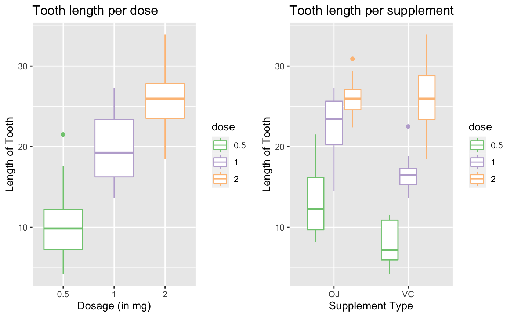

Course 6 Project, Part 2: Basic inferential data analysis
================

#### Overview

This part of the project analyzes the ToothGrowth data in the R datasets
package. There are a few specific steps we are asked to complete:

1)  Load the ToothGrowth data and perform some basic exploratory data
    analyses in order to provide a basic summary of the data  
2)  Use confidence intervals and/or hypothesis tests to compare tooth
    growth by supp and dose. (Only use the techniques from class, even
    if there’s other approaches worth considering)  
3)  State your conclusions and the assumptions needed for your
    conclusions

#### **Step 1:** Load the data and perform some basic exploratory data analyses in order to provide a basic summary of the data

First, let’s load the necessary libraries.

``` r
library(ggplot2)
library(RColorBrewer)
library(ggpubr)
library(datasets)
library(tidyverse)
```

Next, we’ll take an initial look at the data…

``` r
data <- datasets::ToothGrowth
df<- data.frame(data)
head(df)
```

    ##    len supp dose
    ## 1  4.2   VC  0.5
    ## 2 11.5   VC  0.5
    ## 3  7.3   VC  0.5
    ## 4  5.8   VC  0.5
    ## 5  6.4   VC  0.5
    ## 6 10.0   VC  0.5

And now an initial look at the variables…

``` r
str(df)
```

    ## 'data.frame':    60 obs. of  3 variables:
    ##  $ len : num  4.2 11.5 7.3 5.8 6.4 10 11.2 11.2 5.2 7 ...
    ##  $ supp: Factor w/ 2 levels "OJ","VC": 2 2 2 2 2 2 2 2 2 2 ...
    ##  $ dose: num  0.5 0.5 0.5 0.5 0.5 0.5 0.5 0.5 0.5 0.5 ...

``` r
summary(df)
```

    ##       len        supp         dose      
    ##  Min.   : 4.20   OJ:30   Min.   :0.500  
    ##  1st Qu.:13.07   VC:30   1st Qu.:0.500  
    ##  Median :19.25           Median :1.000  
    ##  Mean   :18.81           Mean   :1.167  
    ##  3rd Qu.:25.27           3rd Qu.:2.000  
    ##  Max.   :33.90           Max.   :2.000

It looks like the dataset has 3 variables (tooth length, supplement type
and dosage). Let’s do some exploratory analysis to see how these
variables might be related.

``` r
#first, convert the dosage variable to factor
ToothGrowth$dose <- as.factor(ToothGrowth$dose)

p1 <- ggplot(ToothGrowth, aes(x=dose, y=len, color=dose)) + geom_boxplot() +
    scale_color_brewer(palette="Accent") +
    labs(title="Tooth length per dose", x="Dosage (in mg)", y = "Length of Tooth")

p2 <- ggplot(ToothGrowth, aes(x=supp, y=len, color=dose)) + geom_boxplot() +
    scale_color_brewer(palette="Accent") +
    labs(title="Tooth length per supplement", x="Supplement Type", y = "Length of Tooth")

ggarrange(p1, p2, ncol = 2, nrow = 1)
```



According to the graph, there is a positive relationship between dosage
and tooth length such that, as the dosage increases to 2mg, tooth length
likewise increases. Additionally, supplement “OJ” returns longer tooth
length over supplement “VC” for dosages .5mg and 1mg, but not 2mg.

#### **Step 2:** Use confidence intervals and/or hypothesis tests to compare tooth growth by supp and dose

Based off of our exploratory analyses, our hypotheses are as follows: \*
Null hypothesis 1: Dosage has no significant effect on tooth length
(alternative hypothesis: dosage has a significant positive effect on
tooth length)  
\* Null hypothesis 2: Type of supplement has no sig effect on tooth
length (alt hypothesis: Type of supplement significantly affects tooth
length)

To test H1, we’ll first take a look at the overall impact dosage has on
tooth length, regardless of supplement.

``` r
t.test(df$len, df$dose, paired=F, var.equal=F)
```

    ## 
    ##  Welch Two Sample t-test
    ## 
    ## data:  df$len and df$dose
    ## t = 17.81, df = 59.798, p-value < 2.2e-16
    ## alternative hypothesis: true difference in means is not equal to 0
    ## 95 percent confidence interval:
    ##  15.66453 19.62881
    ## sample estimates:
    ## mean of x mean of y 
    ## 18.813333  1.166667

Overall, it looks like increased dosage results in increased tooth
growth (rejecting the null hypothesis with p-value \<.05).

To test H2, we will compare the binary factor “supp” and numeric
variable “len” in an independent, 2-group t-test.

``` r
t.test(df$len~df$supp, paired=F, var.equal=F)
```

    ## 
    ##  Welch Two Sample t-test
    ## 
    ## data:  df$len by df$supp
    ## t = 1.9153, df = 55.309, p-value = 0.06063
    ## alternative hypothesis: true difference in means is not equal to 0
    ## 95 percent confidence interval:
    ##  -0.1710156  7.5710156
    ## sample estimates:
    ## mean in group OJ mean in group VC 
    ##         20.66333         16.96333

The p-value is .06 (\>.05). Therefore, the result is NOT significant and
we can’t reject the null hypothesis. Let’s do some deeper analysis and a
take a look at what happens to this result after subsetting according to
dosage (.5, 1 or 2 mg).

``` r
df_dose <- df %>% group_split(dose)
```

Now that we have 3 independent groups, we can run 3, 2-group t-tests to
determine whether or not there are significant differences in
supplements’ tooth length according to dosage subsets.

``` r
#hypothesis test comparing .5mg & 1mg dosage's tooth length 
t.test(df_dose[[1]]$len ~df_dose[[1]]$supp, paired = FALSE, var.equal = FALSE)
```

    ## 
    ##  Welch Two Sample t-test
    ## 
    ## data:  df_dose[[1]]$len by df_dose[[1]]$supp
    ## t = 3.1697, df = 14.969, p-value = 0.006359
    ## alternative hypothesis: true difference in means is not equal to 0
    ## 95 percent confidence interval:
    ##  1.719057 8.780943
    ## sample estimates:
    ## mean in group OJ mean in group VC 
    ##            13.23             7.98

``` r
#hypothesis test comparing .5mg & 2mg dosage's tooth length 
t.test(df_dose[[2]]$len ~df_dose[[2]]$supp, paired = FALSE, var.equal = FALSE)
```

    ## 
    ##  Welch Two Sample t-test
    ## 
    ## data:  df_dose[[2]]$len by df_dose[[2]]$supp
    ## t = 4.0328, df = 15.358, p-value = 0.001038
    ## alternative hypothesis: true difference in means is not equal to 0
    ## 95 percent confidence interval:
    ##  2.802148 9.057852
    ## sample estimates:
    ## mean in group OJ mean in group VC 
    ##            22.70            16.77

``` r
#hypothesis test comparing 1mg & 2mg dosage's tooth length 
t.test(df_dose[[3]]$len ~df_dose[[3]]$supp, paired = FALSE, var.equal = FALSE)
```

    ## 
    ##  Welch Two Sample t-test
    ## 
    ## data:  df_dose[[3]]$len by df_dose[[3]]$supp
    ## t = -0.046136, df = 14.04, p-value = 0.9639
    ## alternative hypothesis: true difference in means is not equal to 0
    ## 95 percent confidence interval:
    ##  -3.79807  3.63807
    ## sample estimates:
    ## mean in group OJ mean in group VC 
    ##            26.06            26.14

As expected, dosages .5mg & 1mg have significant impact (p-values\<.05)
and we can reject the null hypothesis for either subset. But the 2mg
dosage does NOT have a significant p-value and therefore cannot be
rejected.

#### **Step 3:** State your conclusions and the assumptions needed for your conclusions

**Hypothesis 1:** Following the results of the t-tests in Step 2, we
were able to reject the null hypothesis, meaning dose had a significant
impact on tooth growth.

**Hypothesis 2:** We originally failed to reject the null hypothesis,
meaning that, although Supplement “OJ” may have a longer mean tooth
length than Supplement “VC”, this difference is non-significant.
However, with further investigation, we also found that only held true
for dosages of 2mg specifically and that, rather, for .5mg & 1mg dosages
we were able to reject the null hypothesis (p-values .01 & .00,
respectively). This means supplement type significantly affected tooth
length when given either of .5mg or 1mg doses but not 2mg.
