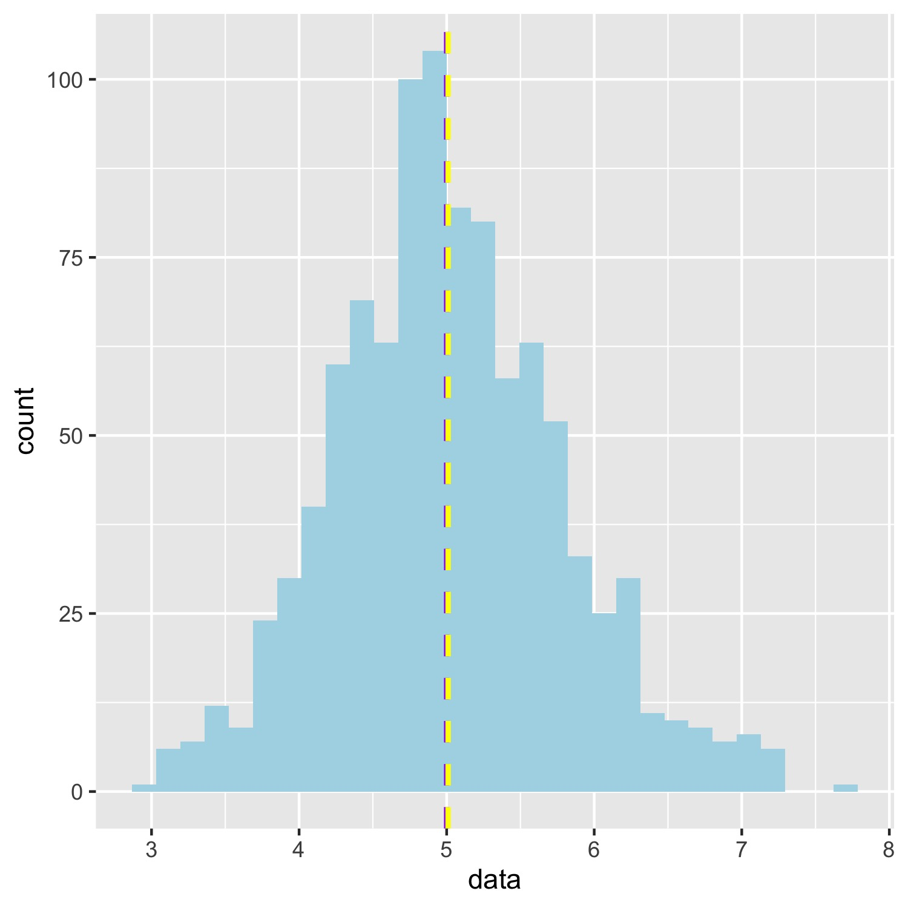
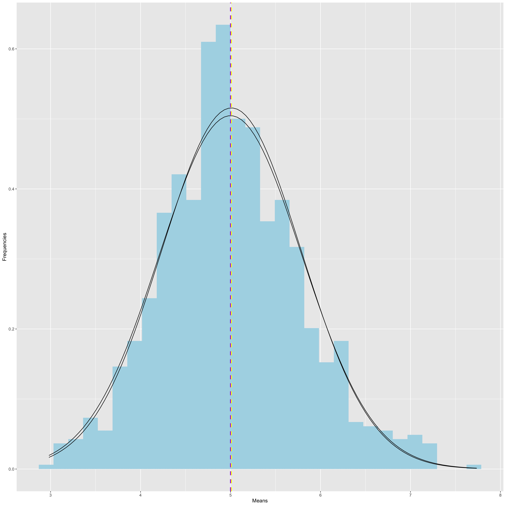

Course 6 Project, Part 1: Simulation Exercise
================

## Overview

The exponential distribution can be simulated with rexp(n, lambda),
where lambda is the rate parameter. The mean of exponential distribution
is 1/lambda and the standard deviation is also 1/lambda. Set lambda =
0.2 for all of the simulations and investigate the distribution of the
averages of 40 exponentials over 1000 simulations.

## Specific Questions

1)  Show the sample mean and compare it to the theoretical mean of the
    distribution,
2)  Show how variable the sample is (via variance) and compare it to the
    theoretical variance of the distribution
3)  Show that the distribution is approximately normal.

## Setting the stage for the requiremed analyses

First, we’ll need to set up our environment by loading the ggplot2
library.

``` r
library(ggplot2)
```

Next, set a seed so our results are reproducible and prepare the data as
detailed by the instructions.

``` r
set.seed(101)

lambda <- 0.2
n <- 40
simulation <- 1000
data <- replicate(simulation, mean(rexp(n, lambda)))
df <- data.frame(data)
```

Now that our data has been generated, let’s take a look at the first
question.

## **Question 1:** Show the sample mean and compare it to the theoretical mean of the distribution

This one’s pretty straight forward. Let’s calculate both the sample and
theoretical mean.

``` r
#theoretical mean
t_mean <- 1/lambda
#sample mean
s_mean <- round(mean(data), 2)
#differences between the means
mean_dif <- round((s_mean - t_mean), 2)
```

Now let’s compare the two values

    ## Theoretical Mean: 5

    ## Sample Mean: 5.01

    ## Value difference between the sample & theoretical mean: 0.01

There is a very small difference between the means, showing that the
center of distribution of the 40 simulated exponential means is a close
approximation of the theoretical center of distribution. We can graph
our results to get an better visualization…

``` r
mean_hist <- ggplot(df, aes(x=data)) + geom_histogram(fill = "lightblue", bins = 30) + 
geom_vline(aes(xintercept=t_mean), color="purple", linetype="dashed", size=1) + 
geom_vline(aes(xintercept = s_mean), color = "yellow", linetype="dashed", size = 1)
mean_hist
```



``` r
ggsave("means.jpg", height = 5, width = 5)
```

The averages are so similar the purple theoretical mean barely shows
from underneath the yellow sample mean.

## **Question 2:** Show how variable the sample is (via variance) and compare it to the theoretical variance of the distribution

First, let’s calculate the sample and theoretical standard deviations
and variances.

``` r
#theoretical sd
t_sd <- (1/lambda)/sqrt(n)
#sample sd
s_sd <- sd(data)
#theoretical variance
t_var <- 1/(lambda^2*n)
#sample variance
s_var <- var(data)
```

Now let’s compare the distribution values.

``` r
sd_dif = round((t_sd -s_sd), 2)
var_dif = round((t_var-s_var), 2)

table <- matrix(c(s_sd, t_sd, sd_dif, s_var, t_var, var_dif),ncol=3,byrow=TRUE)
colnames(table) <- c("Sample","Theoretical","Difference")
rownames(table) <- c("Standard Deviation","Variance")
table <- as.table(table)
table
```

    ##                       Sample Theoretical Difference
    ## Standard Deviation 0.7736526   0.7905694  0.0200000
    ## Variance           0.5985383   0.6250000  0.0300000

According to the values in the table above, the standard deviations and
variances are pretty similar\!

## **Question 3:** Show that the distribution is approximately normal

We can do this a few ways. First, let’s keep it simple and compare
confidence intervals.

``` r
#sample confidence interval
s_mean + (c(-1,1)*1.96*s_sd/sqrt(n))
```

    ## [1] 4.770243 5.249757

``` r
#theoretical confidence interval
t_mean + (c(-1,1)*1.96*t_sd/sqrt(n))
```

    ## [1] 4.755 5.245

The sample CI is pretty close to the normally distributed theoretical
CI\! Now let’s actually visualize the sample distribution.

``` r
hist <- ggplot(df, aes(x=data)) + geom_histogram(aes(y = ..density..), fill = "lightblue", bins = 30) +
geom_vline(aes(xintercept=t_mean), color="purple", linetype="dashed", size=1) +
geom_vline(aes(xintercept = s_mean), color = "yellow", linetype="dashed", size = 1) + 
stat_function(fun = "dnorm", args = list(mean = t_mean, sd = t_sd)) + 
stat_function(fun = "dnorm", args = list(mean = s_mean, sd = s_sd)) + 
xlab("Means") + ylab("Frequencies")

hist
```



``` r
ggsave("disthist.jpg", height = 15, width = 15)
```

The bell curves are nearly identical, showing that the sample
distribution is approximately normal.

Finally, we can also use a qqplot to graph the respective quartiles
against one another to compare distributions.

``` r
qqnorm(data, col = "lightblue")
qqline(data, col = "yellow", lwd =2)
```


It’s nearly linear\! All of this shows that, due to the Central Limit
Theorem, the simulated sample distribution is a very close approximation
of the normally distributed theoretical mean.
