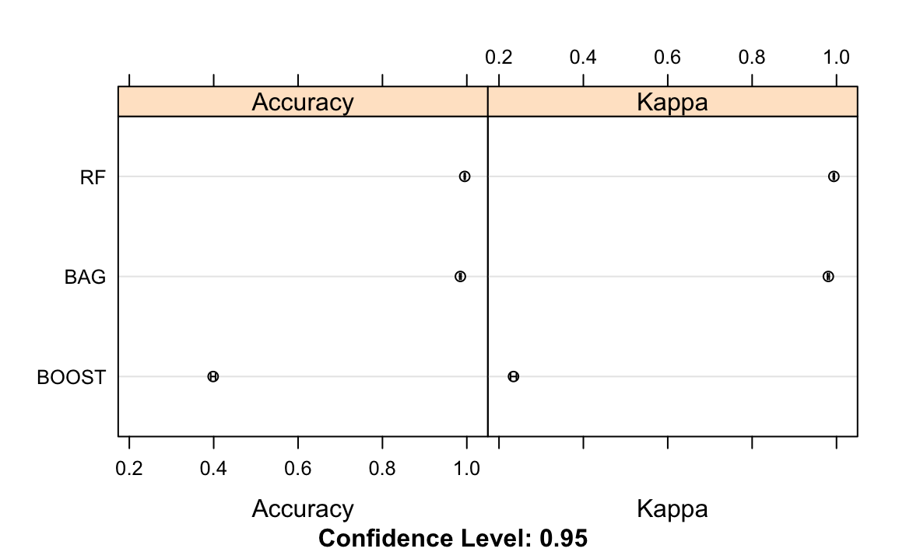

```{r setup, include=FALSE}
knitr::opts_chunk$set(echo = TRUE)
```

## Objective
One thing that people regularly do is quantify how much of a particular activity they do, but they rarely quantify how well they do it. In this project, our goal will be to use data from accelerometers on the belt, forearm, arm, and dumbell of 6 participants to predict the manner in which they did the exercise.

## Loading Necessary Packages & Data
First we'll load some packages we'll need to execute the following cleaning, modeling and analysis.

```{r libraries, include=FALSE}
library(readr)
library(dplyr)
library(caret)
library(randomForest)
library(party)
```

We'll also download the training and test data sets as indicated by the original project instructions.

```{r data loading, include=FALSE}
training <- read_csv("https://d396qusza40orc.cloudfront.net/predmachlearn/pml-training.csv")
test <-read_csv("https://d396qusza40orc.cloudfront.net/predmachlearn/pml-testing.csv")
```

## Data Cleaning
Before we can fit the data, we have to make sure the csv's we downloaded are preprocessed. Let's take an initial look at what's going on with the data. 

```{r head}
#training data
dim(training)
head(training, 5)

#testing data
dim(test)
head(test, 5)
```

Looks like there are columns with NA values. We will need to remove any with all NA's before fitting the data as they won't contribute to the model. 

```{r NAs}
#removing columns with NA values
training <- training[, colSums(is.na(training)) == 0]
test <- test[, colSums(is.na(test)) == 0]

#checking NA's have been removed
sum(is.na(training))
sum(is.na(test))
```

We will also remove any predictors (i.e. columns) that are unrelated to our accelerometer outcome variable of interest to mitigate unecessary noise in our later models. 

```{r remove cols}
#unrelated predictors are cols 1 thro 7: X1, user_name, raw_timestamp_part_1, raw_timestamp_part_2, cvtd_timestamp, num_window

trainingClean <- select(training, -c(1:7))
testClean <- select(test, -c(1:7))
```

Alright, now we have a clean training and test data set reading for fitting. I will go over how I utilized the random forest method for classification of the "classe" outcome variable below. 

**Note:** I also fit the training data on two other tree-based models (bagging and boosting methods) prior to final model selection. Random forest significantly surpassed both boosting and bagging in overall accuracy (see table & plot of respective plot performance in the Appendix) and was thus selected as the final model. As this project is a short report, the bagging (training method "treebag") and boosting (training method "bstTree") modeling code is not included. 

## Data Modeling  
Before fitting the data for the random forest model, we'll set the seed for reproducibility and split the now clean training data into a pure training set (80%) and a validation set (20%).

```{r subsetting, warning=FALSE}
set.seed(101)

train_index <- createDataPartition(trainingClean$classe, p=.8, list = F)
trainData <- trainingClean[train_index, ]
testData <- trainingClean[-train_index, ]
```

Now we'll fit the training data with a random forest model using the train() function in caret, one of R's machine leaning packages. 

```{r RandomForest}
#setting cross-validation method
fit_rf_control <- trainControl(method = "cv", 
                                number = 10)

#setting preferred tuning parameters
rf_grid <- expand.grid(mtry = c(2, 3, 4, 5),
                      splitrule = c("gini", "extratrees"),
                      min.node.size = c(1, 3, 5))

#fitting the model w/ the selected cv & tuning methods
fit_rf <- train(classe ~., 
                 data=trainData, 
                 method="ranger",
                 trControl = fit_rf_control,
                tuneGrid = rf_grid)
fit_rf
```

Next, we'll make some prediction using the validation data (testData) we set aside to see how our model does. If it performs poorly, we can readjust our tuning parameters in our training model before using our test data (testClean) to make final predictions.

```{r rf pred}
pred_rf <- predict(fit_rf, testData)
confusionMatrix(as.factor(testData$classe), pred_rf)
```

So, following the confusion matrix output, the overall accuracy of the random forest model is pretty high (99.54%). To estimate the out-of-sample error we simply subtract the overall accuracy of the model from 1 (.06%). We'll go ahead and use the model for our test data classification but, if we wanted to, we could also further adjust our parameters and/or prune our tree to make it an even closer fit before moving on.  

## Using the Test Data Set for Prediction
Finally, we'll use our cross-validated random forest model to predict the classification of our test data set via supervised learning. 

```{r test data}
test_pred <- predict(fit_rf, testClean)
test_pred
```

## Appendix 

### 1. Table of initally fitted models confusion matrix results

```{r table, echo=FALSE, results="asis"}
models <- data.frame("Bagging" = 98.39, "Random Forest" = 99.54 , "Boosting"= 39.77)
knitr::kable(models, caption = "Overall Accuracy of Models (%)", format = "html", align = "c")
```

### 2. Visual comparison of test error rates across fitted bagging, boosted and random forest models

```{r three  models, eval=FALSE}
#summary of bagging, random forest and boosting models
resamp <- resamples(list(BAG = fit_bag, 
                         RF = fit_rf, 
                         BOOST= fit_boost))
summary(resamp)

#plotting the 3 models' respective ROC
trellis.par.set(caretTheme())
dotplot(resamp)
```



### 3. Random Forest Visualization

```{r rf plots}
#accuracy of training model
plot(fit_rf)

#plotting rf
tree <- randomForest(as.factor(classe) ~., data=trainingClean, method = "class")
plot(tree, main = "Random Forest Model")
```