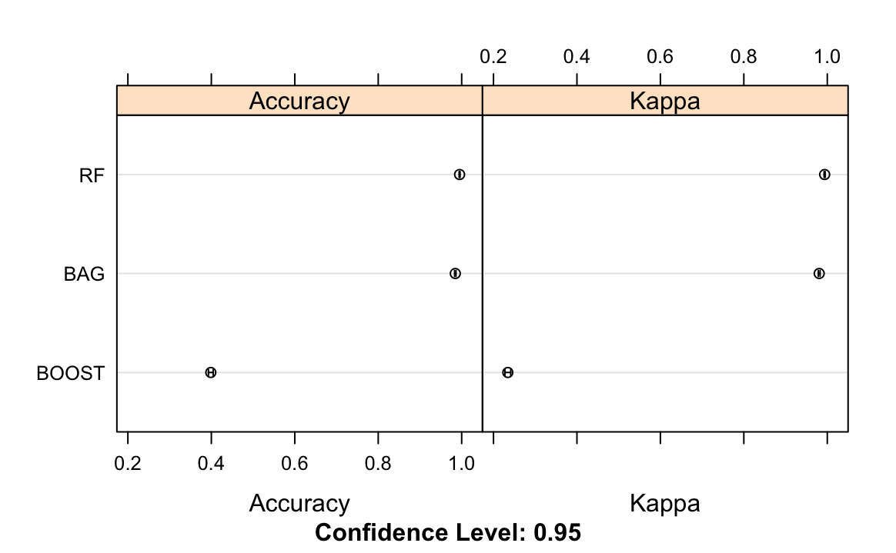

Practical Machine Learning Course Project
================

## Objective

One thing that people regularly do is quantify how much of a particular
activity they do, but they rarely quantify how well they do it. In this
project, our goal will be to use data from accelerometers on the belt,
forearm, arm, and dumbell of 6 participants to predict the manner in
which they did the exercise.

## Loading Necessary Packages & Data

First we’ll load some packages we’ll need to execute the following
cleaning, modeling and analysis.

```r
library(readr)
library(dplyr)
library(caret)
library(randomForest)
library(party)
```

We’ll also download the training and test data sets as indicated by the
original project instructions.

## Data Cleaning

Before we can fit the data, we have to make sure the csv’s we downloaded
are preprocessed. Let’s take an initial look at what’s going on with the
data.

``` r
#training data
dim(training)
```

    ## [1] 19622   160

``` r
head(training, 5)
```

    ## # A tibble: 5 x 160
    ##      X1 user_name raw_timestamp_p… raw_timestamp_p… cvtd_timestamp new_window
    ##   <dbl> <chr>                <dbl>            <dbl> <chr>          <chr>     
    ## 1     1 carlitos        1323084231           788290 05/12/2011 11… no        
    ## 2     2 carlitos        1323084231           808298 05/12/2011 11… no        
    ## 3     3 carlitos        1323084231           820366 05/12/2011 11… no        
    ## 4     4 carlitos        1323084232           120339 05/12/2011 11… no        
    ## 5     5 carlitos        1323084232           196328 05/12/2011 11… no        
    ## # … with 154 more variables: num_window <dbl>, roll_belt <dbl>,
    ## #   pitch_belt <dbl>, yaw_belt <dbl>, total_accel_belt <dbl>,
    ## #   kurtosis_roll_belt <chr>, kurtosis_picth_belt <chr>,
    ## #   kurtosis_yaw_belt <chr>, skewness_roll_belt <chr>,
    ## #   skewness_roll_belt.1 <chr>, skewness_yaw_belt <chr>, max_roll_belt <dbl>,
    ## #   max_picth_belt <dbl>, max_yaw_belt <chr>, min_roll_belt <dbl>,
    ## #   min_pitch_belt <dbl>, min_yaw_belt <chr>, amplitude_roll_belt <dbl>,
    ## #   amplitude_pitch_belt <dbl>, amplitude_yaw_belt <chr>,
    ## #   var_total_accel_belt <dbl>, avg_roll_belt <dbl>, stddev_roll_belt <dbl>,
    ## #   var_roll_belt <dbl>, avg_pitch_belt <dbl>, stddev_pitch_belt <dbl>,
    ## #   var_pitch_belt <dbl>, avg_yaw_belt <dbl>, stddev_yaw_belt <dbl>,
    ## #   var_yaw_belt <dbl>, gyros_belt_x <dbl>, gyros_belt_y <dbl>,
    ## #   gyros_belt_z <dbl>, accel_belt_x <dbl>, accel_belt_y <dbl>,
    ## #   accel_belt_z <dbl>, magnet_belt_x <dbl>, magnet_belt_y <dbl>,
    ## #   magnet_belt_z <dbl>, roll_arm <dbl>, pitch_arm <dbl>, yaw_arm <dbl>,
    ## #   total_accel_arm <dbl>, var_accel_arm <dbl>, avg_roll_arm <dbl>,
    ## #   stddev_roll_arm <dbl>, var_roll_arm <dbl>, avg_pitch_arm <dbl>,
    ## #   stddev_pitch_arm <dbl>, var_pitch_arm <dbl>, avg_yaw_arm <dbl>,
    ## #   stddev_yaw_arm <dbl>, var_yaw_arm <dbl>, gyros_arm_x <dbl>,
    ## #   gyros_arm_y <dbl>, gyros_arm_z <dbl>, accel_arm_x <dbl>, accel_arm_y <dbl>,
    ## #   accel_arm_z <dbl>, magnet_arm_x <dbl>, magnet_arm_y <dbl>,
    ## #   magnet_arm_z <dbl>, kurtosis_roll_arm <dbl>, kurtosis_picth_arm <chr>,
    ## #   kurtosis_yaw_arm <chr>, skewness_roll_arm <dbl>, skewness_pitch_arm <chr>,
    ## #   skewness_yaw_arm <chr>, max_roll_arm <dbl>, max_picth_arm <dbl>,
    ## #   max_yaw_arm <dbl>, min_roll_arm <dbl>, min_pitch_arm <dbl>,
    ## #   min_yaw_arm <dbl>, amplitude_roll_arm <dbl>, amplitude_pitch_arm <dbl>,
    ## #   amplitude_yaw_arm <dbl>, roll_dumbbell <dbl>, pitch_dumbbell <dbl>,
    ## #   yaw_dumbbell <dbl>, kurtosis_roll_dumbbell <dbl>,
    ## #   kurtosis_picth_dumbbell <dbl>, kurtosis_yaw_dumbbell <chr>,
    ## #   skewness_roll_dumbbell <dbl>, skewness_pitch_dumbbell <dbl>,
    ## #   skewness_yaw_dumbbell <chr>, max_roll_dumbbell <dbl>,
    ## #   max_picth_dumbbell <dbl>, max_yaw_dumbbell <dbl>, min_roll_dumbbell <dbl>,
    ## #   min_pitch_dumbbell <dbl>, min_yaw_dumbbell <dbl>,
    ## #   amplitude_roll_dumbbell <dbl>, amplitude_pitch_dumbbell <dbl>,
    ## #   amplitude_yaw_dumbbell <dbl>, total_accel_dumbbell <dbl>,
    ## #   var_accel_dumbbell <dbl>, avg_roll_dumbbell <dbl>,
    ## #   stddev_roll_dumbbell <dbl>, var_roll_dumbbell <dbl>, …

``` r
#testing data
dim(test)
```

    ## [1]  20 160

``` r
head(test, 5)
```

    ## # A tibble: 5 x 160
    ##      X1 user_name raw_timestamp_p… raw_timestamp_p… cvtd_timestamp new_window
    ##   <dbl> <chr>                <dbl>            <dbl> <chr>          <chr>     
    ## 1     1 pedro           1323095002           868349 05/12/2011 14… no        
    ## 2     2 jeremy          1322673067           778725 30/11/2011 17… no        
    ## 3     3 jeremy          1322673075           342967 30/11/2011 17… no        
    ## 4     4 adelmo          1322832789           560311 02/12/2011 13… no        
    ## 5     5 eurico          1322489635           814776 28/11/2011 14… no        
    ## # … with 154 more variables: num_window <dbl>, roll_belt <dbl>,
    ## #   pitch_belt <dbl>, yaw_belt <dbl>, total_accel_belt <dbl>,
    ## #   kurtosis_roll_belt <lgl>, kurtosis_picth_belt <lgl>,
    ## #   kurtosis_yaw_belt <lgl>, skewness_roll_belt <lgl>,
    ## #   skewness_roll_belt.1 <lgl>, skewness_yaw_belt <lgl>, max_roll_belt <lgl>,
    ## #   max_picth_belt <lgl>, max_yaw_belt <lgl>, min_roll_belt <lgl>,
    ## #   min_pitch_belt <lgl>, min_yaw_belt <lgl>, amplitude_roll_belt <lgl>,
    ## #   amplitude_pitch_belt <lgl>, amplitude_yaw_belt <lgl>,
    ## #   var_total_accel_belt <lgl>, avg_roll_belt <lgl>, stddev_roll_belt <lgl>,
    ## #   var_roll_belt <lgl>, avg_pitch_belt <lgl>, stddev_pitch_belt <lgl>,
    ## #   var_pitch_belt <lgl>, avg_yaw_belt <lgl>, stddev_yaw_belt <lgl>,
    ## #   var_yaw_belt <lgl>, gyros_belt_x <dbl>, gyros_belt_y <dbl>,
    ## #   gyros_belt_z <dbl>, accel_belt_x <dbl>, accel_belt_y <dbl>,
    ## #   accel_belt_z <dbl>, magnet_belt_x <dbl>, magnet_belt_y <dbl>,
    ## #   magnet_belt_z <dbl>, roll_arm <dbl>, pitch_arm <dbl>, yaw_arm <dbl>,
    ## #   total_accel_arm <dbl>, var_accel_arm <lgl>, avg_roll_arm <lgl>,
    ## #   stddev_roll_arm <lgl>, var_roll_arm <lgl>, avg_pitch_arm <lgl>,
    ## #   stddev_pitch_arm <lgl>, var_pitch_arm <lgl>, avg_yaw_arm <lgl>,
    ## #   stddev_yaw_arm <lgl>, var_yaw_arm <lgl>, gyros_arm_x <dbl>,
    ## #   gyros_arm_y <dbl>, gyros_arm_z <dbl>, accel_arm_x <dbl>, accel_arm_y <dbl>,
    ## #   accel_arm_z <dbl>, magnet_arm_x <dbl>, magnet_arm_y <dbl>,
    ## #   magnet_arm_z <dbl>, kurtosis_roll_arm <lgl>, kurtosis_picth_arm <lgl>,
    ## #   kurtosis_yaw_arm <lgl>, skewness_roll_arm <lgl>, skewness_pitch_arm <lgl>,
    ## #   skewness_yaw_arm <lgl>, max_roll_arm <lgl>, max_picth_arm <lgl>,
    ## #   max_yaw_arm <lgl>, min_roll_arm <lgl>, min_pitch_arm <lgl>,
    ## #   min_yaw_arm <lgl>, amplitude_roll_arm <lgl>, amplitude_pitch_arm <lgl>,
    ## #   amplitude_yaw_arm <lgl>, roll_dumbbell <dbl>, pitch_dumbbell <dbl>,
    ## #   yaw_dumbbell <dbl>, kurtosis_roll_dumbbell <lgl>,
    ## #   kurtosis_picth_dumbbell <lgl>, kurtosis_yaw_dumbbell <lgl>,
    ## #   skewness_roll_dumbbell <lgl>, skewness_pitch_dumbbell <lgl>,
    ## #   skewness_yaw_dumbbell <lgl>, max_roll_dumbbell <lgl>,
    ## #   max_picth_dumbbell <lgl>, max_yaw_dumbbell <lgl>, min_roll_dumbbell <lgl>,
    ## #   min_pitch_dumbbell <lgl>, min_yaw_dumbbell <lgl>,
    ## #   amplitude_roll_dumbbell <lgl>, amplitude_pitch_dumbbell <lgl>,
    ## #   amplitude_yaw_dumbbell <lgl>, total_accel_dumbbell <dbl>,
    ## #   var_accel_dumbbell <lgl>, avg_roll_dumbbell <lgl>,
    ## #   stddev_roll_dumbbell <lgl>, var_roll_dumbbell <lgl>, …

Looks like there are columns with NA values. We will need to remove any
with all NA’s before fitting the data as they won’t contribute to the
model.

``` r
#removing columns with NA values
training <- training[, colSums(is.na(training)) == 0]
test <- test[, colSums(is.na(test)) == 0]

#checking NA's have been removed
sum(is.na(training))
```

    ## [1] 0

``` r
sum(is.na(test))
```

    ## [1] 0

We will also remove any predictors (i.e. columns) that are unrelated to
our accelerometer outcome variable of interest to mitigate unecessary
noise in our later models.

``` r
#unrelated predictors are cols 1 thro 7: X1, user_name, raw_timestamp_part_1, raw_timestamp_part_2, cvtd_timestamp, num_window

trainingClean <- select(training, -c(1:7))
testClean <- select(test, -c(1:7))
```

Alright, now we have a clean training and test data set reading for
fitting. I will go over how I utilized the random forest method for
classification of the “classe” outcome variable below.

**Note:** I also fit the training data on two other tree-based models
(bagging and boosting methods) prior to final model selection. Random
forest surpassed both boosting and bagging in overall
accuracy (see table & plot of respective plot performance in the
Appendix) and was thus selected as the final model. As this project is a
short report, the bagging (training method “treebag”) and boosting
(training method “bstTree”) modeling code is not included.

## Data Modeling 
Before fitting the data for the random forest model,
we’ll set the seed for reproducibility and split the now clean training
data into a pure training set (80%) and a validation set (20%).

``` r
set.seed(101)

train_index <- createDataPartition(trainingClean$classe, p=.8, list = F)
trainData <- trainingClean[train_index, ]
testData <- trainingClean[-train_index, ]
```

Now we’ll fit the training data with a random forest model using the
train() function in caret, one of R’s machine leaning packages.

``` r
#setting cross-validation method
fit_rf_control <- trainControl(method = "cv", 
                                number = 10)

#setting preferred tuning parameters
rf_grid <- expand.grid(mtry = c(2, 3, 4, 5),
                      splitrule = c("gini", "extratrees"),
                      min.node.size = c(1, 3, 5))

#fitting the model w/ the selected cv & tuning methods
fit_rf <- train(classe ~., 
                 data=trainData, 
                 method="ranger",
                 trControl = fit_rf_control,
                tuneGrid = rf_grid)
fit_rf
```

    ## Random Forest 
    ## 
    ## 15699 samples
    ##    52 predictor
    ##     5 classes: 'A', 'B', 'C', 'D', 'E' 
    ## 
    ## No pre-processing
    ## Resampling: Cross-Validated (10 fold) 
    ## Summary of sample sizes: 14130, 14130, 14128, 14129, 14130, 14127, ... 
    ## Resampling results across tuning parameters:
    ## 
    ##   mtry  splitrule   min.node.size  Accuracy   Kappa    
    ##   2     gini        1              0.9936934  0.9920224
    ##   2     gini        3              0.9933749  0.9916191
    ##   2     gini        5              0.9925470  0.9905720
    ##   2     extratrees  1              0.9929292  0.9910554
    ##   2     extratrees  3              0.9915277  0.9892823
    ##   2     extratrees  5              0.9899350  0.9872666
    ##   3     gini        1              0.9949675  0.9936340
    ##   3     gini        3              0.9940760  0.9925065
    ##   3     gini        5              0.9936300  0.9919420
    ##   3     extratrees  1              0.9938846  0.9922642
    ##   3     extratrees  3              0.9926743  0.9907331
    ##   3     extratrees  5              0.9917825  0.9896046
    ##   4     gini        1              0.9948403  0.9934733
    ##   4     gini        3              0.9945219  0.9930704
    ##   4     gini        5              0.9942671  0.9927479
    ##   4     extratrees  1              0.9938209  0.9921835
    ##   4     extratrees  3              0.9933111  0.9915386
    ##   4     extratrees  5              0.9922924  0.9902497
    ##   5     gini        1              0.9952228  0.9939572
    ##   5     gini        3              0.9949043  0.9935544
    ##   5     gini        5              0.9950314  0.9937149
    ##   5     extratrees  1              0.9939483  0.9923448
    ##   5     extratrees  3              0.9936298  0.9919419
    ##   5     extratrees  5              0.9929929  0.9911362
    ## 
    ## Accuracy was used to select the optimal model using the largest value.
    ## The final values used for the model were mtry = 5, splitrule = gini
    ##  and min.node.size = 1.

Next, we’ll make some prediction using the validation data (testData) we
set aside to see how our model does. If it performs poorly, we can
readjust our tuning parameters in our training model before using our
test data (testClean) to make final predictions.

``` r
pred_rf <- predict(fit_rf, testData)
confusionMatrix(as.factor(testData$classe), pred_rf)
```

    ## Confusion Matrix and Statistics
    ## 
    ##           Reference
    ## Prediction    A    B    C    D    E
    ##          A 1114    1    0    0    1
    ##          B    3  754    2    0    0
    ##          C    0    5  679    0    0
    ##          D    0    0    7  634    2
    ##          E    0    0    0    0  721
    ## 
    ## Overall Statistics
    ##                                           
    ##                Accuracy : 0.9946          
    ##                  95% CI : (0.9918, 0.9967)
    ##     No Information Rate : 0.2847          
    ##     P-Value [Acc > NIR] : < 2.2e-16       
    ##                                           
    ##                   Kappa : 0.9932          
    ##                                           
    ##  Mcnemar's Test P-Value : NA              
    ## 
    ## Statistics by Class:
    ## 
    ##                      Class: A Class: B Class: C Class: D Class: E
    ## Sensitivity            0.9973   0.9921   0.9869   1.0000   0.9959
    ## Specificity            0.9993   0.9984   0.9985   0.9973   1.0000
    ## Pos Pred Value         0.9982   0.9934   0.9927   0.9860   1.0000
    ## Neg Pred Value         0.9989   0.9981   0.9972   1.0000   0.9991
    ## Prevalence             0.2847   0.1937   0.1754   0.1616   0.1846
    ## Detection Rate         0.2840   0.1922   0.1731   0.1616   0.1838
    ## Detection Prevalence   0.2845   0.1935   0.1744   0.1639   0.1838
    ## Balanced Accuracy      0.9983   0.9953   0.9927   0.9986   0.9979

So, following the confusion matrix output, the overall accuracy of the
random forest model is pretty high (99.46%). To estimate the
out-of-sample error we simply subtract the overall accuracy of the model
from 1 (.54%). We’ll go ahead and use the model for our test data
classification but, if we wanted to, we could also further adjust our
parameters and/or prune our tree to make it an even closer fit before
moving on.

## Using the Test Data Set for Prediction

Finally, we’ll use our cross-validated random forest model to predict
the classification of our test data set via supervised learning.

``` r
test_pred <- predict(fit_rf, testClean)
test_pred
```

    ##  [1] B A B A A E D B A A B C B A E E A B B B
    ## Levels: A B C D E

Great! When we check these classifications against the answers provided in the Course Project Quiz, we see that each was correctly identified, thus closing out the task.

## Appendix

### 1\. Table of initally fitted models confusion matrix results

<table>

<caption>

Overall Accuracy of Models (%)

</caption>

<thead>

<tr>

<th style="text-align:center;">

Bagging

</th>

<th style="text-align:center;">

Random.Forest

</th>

<th style="text-align:center;">

Boosting

</th>

</tr>

</thead>

<tbody>

<tr>

<td style="text-align:center;">

98.39

</td>

<td style="text-align:center;">

99.46

</td>

<td style="text-align:center;">

39.77

</td>

</tr>

</tbody>

</table>

### 2\. Visual comparison of test error rates across fitted bagging, boosted and random forest models

``` r
#summary of bagging, random forest and boosting models
resamp <- resamples(list(BAG = fit_bag, 
                         RF = fit_rf, 
                         BOOST= fit_boost))
summary(resamp)

#plotting the 3 models' respective ROC
trellis.par.set(caretTheme())
dotplot(resamp)
```



### 3\. Random Forest Visualization

``` r
#accuracy of training model
plot(fit_rf)
```


``` r
#plotting rf
tree <- randomForest(as.factor(classe) ~., data=trainingClean, method = "class")
plot(tree, main = "Random Forest Model")
```


