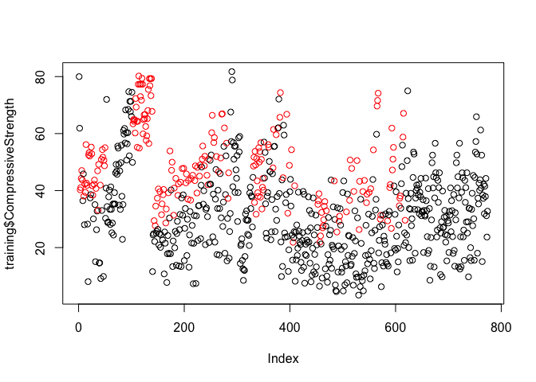
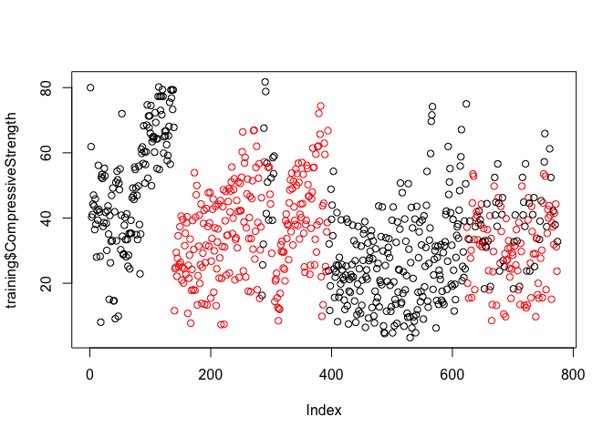
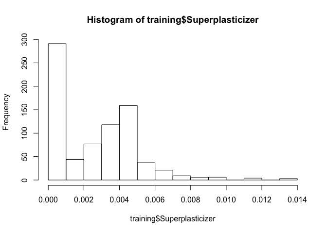

Course 8: Quiz 2
================

## Question 1

Question 1 Load the Alzheimer’s disease data using the commands:

``` r
library(AppliedPredictiveModeling)
library(caret)
```

    ## Loading required package: lattice

    ## Loading required package: ggplot2

``` r
data(AlzheimerDisease)
```

Which of the following commands will create non-overlapping training and
test sets with about 50% of the observations assigned to each?

``` r
adData = data.frame(diagnosis, predictors)
trainIndex = createDataPartition(diagnosis, p = .5, list = F)
training = adData[trainIndex,]
testing = adData[-trainIndex, ]
```

## Question 2

Load the cement data using the commands:

``` r
data(concrete)
library(caret)
set.seed(1000)
inTrain = createDataPartition(mixtures$CompressiveStrength, p = 3/4)[[1]]
training = mixtures[ inTrain,]
testing = mixtures[-inTrain,]
```

Make a plot of the outcome (CompressiveStrength) versus the index of the
samples. Color by each of the variables in the data set (you may find
the cut2() function in the Hmisc package useful for turning continuous
covariates into factors). What do you notice in these plots?

``` r
library(Hmisc)
```

    ## Loading required package: survival

    ## 
    ## Attaching package: 'survival'

    ## The following object is masked from 'package:caret':
    ## 
    ##     cluster

    ## Loading required package: Formula

    ## 
    ## Attaching package: 'Hmisc'

    ## The following objects are masked from 'package:base':
    ## 
    ##     format.pval, units

``` r
cutAge<-cut2(training$Age, g=2)
plot(training$CompressiveStrength,col=cutAge)
```
<!-- -->

``` r
cutFly<-cut2(training$FlyAsh, g=2)
plot(training$CompressiveStrength,col=cutFly)
```

``` r
#There is a non-random pattern in the plot of the outcome versus index that doesn't appear to be perfectly explained by any predictor suggesting a variable may be missing
```



## Question 3

Load the cement data using the commands:

``` r
data(concrete)
set.seed(1000)
inTrain = createDataPartition(mixtures$CompressiveStrength, p = 3/4)[[1]]
training = mixtures[ inTrain,]
testing = mixtures[-inTrain,]
```

Make a histogram and confirm the SuperPlasticizer variable is skewed.
Normally you might use the log transform to try to make the data more
symmetric. Why would that be a poor choice for this variable?

``` r
hist(training$Superplasticizer)
```



``` r
log10(training$Superplasticizer)
```

    ##   [1] -2.985965 -2.988648      -Inf      -Inf      -Inf      -Inf      -Inf
    ##   [8]      -Inf      -Inf      -Inf      -Inf      -Inf      -Inf      -Inf
    ##  [15]      -Inf      -Inf      -Inf      -Inf      -Inf      -Inf      -Inf
    ##  [22]      -Inf      -Inf      -Inf      -Inf      -Inf      -Inf      -Inf
    ##  [29]      -Inf      -Inf      -Inf      -Inf      -Inf      -Inf      -Inf
    ##  [36]      -Inf      -Inf      -Inf      -Inf      -Inf      -Inf      -Inf
    ##  [43]      -Inf      -Inf      -Inf      -Inf      -Inf      -Inf      -Inf
    ##  [50]      -Inf      -Inf      -Inf      -Inf -2.380605 -2.449012 -2.022337
    ##  [57] -2.433959 -1.881097 -2.169995 -2.303446 -1.938403 -2.169995 -2.230949
    ##  [64] -2.185957 -2.320898 -2.340196 -2.320898 -2.335955 -2.320898 -2.380605
    ##  [71] -2.169995 -2.118055 -2.022337 -2.433959 -1.881097 -2.169995 -2.303446
    ##  [78] -1.938403 -2.230949 -2.367953 -2.320898 -2.340196 -2.320898 -2.404618
    ##  [85] -2.380605 -2.449012 -2.118055 -2.022337 -2.433959 -2.169995 -2.303446
    ##  [92] -1.938403 -2.169995 -2.333005 -2.367953 -2.185957 -2.320898 -2.340196
    ##  [99] -2.320898 -2.335955 -2.046265 -2.404618 -2.380605 -2.449012 -2.169995
    ## [106] -2.118055 -2.022337 -2.433959 -1.881097 -2.169995 -2.303446 -2.169995
    ## [113] -2.320898 -2.367953 -2.185957 -2.320898 -2.340196 -2.320898 -2.335955
    ## [120] -2.046265 -2.320898 -2.404618 -2.380605 -2.449012 -2.169995 -2.118055
    ## [127] -2.022337 -2.303446 -1.938403 -2.169995 -2.230949 -2.333005 -2.185957
    ## [134] -2.320898 -2.340196 -2.320898 -2.335955 -2.320898 -2.404618 -2.717911
    ## [141] -2.717911 -2.717911 -2.717911 -2.704617 -2.704617 -2.704617 -2.501625
    ## [148] -2.501625 -2.501625 -2.484482 -2.484482 -2.616411 -2.616411 -2.616411
    ## [155] -2.705789 -2.705789 -2.705789 -2.705789 -2.380577 -2.380577 -2.380577
    ## [162] -2.717689 -2.717689 -2.717689 -2.717689 -2.717689 -2.613378 -2.613378
    ## [169] -2.613378 -2.613378 -2.537016 -2.537016 -2.537016 -2.549826 -2.549826
    ## [176] -2.549826 -2.549826 -2.582938 -2.582938 -2.582938 -2.582938 -2.520914
    ## [183] -2.520914 -2.520914 -2.631942 -2.631942 -2.631942 -2.631942 -2.631942
    ## [190] -2.439296 -2.439296 -2.439296 -2.439296 -2.361437 -2.361437 -2.361437
    ## [197] -2.486031 -2.486031 -2.486031 -2.548490 -2.548490 -2.548490 -2.548490
    ## [204] -2.548490 -2.607658 -2.607658 -2.607658 -2.607658 -2.565017 -2.565017
    ## [211] -2.565017 -2.565017 -2.565017 -2.491914 -2.491914 -2.491914 -2.460513
    ## [218] -2.460513 -2.460513 -2.460513 -2.460513 -2.343427 -2.343427 -2.343427
    ## [225] -2.343427 -2.405325 -2.405325 -2.405325 -2.405325 -2.405325 -2.307677
    ## [232] -2.307677 -2.307677 -2.307677 -2.307677 -2.428280 -2.428280 -2.428280
    ## [239] -2.428280 -2.289675 -2.289675 -2.289675 -2.289675 -2.272204 -2.272204
    ## [246] -2.272204 -2.225819 -2.225819 -2.225819 -2.303718 -2.303718 -2.303718
    ## [253] -2.303718 -2.384033 -2.384033 -2.384033 -2.384033 -2.397995 -2.397995
    ## [260] -2.397995 -2.397995 -2.368579 -2.368579 -2.368579 -2.368579 -2.308719
    ## [267] -2.308719 -2.308719 -2.308719 -2.333807 -2.333807 -2.333807 -2.307855
    ## [274] -2.307855 -2.307855 -2.307855 -2.388926 -2.388926 -2.388926 -2.388926
    ## [281] -2.324665 -2.324665 -2.324665 -2.324665      -Inf      -Inf      -Inf
    ## [288] -2.789404 -3.104505 -2.623232 -2.327549 -2.445870 -2.534045 -2.659697
    ## [295] -2.073718 -2.910393 -2.054849 -2.117549 -2.179653      -Inf -2.602574
    ## [302] -2.595739 -2.393806 -2.492393 -2.419037      -Inf -2.817345 -2.764158
    ## [309] -2.561487 -2.475046 -2.379095 -2.646589 -2.500182 -2.610642      -Inf
    ## [316] -2.481204 -2.764158 -2.475046 -2.386674 -2.646589 -2.307313 -2.500182
    ## [323] -2.610642 -2.817345 -2.481204 -2.764158 -2.561487 -2.386674 -2.646589
    ## [330] -2.307313 -2.817345 -2.481204 -2.764158 -2.561487 -2.386674 -2.379095
    ## [337] -2.307313 -2.500182 -2.610642      -Inf -2.464648 -2.817345 -2.481204
    ## [344] -2.764158 -2.475046 -2.386674 -2.379095 -2.646589 -2.500182 -2.610642
    ## [351] -2.316043 -2.316043 -2.367428 -2.316043 -2.316043 -2.316043 -2.316043
    ## [358] -2.316043 -2.316043 -2.316043 -2.234769 -2.247019 -2.325169 -2.234769
    ## [365] -2.247019 -2.234769 -2.247019 -2.247019 -2.325169 -2.302141 -2.795417
    ## [372] -2.795417 -2.795417 -2.795417 -2.782932 -2.782932 -2.782932 -2.439147
    ## [379] -2.417388 -2.439147 -2.439147 -2.417388 -3.132165 -3.132165 -2.615185
    ## [386] -2.615185 -2.615185 -2.347625 -2.347625 -2.347625 -2.347625 -2.347625
    ## [393] -2.347625 -2.347625      -Inf      -Inf      -Inf      -Inf      -Inf
    ## [400]      -Inf      -Inf      -Inf      -Inf      -Inf      -Inf      -Inf
    ## [407]      -Inf      -Inf      -Inf      -Inf      -Inf      -Inf      -Inf
    ## [414]      -Inf      -Inf      -Inf      -Inf      -Inf      -Inf      -Inf
    ## [421]      -Inf      -Inf      -Inf      -Inf      -Inf      -Inf      -Inf
    ## [428]      -Inf      -Inf      -Inf      -Inf      -Inf      -Inf      -Inf
    ## [435]      -Inf      -Inf      -Inf      -Inf      -Inf      -Inf      -Inf
    ## [442]      -Inf      -Inf      -Inf      -Inf      -Inf      -Inf      -Inf
    ## [449]      -Inf      -Inf      -Inf      -Inf      -Inf      -Inf      -Inf
    ## [456]      -Inf      -Inf      -Inf      -Inf      -Inf      -Inf      -Inf
    ## [463]      -Inf      -Inf      -Inf      -Inf      -Inf      -Inf      -Inf
    ## [470]      -Inf      -Inf      -Inf      -Inf      -Inf      -Inf      -Inf
    ## [477]      -Inf      -Inf      -Inf      -Inf      -Inf      -Inf      -Inf
    ## [484]      -Inf      -Inf      -Inf      -Inf      -Inf      -Inf      -Inf
    ## [491]      -Inf      -Inf      -Inf      -Inf      -Inf      -Inf      -Inf
    ## [498]      -Inf      -Inf      -Inf      -Inf      -Inf      -Inf      -Inf
    ## [505]      -Inf      -Inf      -Inf      -Inf      -Inf      -Inf      -Inf
    ## [512]      -Inf      -Inf      -Inf      -Inf      -Inf      -Inf      -Inf
    ## [519]      -Inf      -Inf      -Inf      -Inf      -Inf      -Inf      -Inf
    ## [526]      -Inf      -Inf      -Inf      -Inf      -Inf      -Inf      -Inf
    ## [533]      -Inf      -Inf      -Inf      -Inf      -Inf      -Inf      -Inf
    ## [540]      -Inf      -Inf      -Inf      -Inf      -Inf      -Inf      -Inf
    ## [547]      -Inf      -Inf      -Inf      -Inf      -Inf      -Inf      -Inf
    ## [554]      -Inf      -Inf      -Inf      -Inf      -Inf      -Inf      -Inf
    ## [561]      -Inf      -Inf      -Inf      -Inf      -Inf      -Inf      -Inf
    ## [568]      -Inf      -Inf      -Inf      -Inf      -Inf      -Inf      -Inf
    ## [575]      -Inf      -Inf      -Inf      -Inf      -Inf      -Inf      -Inf
    ## [582]      -Inf      -Inf      -Inf      -Inf      -Inf      -Inf      -Inf
    ## [589]      -Inf      -Inf      -Inf      -Inf      -Inf      -Inf      -Inf
    ## [596]      -Inf      -Inf      -Inf      -Inf      -Inf      -Inf      -Inf
    ## [603]      -Inf      -Inf      -Inf      -Inf      -Inf      -Inf      -Inf
    ## [610]      -Inf      -Inf      -Inf      -Inf      -Inf      -Inf      -Inf
    ## [617]      -Inf      -Inf      -Inf      -Inf      -Inf      -Inf      -Inf
    ## [624] -2.400442 -2.398133 -2.022878 -2.103043 -2.579974 -2.519265 -2.183175
    ## [631] -2.356981 -2.278182 -2.318822 -2.580164 -2.411245 -2.455416 -2.275119
    ## [638] -2.322219 -2.575573 -2.407296 -2.316733 -2.660296 -2.364551 -2.522258
    ## [645] -2.310790 -2.287615 -2.249292 -2.409181 -2.356981 -2.322595 -2.402548
    ## [652] -2.459204 -2.404454 -2.880814 -2.307302 -2.881955 -2.465197 -2.507470
    ## [659] -2.250420 -2.351796 -2.155905 -2.314059 -2.459769 -2.660296 -2.300042
    ## [666] -2.152097 -2.513218 -2.451786 -2.365301 -2.368845 -2.524674 -2.889115
    ## [673] -2.313100 -2.285745 -2.461836 -2.462023 -2.479827 -2.885926 -2.513978
    ## [680] -2.515685 -2.251357 -2.465197 -2.585085 -3.065206 -2.444630 -2.462585
    ## [687] -2.360404 -2.396974 -2.347720 -2.576917 -2.451403 -2.352568 -2.398904
    ## [694] -2.449864 -2.572678 -2.507856 -2.577109 -2.498311 -2.500668 -2.564528
    ## [701] -2.399788 -2.826665 -2.327544 -2.465383 -2.456404 -2.483510 -2.263880
    ## [708] -2.355929 -2.153161 -2.322181 -2.459656 -2.163054 -2.329762 -2.430808
    ## [715] -2.348174 -2.386332 -2.512588 -2.834832 -2.309035 -2.289304 -2.456329
    ## [722] -2.392001 -2.399940 -2.353435 -2.346297 -2.462155 -2.479755 -2.831418
    ## [729] -2.484338 -2.176053 -2.515590 -2.258128 -2.465271 -2.390973 -2.622741
    ## [736] -2.462529 -2.343333 -2.392156 -2.547775 -2.083262 -2.342305 -2.407816
    ## [743] -2.105463 -2.565772 -2.538439 -2.183099 -2.370883 -2.365717 -2.292791
    ## [750] -2.322504 -2.580336 -2.703590 -2.548203 -2.387952 -2.286019 -2.334191
    ## [757] -2.298621 -2.574847 -2.597637 -2.397713 -2.421031 -2.316847 -2.437172
    ## [764] -2.252468 -2.360155 -2.299725 -2.522481 -2.306821 -2.588300 -2.259282
    ## [771] -2.414147 -2.340044 -2.570256 -2.310759

``` r
#There are values of zero so when you take the log() transform those values will be -Inf
```

## Question 4

Load the Alzheimer’s disease data using the commands:

``` r
set.seed(3433)
data(AlzheimerDisease)
adData = data.frame(diagnosis, predictors)
inTrain = createDataPartition(adData$diagnosis, p = 3/4)[[1]]
training = adData[ inTrain,]
testing = adData[-inTrain,]
```

Find all the predictor variables in the training set that begin with IL.
Perform principal components on these variables with the preProcess()
function from the caret package. Calculate the number of principal
components needed to capture 90% of the variance. How many are there?

``` r4

#predictor variables with 'IL'
ilvars <- as.character(colnames(training))
grep("^IL", ilvars, value=TRUE)

#PC w/ caret
preProc<-preProcess(training[,58:69], method="pca")
pr.alz<-prcomp(training[,58:69],scale=TRUE)
pr.alz.var<-pr.alz$sdev^2
pve<-pr.alz.var/sum(pr.alz.var)
plot(cumsum(pve),xlab="Principal Component",ylab="Variance",type="b",ylim=c(0,1))+abline(h=0.9,col="purple")

#number of PC's needed: 9
```

## Question 5

Load the Alzheimer’s disease data using the commands:

``` r
set.seed(3433)
data(AlzheimerDisease)
adData = data.frame(diagnosis,predictors)
inTrain = createDataPartition(adData$diagnosis, p = 3/4)[[1]]
training = adData[ inTrain,]
testing = adData[-inTrain,]
```

Create a training data set consisting of only the predictors with
variable names beginning with IL and the diagnosis. Build two predictive
models, one using the predictors as they are and one using PCA with
principal components explaining 80% of the variance in the predictors.
Use method=“glm” in the train function.

What is the accuracy of each method in the test set? Which is more
accurate?

``` r
#training set
training <- training[,c(1,58:69)]
testing <- testing[,c(1,58:69)]

#predictive models
mod1<-train(diagnosis~.,method="glm",data=training)
confusionMatrix(testing$diagnosis,predict(mod1,testing))
```

    ## Confusion Matrix and Statistics
    ## 
    ##           Reference
    ## Prediction Impaired Control
    ##   Impaired        4      18
    ##   Control         2      58
    ##                                           
    ##                Accuracy : 0.7561          
    ##                  95% CI : (0.6488, 0.8442)
    ##     No Information Rate : 0.9268          
    ##     P-Value [Acc > NIR] : 0.9999997       
    ##                                           
    ##                   Kappa : 0.1929          
    ##                                           
    ##  Mcnemar's Test P-Value : 0.0007962       
    ##                                           
    ##             Sensitivity : 0.66667         
    ##             Specificity : 0.76316         
    ##          Pos Pred Value : 0.18182         
    ##          Neg Pred Value : 0.96667         
    ##              Prevalence : 0.07317         
    ##          Detection Rate : 0.04878         
    ##    Detection Prevalence : 0.26829         
    ##       Balanced Accuracy : 0.71491         
    ##                                           
    ##        'Positive' Class : Impaired        
    ## 

``` r
mod2<-train(diagnosis~.,method="glm",preProcess="pca",data=training)
confusionMatrix(testing$diagnosis,predict(mod2,testing))
```

    ## Confusion Matrix and Statistics
    ## 
    ##           Reference
    ## Prediction Impaired Control
    ##   Impaired        2      20
    ##   Control         2      58
    ##                                           
    ##                Accuracy : 0.7317          
    ##                  95% CI : (0.6224, 0.8236)
    ##     No Information Rate : 0.9512          
    ##     P-Value [Acc > NIR] : 1.0000000       
    ##                                           
    ##                   Kappa : 0.0777          
    ##                                           
    ##  Mcnemar's Test P-Value : 0.0002896       
    ##                                           
    ##             Sensitivity : 0.50000         
    ##             Specificity : 0.74359         
    ##          Pos Pred Value : 0.09091         
    ##          Neg Pred Value : 0.96667         
    ##              Prevalence : 0.04878         
    ##          Detection Rate : 0.02439         
    ##    Detection Prevalence : 0.26829         
    ##       Balanced Accuracy : 0.62179         
    ##                                           
    ##        'Positive' Class : Impaired        
    ## 

``` r
# Non-PCA Accurracy: .65, PCA Accuracy: .72
```
