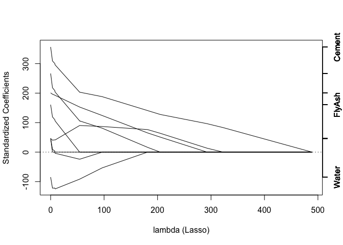

Course 8: Quiz 4
================

## Question 1

For this quiz we will be using several R packages. R package versions
change over time, the right answers have been checked using the
following versions of the packages.

AppliedPredictiveModeling: v1.1.6

caret: v6.0.47

ElemStatLearn: v2012.04-0

pgmm: v1.1

rpart: v4.1.8

gbm: v2.1

lubridate: v1.3.3

forecast: v5.6

e1071: v1.6.4

If you aren’t using these versions of the packages, your answers may not
exactly match the right answer, but hopefully should be close.

``` r
library(AppliedPredictiveModeling)
library(caret)
```

    ## Loading required package: lattice

    ## Loading required package: ggplot2

``` r
# library(ElemStatLearn) listed as needed package but CRAN archived it in 2020. To access the data, visit subdirectory of ESL website https://web.stanford.edu/~hastie/ElemStatLearn/datasets/ and use readr::read_csv() to call required data set
library(readr)
library(pgmm)
library(rpart)
library(gbm)
```

    ## Loaded gbm 2.1.8

``` r
library(lubridate)
```

    ## 
    ## Attaching package: 'lubridate'

    ## The following objects are masked from 'package:base':
    ## 
    ##     date, intersect, setdiff, union

``` r
library(forecast)
```

    ## Registered S3 method overwritten by 'quantmod':
    ##   method            from
    ##   as.zoo.data.frame zoo

``` r
library(e1071)
```

load the vowel.train and vowel.test data sets:

``` r
vowel.train <- readr::read_csv("https://web.stanford.edu/~hastie/ElemStatLearn/datasets/vowel.test")
```

    ## Parsed with column specification:
    ## cols(
    ##   row.names = col_double(),
    ##   y = col_double(),
    ##   x.1 = col_double(),
    ##   x.2 = col_double(),
    ##   x.3 = col_double(),
    ##   x.4 = col_double(),
    ##   x.5 = col_double(),
    ##   x.6 = col_double(),
    ##   x.7 = col_double(),
    ##   x.8 = col_double(),
    ##   x.9 = col_double(),
    ##   x.10 = col_double()
    ## )

``` r
vowel.test <- readr::read_csv("https://web.stanford.edu/~hastie/ElemStatLearn/datasets/vowel.train")
```

    ## Parsed with column specification:
    ## cols(
    ##   row.names = col_double(),
    ##   y = col_double(),
    ##   x.1 = col_double(),
    ##   x.2 = col_double(),
    ##   x.3 = col_double(),
    ##   x.4 = col_double(),
    ##   x.5 = col_double(),
    ##   x.6 = col_double(),
    ##   x.7 = col_double(),
    ##   x.8 = col_double(),
    ##   x.9 = col_double(),
    ##   x.10 = col_double()
    ## )

Set the variable y to be a factor variable in both the training and test
set. Then set the seed to 33833. Fit (1) a random forest predictor
relating the factor variable y to the remaining variables and (2) a
boosted predictor using the “gbm” method. Fit these both with the
train() command in the caret package.

What are the accuracies for the two approaches on the test data set?
What is the accuracy among the test set samples where the two methods
agree?

## Question 2

Load the Alzheimer’s data using the following commands:

``` r
set.seed(3433)

data(AlzheimerDisease)
adData = data.frame(diagnosis, predictors)
inTrain = createDataPartition(adData$diagnosis, p = 3/4)[[1]]
training = adData[inTrain,]
testing = adData[-inTrain,]
```

Set the seed to 62433 and predict diagnosis with all the other variables
using a random forest, boosted trees and linear discriminant analysis
model. Stack the predicitons together using random forests. What is the
resulting accuracy on the test set? Is it better or worse than each of
the individual predictions?

## Question 3

Load the concrete data with the commands:

``` r
set.seed(3523)

data(concrete)
inTrain = createDataPartition(concrete$CompressiveStrength, p = 3/4)[[1]]
training = concrete[inTrain,]
testing = concrete[-inTrain,]
```

Set the seed to 233 and fit a lasso model to predict Compressive
Strength. Which variable is the last coefficient to be set to zero as
the penalty increases? (Hint: it may be useful to look up ?plot.enet).

``` r
set.seed(233)

mod1.lasso <- train(CompressiveStrength~., method="lasso", data=training)
plot(mod1.lasso$finalModel, xvar="penalty") #cement is last coefficient to be set to zero
```



## Question 4

Load the data on the number of visitors to the instructors blog from
here:

<https://d396qusza40orc.cloudfront.net/predmachlearn/gaData.csv>

Using the commands:

``` r
data = read.csv("https://d396qusza40orc.cloudfront.net/predmachlearn/gaData.csv")

training = data[year(data$date) < 2012,]
testing = data[(year(data$date)) > 2011,]
tstrain = ts(training$visitsTumblr)
tstest = ts(testing$visitsTumblr)
```

Fit a model using the bats() function in the forecast package to the
training time series. Then forecast this model for the remaining time
points. For how many of the testing points is the true value within the
95% prediction interval bounds?

``` r
mod.train <- bats(tstrain)
mod.test <- bats(tstest)

plot(mod.train)
```


``` r
#ets1<- ets(mod.train)
fcast <- forecast(mod.train,level=95)
fcast
```

    ##     Point Forecast     Lo 95    Hi 95
    ## 366       207.6626 -299.5394 714.8647
    ## 367       245.9617 -284.5895 776.5128
    ## 368       245.9617 -285.5889 777.5122
    ## 369       245.9617 -286.5864 778.5097
    ## 370       245.9617 -287.5821 779.5054
    ## 371       245.9617 -288.5759 780.4992
    ## 372       245.9617 -289.5679 781.4912
    ## 373       245.9617 -290.5580 782.4813
    ## 374       245.9617 -291.5463 783.4697
    ## 375       245.9617 -292.5328 784.4562

## Question 5

Load the concrete data with the commands:

``` r
set.seed(3523)

data(concrete)
inTrain = createDataPartition(concrete$CompressiveStrength, p = 3/4)[[1]]
training = concrete[inTrain,]
testing = concrete[-inTrain,]
```

Set the seed to 325 and fit a support vector machine using the e1071
package to predict Compressive Strength using the default settings.
Predict on the testing set. What is the RMSE?

``` r
library(Metrics)
```

    ## 
    ## Attaching package: 'Metrics'

    ## The following object is masked from 'package:forecast':
    ## 
    ##     accuracy

    ## The following objects are masked from 'package:caret':
    ## 
    ##     precision, recall

``` r
set.seed(325)

mod.svm <- svm(CompressiveStrength~., data=training, kernel="radial")
pred.svm <- predict(mod.svm, data=testing)
sqrt(sum((pred.svm-testing$CompressiveStrength)^2))
```

    ## [1] 572.2067

``` r
rmse(testing$CompressiveStrength,pred.svm)
```

    ## [1] 20.56754

``` r
#Provides an answer of 22.6 but answer according to quiz is 6.72. Due to differences in package versions
```
