# 911 Calls Capstone Project

For this capstone project we will be analyzing some 911 call data from [Kaggle](https://www.kaggle.com/mchirico/montcoalert). The data contains the following fields:

* lat : String variable, Latitude
* lng: String variable, Longitude
* desc: String variable, Description of the Emergency Call
* zip: String variable, Zipcode
* title: String variable, Title
* timeStamp: String variable, YYYY-MM-DD HH:MM:SS
* twp: String variable, Township
* addr: String variable, Address
* e: String variable, Dummy variable (always 1)

Just go along with this notebook and try to complete the instructions or answer the questions in bold using your Python and Data Science skills!

## Data and Setup

____
** Import numpy and pandas **


```python
import numpy as np
import pandas as pd
```

** Import visualization libraries and set %matplotlib inline. **


```python
import matplotlib.pyplot as plt
import seaborn as sns
sns.set_style('whitegrid')
%matplotlib inline
```

** Read in the csv file as a dataframe called df **


```python
df = pd.read_csv('/Users/emilyburns/Downloads/911.csv')
```

** Check the info() of the df **


```python
df.info()
```

    <class 'pandas.core.frame.DataFrame'>
    RangeIndex: 639898 entries, 0 to 639897
    Data columns (total 9 columns):
     #   Column     Non-Null Count   Dtype  
    ---  ------     --------------   -----  
     0   lat        639898 non-null  float64
     1   lng        639898 non-null  float64
     2   desc       639898 non-null  object 
     3   zip        562221 non-null  float64
     4   title      639898 non-null  object 
     5   timeStamp  639898 non-null  object 
     6   twp        639619 non-null  object 
     7   addr       639898 non-null  object 
     8   e          639898 non-null  int64  
    dtypes: float64(3), int64(1), object(5)
    memory usage: 43.9+ MB


** Check the head of df **


```python
df.head()
```


<div>
<style scoped>
    .dataframe tbody tr th:only-of-type {
        vertical-align: middle;
    }

    .dataframe tbody tr th {
        vertical-align: top;
    }

    .dataframe thead th {
        text-align: right;
    }
</style>
<table border="1" class="dataframe">
  <thead>
    <tr style="text-align: right;">
      <th></th>
      <th>lat</th>
      <th>lng</th>
      <th>desc</th>
      <th>zip</th>
      <th>title</th>
      <th>timeStamp</th>
      <th>twp</th>
      <th>addr</th>
      <th>e</th>
    </tr>
  </thead>
  <tbody>
    <tr>
      <th>0</th>
      <td>40.297876</td>
      <td>-75.581294</td>
      <td>REINDEER CT &amp; DEAD END;  NEW HANOVER; Station ...</td>
      <td>19525.0</td>
      <td>EMS: BACK PAINS/INJURY</td>
      <td>2015-12-10 17:10:52</td>
      <td>NEW HANOVER</td>
      <td>REINDEER CT &amp; DEAD END</td>
      <td>1</td>
    </tr>
    <tr>
      <th>1</th>
      <td>40.258061</td>
      <td>-75.264680</td>
      <td>BRIAR PATH &amp; WHITEMARSH LN;  HATFIELD TOWNSHIP...</td>
      <td>19446.0</td>
      <td>EMS: DIABETIC EMERGENCY</td>
      <td>2015-12-10 17:29:21</td>
      <td>HATFIELD TOWNSHIP</td>
      <td>BRIAR PATH &amp; WHITEMARSH LN</td>
      <td>1</td>
    </tr>
    <tr>
      <th>2</th>
      <td>40.121182</td>
      <td>-75.351975</td>
      <td>HAWS AVE; NORRISTOWN; 2015-12-10 @ 14:39:21-St...</td>
      <td>19401.0</td>
      <td>Fire: GAS-ODOR/LEAK</td>
      <td>2015-12-10 14:39:21</td>
      <td>NORRISTOWN</td>
      <td>HAWS AVE</td>
      <td>1</td>
    </tr>
    <tr>
      <th>3</th>
      <td>40.116153</td>
      <td>-75.343513</td>
      <td>AIRY ST &amp; SWEDE ST;  NORRISTOWN; Station 308A;...</td>
      <td>19401.0</td>
      <td>EMS: CARDIAC EMERGENCY</td>
      <td>2015-12-10 16:47:36</td>
      <td>NORRISTOWN</td>
      <td>AIRY ST &amp; SWEDE ST</td>
      <td>1</td>
    </tr>
    <tr>
      <th>4</th>
      <td>40.251492</td>
      <td>-75.603350</td>
      <td>CHERRYWOOD CT &amp; DEAD END;  LOWER POTTSGROVE; S...</td>
      <td>NaN</td>
      <td>EMS: DIZZINESS</td>
      <td>2015-12-10 16:56:52</td>
      <td>LOWER POTTSGROVE</td>
      <td>CHERRYWOOD CT &amp; DEAD END</td>
      <td>1</td>
    </tr>
  </tbody>
</table>
</div>


## Basic Questions

** What are the top 5 zipcodes for 911 calls? **


```python
df['zip'].head(5)
```


    0    19525.0
    1    19446.0
    2    19401.0
    3    19401.0
    4        NaN
    Name: zip, dtype: float64


** What are the top 5 townships (twp) for 911 calls? **


```python
df['twp'].value_counts().head(5)
```


    LOWER MERION    53694
    ABINGTON        38554
    NORRISTOWN      36122
    UPPER MERION    34798
    CHELTENHAM      29540
    Name: twp, dtype: int64


** Take a look at the 'title' column, how many unique title codes are there? **


```python
df['title'].nunique()
```


    147


## Creating new features

** In the titles column there are "Reasons/Departments" specified before the title code. These are EMS, Fire, and Traffic. Use .apply() with a custom lambda expression to create a new column called "Reason" that contains this string value.** 

**For example, if the title column value is EMS: BACK PAINS/INJURY , the Reason column value would be EMS. **


```python
df['Reason'] = df['title'].apply(lambda x: x.split(':')[0])
df['Reason']
```


    0          EMS
    1          EMS
    2         Fire
    3          EMS
    4          EMS
              ... 
    639893    Fire
    639894     EMS
    639895    Fire
    639896     EMS
    639897    Fire
    Name: Reason, Length: 639898, dtype: object


** What is the most common Reason for a 911 call based off of this new column? **


```python
df['Reason'].value_counts()
```


    EMS        320326
    Traffic    223395
    Fire        96177
    Name: Reason, dtype: int64


** Now use seaborn to create a countplot of 911 calls by Reason. **


```python
sns.countplot(x = 'Reason', data = df, palette='viridis')
```


    <matplotlib.axes._subplots.AxesSubplot at 0x10fa80dd0>


    
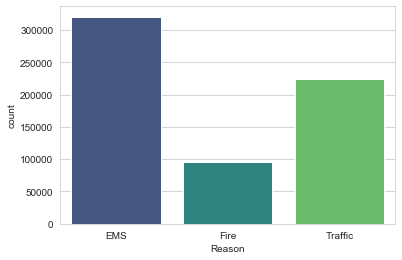
    


** Now let us begin to focus on time information. What is the data type of the objects in the timeStamp column? **


```python
print(type('timeStamp'))
```

    <class 'str'>


** You should have seen that these timestamps are still strings. Use [pd.to_datetime](http://pandas.pydata.org/pandas-docs/stable/generated/pandas.to_datetime.html) to convert the column from strings to DateTime objects. **


```python
df['timeStamp'] = pd.to_datetime(df['timeStamp'])
```

** You can now grab specific attributes from a Datetime object by calling them. For example:**

    time = df['timeStamp'].iloc[0]
    time.hour

**You can use Jupyter's tab method to explore the various attributes you can call. Now that the timestamp column are actually DateTime objects, use .apply() to create 3 new columns called Hour, Month, and Day of Week. You will create these columns based off of the timeStamp column, reference the solutions if you get stuck on this step.**


```python
df['Hour'] = df['timeStamp'].apply(lambda time: time.hour)
df['Month'] = df['timeStamp'].apply(lambda time: time.month)
df['Day of Week'] = df['timeStamp'].apply(lambda time: time.dayofweek)
```

** Notice how the Day of Week is an integer 0-6. Use the .map() with this dictionary to map the actual string names to the day of the week: **

    dmap = {0:'Mon',1:'Tue',2:'Wed',3:'Thu',4:'Fri',5:'Sat',6:'Sun'}


```python
dmap = {0:'Mon',1:'Tue',2:'Wed',3:'Thu',4:'Fri',5:'Sat',6:'Sun'}

df['Day of Week'] = df['Day of Week'].map(dmap)
```

** Now use seaborn to create a countplot of the Day of Week column with the hue based off of the Reason column. **


```python
sns.countplot(x = 'Day of Week', data = df, hue = 'Reason')

#adjusting plot legend location to fit well in the graph
plt.legend(bbox_to_anchor=(1.05, 1), loc=2, borderaxespad=0.)
```


    <matplotlib.legend.Legend at 0x1a25704190>


    
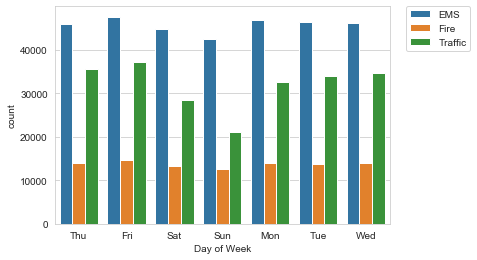
    


** Now do the same for Month:**


```python
sns.countplot(x='Month',data=df,hue='Reason',palette='viridis')

plt.legend(bbox_to_anchor=(1.05, 1), loc=2, borderaxespad=0.)
```


    <matplotlib.legend.Legend at 0x1a2e830490>


    
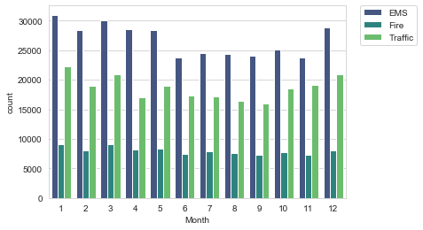
    


**Did you notice something strange about the Plot?**

_____

** You should have noticed it was missing some Months, let's see if we can maybe fill in this information by plotting the information in another way, possibly a simple line plot that fills in the missing months, in order to do this, we'll need to do some work with pandas... **

** Now create a gropuby object called byMonth, where you group the DataFrame by the month column and use the count() method for aggregation. Use the head() method on this returned DataFrame. **


```python
byMonth = df.groupby('Month').count()
byMonth.head()
```


<div>
<style scoped>
    .dataframe tbody tr th:only-of-type {
        vertical-align: middle;
    }

    .dataframe tbody tr th {
        vertical-align: top;
    }

    .dataframe thead th {
        text-align: right;
    }
</style>
<table border="1" class="dataframe">
  <thead>
    <tr style="text-align: right;">
      <th></th>
      <th>lat</th>
      <th>lng</th>
      <th>desc</th>
      <th>zip</th>
      <th>title</th>
      <th>timeStamp</th>
      <th>twp</th>
      <th>addr</th>
      <th>e</th>
      <th>Reason</th>
      <th>Hour</th>
      <th>Day of Week</th>
    </tr>
    <tr>
      <th>Month</th>
      <th></th>
      <th></th>
      <th></th>
      <th></th>
      <th></th>
      <th></th>
      <th></th>
      <th></th>
      <th></th>
      <th></th>
      <th></th>
      <th></th>
    </tr>
  </thead>
  <tbody>
    <tr>
      <th>1</th>
      <td>62336</td>
      <td>62336</td>
      <td>62336</td>
      <td>55294</td>
      <td>62336</td>
      <td>62336</td>
      <td>62312</td>
      <td>62336</td>
      <td>62336</td>
      <td>62336</td>
      <td>62336</td>
      <td>62336</td>
    </tr>
    <tr>
      <th>2</th>
      <td>55427</td>
      <td>55427</td>
      <td>55427</td>
      <td>48922</td>
      <td>55427</td>
      <td>55427</td>
      <td>55405</td>
      <td>55427</td>
      <td>55427</td>
      <td>55427</td>
      <td>55427</td>
      <td>55427</td>
    </tr>
    <tr>
      <th>3</th>
      <td>60027</td>
      <td>60027</td>
      <td>60027</td>
      <td>53252</td>
      <td>60027</td>
      <td>60027</td>
      <td>60001</td>
      <td>60027</td>
      <td>60027</td>
      <td>60027</td>
      <td>60027</td>
      <td>60027</td>
    </tr>
    <tr>
      <th>4</th>
      <td>53671</td>
      <td>53671</td>
      <td>53671</td>
      <td>47349</td>
      <td>53671</td>
      <td>53671</td>
      <td>53655</td>
      <td>53671</td>
      <td>53671</td>
      <td>53671</td>
      <td>53671</td>
      <td>53671</td>
    </tr>
    <tr>
      <th>5</th>
      <td>55687</td>
      <td>55687</td>
      <td>55687</td>
      <td>48724</td>
      <td>55687</td>
      <td>55687</td>
      <td>55655</td>
      <td>55687</td>
      <td>55687</td>
      <td>55687</td>
      <td>55687</td>
      <td>55687</td>
    </tr>
  </tbody>
</table>
</div>


** Now create a simple plot off of the dataframe indicating the count of calls per month. **


```python
byMonth['title'].plot()
```


    <matplotlib.axes._subplots.AxesSubplot at 0x1a24ea5f90>


    
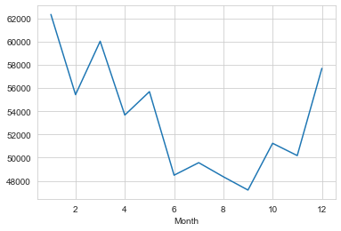
    


** Now see if you can use seaborn's lmplot() to create a linear fit on the number of calls per month. Keep in mind you may need to reset the index to a column. **


```python
sns.lmplot(x='Month',y='title',data=byMonth.reset_index())
```


    <seaborn.axisgrid.FacetGrid at 0x1a24f4b090>


    
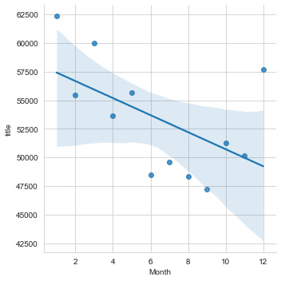
    


**Create a new column called 'Date' that contains the date from the timeStamp column. You'll need to use apply along with the .date() method. ** 


```python
df['Date']=df['timeStamp'].apply(lambda t: t.date())
```

** Now groupby this Date column with the count() aggregate and create a plot of counts of 911 calls.**


```python
df.groupby('Date').count()['title'].plot()
plt.tight_layout()
```


    
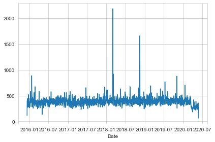
    


** Now recreate this plot but create 3 separate plots with each plot representing a Reason for the 911 call**


```python
df[df['Reason']=='Fire'].groupby('Date').count()['twp'].plot()
plt.title('Fire')
plt.tight_layout()
```


    
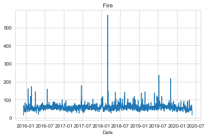
    


```python
df[df['Reason']=='Traffic'].groupby('Date').count()['twp'].plot()
plt.title('Traffic')
plt.tight_layout()
```


    
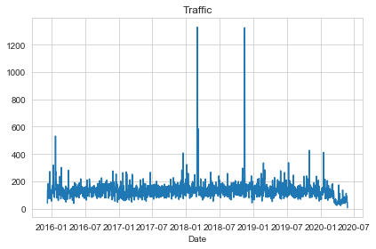
    


```python
df[df['Reason']=='EMS'].groupby('Date').count()['twp'].plot()
plt.title('EMS')
plt.tight_layout()
```


    
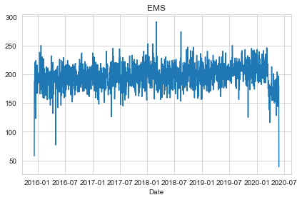
    


____
** Now let's move on to creating  heatmaps with seaborn and our data. We'll first need to restructure the dataframe so that the columns become the Hours and the Index becomes the Day of the Week. There are lots of ways to do this, but I would recommend trying to combine groupby with an [unstack](http://pandas.pydata.org/pandas-docs/stable/generated/pandas.DataFrame.unstack.html) method. Reference the solutions if you get stuck on this!**


```python
dayHour = df.groupby(by=['Day of Week','Hour']).count()['Reason'].unstack()
dayHour.head()
```


<div>
<style scoped>
    .dataframe tbody tr th:only-of-type {
        vertical-align: middle;
    }

    .dataframe tbody tr th {
        vertical-align: top;
    }

    .dataframe thead th {
        text-align: right;
    }
</style>
<table border="1" class="dataframe">
  <thead>
    <tr style="text-align: right;">
      <th>Hour</th>
      <th>0</th>
      <th>1</th>
      <th>2</th>
      <th>3</th>
      <th>4</th>
      <th>5</th>
      <th>6</th>
      <th>7</th>
      <th>8</th>
      <th>9</th>
      <th>...</th>
      <th>14</th>
      <th>15</th>
      <th>16</th>
      <th>17</th>
      <th>18</th>
      <th>19</th>
      <th>20</th>
      <th>21</th>
      <th>22</th>
      <th>23</th>
    </tr>
    <tr>
      <th>Day of Week</th>
      <th></th>
      <th></th>
      <th></th>
      <th></th>
      <th></th>
      <th></th>
      <th></th>
      <th></th>
      <th></th>
      <th></th>
      <th></th>
      <th></th>
      <th></th>
      <th></th>
      <th></th>
      <th></th>
      <th></th>
      <th></th>
      <th></th>
      <th></th>
      <th></th>
    </tr>
  </thead>
  <tbody>
    <tr>
      <th>Fri</th>
      <td>1913</td>
      <td>1570</td>
      <td>1396</td>
      <td>1256</td>
      <td>1283</td>
      <td>1581</td>
      <td>2592</td>
      <td>4048</td>
      <td>4888</td>
      <td>5129</td>
      <td>...</td>
      <td>6158</td>
      <td>6784</td>
      <td>6857</td>
      <td>6886</td>
      <td>5476</td>
      <td>4877</td>
      <td>4213</td>
      <td>3740</td>
      <td>3298</td>
      <td>2759</td>
    </tr>
    <tr>
      <th>Mon</th>
      <td>1826</td>
      <td>1507</td>
      <td>1316</td>
      <td>1230</td>
      <td>1296</td>
      <td>1782</td>
      <td>2602</td>
      <td>4324</td>
      <td>5375</td>
      <td>5562</td>
      <td>...</td>
      <td>5464</td>
      <td>5990</td>
      <td>6147</td>
      <td>6215</td>
      <td>5258</td>
      <td>4332</td>
      <td>3651</td>
      <td>3135</td>
      <td>2572</td>
      <td>2007</td>
    </tr>
    <tr>
      <th>Sat</th>
      <td>2350</td>
      <td>1982</td>
      <td>1831</td>
      <td>1540</td>
      <td>1392</td>
      <td>1511</td>
      <td>1820</td>
      <td>2415</td>
      <td>3352</td>
      <td>4189</td>
      <td>...</td>
      <td>5251</td>
      <td>4996</td>
      <td>5030</td>
      <td>5016</td>
      <td>4810</td>
      <td>4605</td>
      <td>3990</td>
      <td>3747</td>
      <td>3099</td>
      <td>2857</td>
    </tr>
    <tr>
      <th>Sun</th>
      <td>2345</td>
      <td>2075</td>
      <td>1881</td>
      <td>1565</td>
      <td>1421</td>
      <td>1427</td>
      <td>1681</td>
      <td>2322</td>
      <td>2911</td>
      <td>3596</td>
      <td>...</td>
      <td>4561</td>
      <td>4315</td>
      <td>4402</td>
      <td>4357</td>
      <td>4235</td>
      <td>4010</td>
      <td>3605</td>
      <td>3023</td>
      <td>2517</td>
      <td>2244</td>
    </tr>
    <tr>
      <th>Thu</th>
      <td>1648</td>
      <td>1353</td>
      <td>1357</td>
      <td>1187</td>
      <td>1217</td>
      <td>1707</td>
      <td>2727</td>
      <td>4324</td>
      <td>5170</td>
      <td>5219</td>
      <td>...</td>
      <td>5865</td>
      <td>6247</td>
      <td>6171</td>
      <td>6732</td>
      <td>5333</td>
      <td>4545</td>
      <td>3939</td>
      <td>3375</td>
      <td>2735</td>
      <td>2272</td>
    </tr>
  </tbody>
</table>
<p>5 rows × 24 columns</p>
</div>


** Now create a HeatMap using this new DataFrame. **


```python
plt.figure()
sns.heatmap(dayHour,cmap='viridis')
```


    <matplotlib.axes._subplots.AxesSubplot at 0x1a26341b90>


    
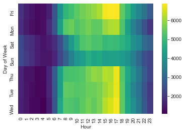
    


** Now create a clustermap using this DataFrame. **


```python
sns.clustermap(dayHour,cmap='viridis')
```


    <seaborn.matrix.ClusterGrid at 0x1a2ebefe90>


    
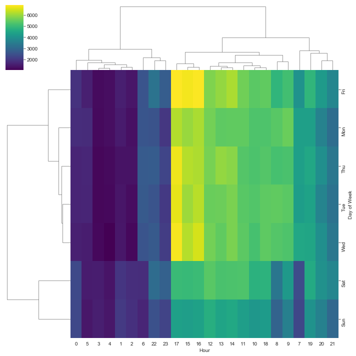
    


** Now repeat these same plots and operations, for a DataFrame that shows the Month as the column. **


```python
dayMonth = df.groupby(by=['Day of Week','Month']).count()['Reason'].unstack()
dayMonth.head()
```


<div>
<style scoped>
    .dataframe tbody tr th:only-of-type {
        vertical-align: middle;
    }

    .dataframe tbody tr th {
        vertical-align: top;
    }

    .dataframe thead th {
        text-align: right;
    }
</style>
<table border="1" class="dataframe">
  <thead>
    <tr style="text-align: right;">
      <th>Month</th>
      <th>1</th>
      <th>2</th>
      <th>3</th>
      <th>4</th>
      <th>5</th>
      <th>6</th>
      <th>7</th>
      <th>8</th>
      <th>9</th>
      <th>10</th>
      <th>11</th>
      <th>12</th>
    </tr>
    <tr>
      <th>Day of Week</th>
      <th></th>
      <th></th>
      <th></th>
      <th></th>
      <th></th>
      <th></th>
      <th></th>
      <th></th>
      <th></th>
      <th></th>
      <th></th>
      <th></th>
    </tr>
  </thead>
  <tbody>
    <tr>
      <th>Fri</th>
      <td>9309</td>
      <td>8255</td>
      <td>10941</td>
      <td>7997</td>
      <td>8566</td>
      <td>7647</td>
      <td>7103</td>
      <td>7336</td>
      <td>7694</td>
      <td>6934</td>
      <td>8379</td>
      <td>9305</td>
    </tr>
    <tr>
      <th>Mon</th>
      <td>8896</td>
      <td>8747</td>
      <td>8060</td>
      <td>8410</td>
      <td>7881</td>
      <td>6740</td>
      <td>7929</td>
      <td>6854</td>
      <td>6598</td>
      <td>8075</td>
      <td>6722</td>
      <td>8492</td>
    </tr>
    <tr>
      <th>Sat</th>
      <td>8475</td>
      <td>7593</td>
      <td>8050</td>
      <td>7514</td>
      <td>6900</td>
      <td>6839</td>
      <td>6395</td>
      <td>6111</td>
      <td>6566</td>
      <td>6609</td>
      <td>6773</td>
      <td>8592</td>
    </tr>
    <tr>
      <th>Sun</th>
      <td>7478</td>
      <td>6452</td>
      <td>6766</td>
      <td>6865</td>
      <td>6423</td>
      <td>5673</td>
      <td>6567</td>
      <td>5275</td>
      <td>5956</td>
      <td>6316</td>
      <td>5196</td>
      <td>7165</td>
    </tr>
    <tr>
      <th>Thu</th>
      <td>9055</td>
      <td>7997</td>
      <td>8849</td>
      <td>7722</td>
      <td>8449</td>
      <td>7850</td>
      <td>6964</td>
      <td>7508</td>
      <td>6954</td>
      <td>7482</td>
      <td>8358</td>
      <td>8151</td>
    </tr>
  </tbody>
</table>
</div>


```python
plt.figure()
sns.heatmap(dayMonth,cmap='viridis')
```


    <matplotlib.axes._subplots.AxesSubplot at 0x1a26336450>


    
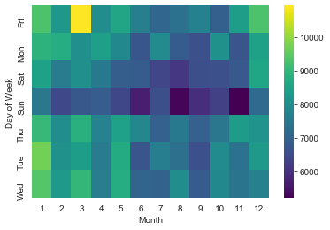
    


```python
sns.clustermap(dayMonth,cmap='viridis')
```


    <seaborn.matrix.ClusterGrid at 0x1a31bc7e90>


    

    


**Continue exploring the Data however you see fit!**
# Great Job!
