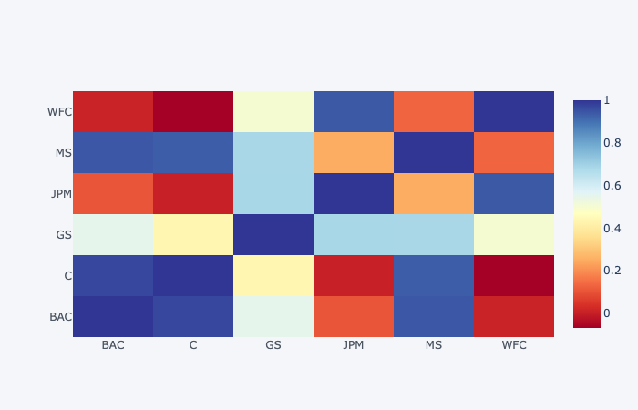

# Finance Data Project 

In this data project we will focus on exploratory data analysis of stock prices. Keep in mind, this project is just meant to practice your visualization and pandas skills, it is not meant to be a robust financial analysis or be taken as financial advice.
____
** NOTE: This project is extremely challenging because it will introduce a lot of new concepts and have you looking things up on your own (we'll point you in the right direction) to try to solve the tasks issued. Feel free to just go through the solutions lecture notebook and video as a "walkthrough" project if you don't want to have to look things up yourself. You'll still learn a lot that way! **
____
We'll focus on bank stocks and see how they progressed throughout the [financial crisis](https://en.wikipedia.org/wiki/Financial_crisis_of_2007%E2%80%9308) all the way to early 2016.

## Get the Data

In this section we will learn how to use pandas to directly read data from Google finance using pandas!

First we need to start with the proper imports, which we've already laid out for you here.

*Note: [You'll need to install pandas-datareader for this to work!](https://github.com/pydata/pandas-datareader) Pandas datareader allows you to [read stock information directly from the internet](http://pandas.pydata.org/pandas-docs/stable/remote_data.html) Use these links for install guidance (**pip install pandas-datareader**), or just follow along with the video lecture.*

### The Imports

Already filled out for you.


```python
from pandas_datareader import data, wb
import pandas as pd
import numpy as np
import datetime
%matplotlib inline
```

## Data

We need to get data using pandas datareader. We will get stock information for the following banks:
*  Bank of America
* CitiGroup
* Goldman Sachs
* JPMorgan Chase
* Morgan Stanley
* Wells Fargo

** Figure out how to get the stock data from Jan 1st 2006 to Jan 1st 2016 for each of these banks. Set each bank to be a separate dataframe, with the variable name for that bank being its ticker symbol. This will involve a few steps:**
1. Use datetime to set start and end datetime objects.
2. Figure out the ticker symbol for each bank.
2. Figure out how to use datareader to grab info on the stock.

** Use [this documentation page](https://pandas-datareader.readthedocs.io/en/latest/remote_data.html) for hints and instructions (it should just be a matter of replacing certain values. Use google finance as a source, for example:**
    
    # Bank of America
    BAC = data.DataReader("BAC", 'google', start, end)

### WARNING: MAKE SURE TO CHECK THE LINK ABOVE FOR THE LATEST WORKING API. "google" MAY NOT ALWAYS WORK. 
------------
### We also provide pickle file in the article lecture right before the video lectures.


```python
start = datetime.datetime(2006, 1, 1)
end = datetime.datetime(2016, 1, 1)
```


```python
# Bank of America
BAC = data.DataReader("BAC", 'yahoo', start, end)

# CitiGroup
C = data.DataReader("C", 'yahoo', start, end)

# Goldman Sachs
GS = data.DataReader("GS", 'yahoo', start, end)

# JPMorgan Chase
JPM = data.DataReader("JPM", 'yahoo', start, end)

# Morgan Stanley
MS = data.DataReader("MS", 'yahoo', start, end)

# Wells Fargo
WFC = data.DataReader("WFC", 'yahoo', start, end)
```

** Create a list of the ticker symbols (as strings) in alphabetical order. Call this list: tickers**


```python
tickers = ['BAC', 'C', 'GS', 'JPM', 'MS', 'WFC']
```

** Use pd.concat to concatenate the bank dataframes together to a single data frame called bank_stocks. Set the keys argument equal to the tickers list. Also pay attention to what axis you concatenate on.**


```python
bank_stocks = pd.concat([BAC, C, GS, JPM, MS, WFC], axis = 1, keys = tickers)
```

** Set the column name levels (this is filled out for you):**


```python
bank_stocks.columns.names = ['Bank Ticker','Stock Info']
```

** Check the head of the bank_stocks dataframe.**


```python
bank_stocks.head()
```


<div>
<style scoped>
    .dataframe tbody tr th:only-of-type {
        vertical-align: middle;
    }

    .dataframe tbody tr th {
        vertical-align: top;
    }

    .dataframe thead tr th {
        text-align: left;
    }

    .dataframe thead tr:last-of-type th {
        text-align: right;
    }
</style>
<table border="1" class="dataframe">
  <thead>
    <tr>
      <th>Bank Ticker</th>
      <th colspan="6" halign="left">BAC</th>
      <th colspan="4" halign="left">C</th>
      <th>...</th>
      <th colspan="4" halign="left">MS</th>
      <th colspan="6" halign="left">WFC</th>
    </tr>
    <tr>
      <th>Stock Info</th>
      <th>High</th>
      <th>Low</th>
      <th>Open</th>
      <th>Close</th>
      <th>Volume</th>
      <th>Adj Close</th>
      <th>High</th>
      <th>Low</th>
      <th>Open</th>
      <th>Close</th>
      <th>...</th>
      <th>Open</th>
      <th>Close</th>
      <th>Volume</th>
      <th>Adj Close</th>
      <th>High</th>
      <th>Low</th>
      <th>Open</th>
      <th>Close</th>
      <th>Volume</th>
      <th>Adj Close</th>
    </tr>
    <tr>
      <th>Date</th>
      <th></th>
      <th></th>
      <th></th>
      <th></th>
      <th></th>
      <th></th>
      <th></th>
      <th></th>
      <th></th>
      <th></th>
      <th></th>
      <th></th>
      <th></th>
      <th></th>
      <th></th>
      <th></th>
      <th></th>
      <th></th>
      <th></th>
      <th></th>
      <th></th>
    </tr>
  </thead>
  <tbody>
    <tr>
      <th>2006-01-03</th>
      <td>47.180000</td>
      <td>46.150002</td>
      <td>46.919998</td>
      <td>47.080002</td>
      <td>16296700.0</td>
      <td>35.298687</td>
      <td>493.799988</td>
      <td>481.100006</td>
      <td>490.000000</td>
      <td>492.899994</td>
      <td>...</td>
      <td>57.169998</td>
      <td>58.310001</td>
      <td>5377000.0</td>
      <td>37.399338</td>
      <td>31.975000</td>
      <td>31.195000</td>
      <td>31.600000</td>
      <td>31.900000</td>
      <td>11016400.0</td>
      <td>20.904305</td>
    </tr>
    <tr>
      <th>2006-01-04</th>
      <td>47.240002</td>
      <td>46.450001</td>
      <td>47.000000</td>
      <td>46.580002</td>
      <td>17757900.0</td>
      <td>34.923801</td>
      <td>491.000000</td>
      <td>483.500000</td>
      <td>488.600006</td>
      <td>483.799988</td>
      <td>...</td>
      <td>58.700001</td>
      <td>58.349998</td>
      <td>7977800.0</td>
      <td>37.424999</td>
      <td>31.820000</td>
      <td>31.365000</td>
      <td>31.799999</td>
      <td>31.530001</td>
      <td>10870000.0</td>
      <td>20.661839</td>
    </tr>
    <tr>
      <th>2006-01-05</th>
      <td>46.830002</td>
      <td>46.320000</td>
      <td>46.580002</td>
      <td>46.639999</td>
      <td>14970700.0</td>
      <td>34.968796</td>
      <td>487.799988</td>
      <td>484.000000</td>
      <td>484.399994</td>
      <td>486.200012</td>
      <td>...</td>
      <td>58.549999</td>
      <td>58.509998</td>
      <td>5778000.0</td>
      <td>37.527611</td>
      <td>31.555000</td>
      <td>31.309999</td>
      <td>31.500000</td>
      <td>31.495001</td>
      <td>10158000.0</td>
      <td>20.638908</td>
    </tr>
    <tr>
      <th>2006-01-06</th>
      <td>46.910000</td>
      <td>46.349998</td>
      <td>46.799999</td>
      <td>46.570000</td>
      <td>12599800.0</td>
      <td>34.916302</td>
      <td>489.000000</td>
      <td>482.000000</td>
      <td>488.799988</td>
      <td>486.200012</td>
      <td>...</td>
      <td>58.770000</td>
      <td>58.570000</td>
      <td>6889800.0</td>
      <td>37.566090</td>
      <td>31.775000</td>
      <td>31.385000</td>
      <td>31.580000</td>
      <td>31.680000</td>
      <td>8403800.0</td>
      <td>20.760138</td>
    </tr>
    <tr>
      <th>2006-01-09</th>
      <td>46.970001</td>
      <td>46.360001</td>
      <td>46.720001</td>
      <td>46.599998</td>
      <td>15619400.0</td>
      <td>34.938789</td>
      <td>487.399994</td>
      <td>483.000000</td>
      <td>486.000000</td>
      <td>483.899994</td>
      <td>...</td>
      <td>58.630001</td>
      <td>59.189999</td>
      <td>4144500.0</td>
      <td>37.963749</td>
      <td>31.825001</td>
      <td>31.555000</td>
      <td>31.674999</td>
      <td>31.674999</td>
      <td>5619600.0</td>
      <td>20.756863</td>
    </tr>
  </tbody>
</table>
<p>5 rows × 36 columns</p>
</div>


# EDA

Let's explore the data a bit! Before continuing, I encourage you to check out the documentation on [Multi-Level Indexing](http://pandas.pydata.org/pandas-docs/stable/advanced.html) and [Using .xs](http://pandas.pydata.org/pandas-docs/stable/generated/pandas.DataFrame.xs.html).
Reference the solutions if you can not figure out how to use .xs(), since that will be a major part of this project.

** What is the max Close price for each bank's stock throughout the time period?**


```python
bank_stocks.xs(key = 'Close', axis = 1, level = 'Stock Info').max()
```


    Bank Ticker
    BAC     54.900002
    C      564.099976
    GS     247.919998
    JPM     70.080002
    MS      89.300003
    WFC     58.520000
    dtype: float64


** Create a new empty DataFrame called returns. This dataframe will contain the returns for each bank's stock. returns are typically defined by:**

$$r_t = \frac{p_t - p_{t-1}}{p_{t-1}} = \frac{p_t}{p_{t-1}} - 1$$


```python
returns = pd.DataFrame()
```

** We can use pandas pct_change() method on the Close column to create a column representing this return value. Create a for loop that goes and for each Bank Stock Ticker creates this returns column and set's it as a column in the returns DataFrame.**


```python
for i in tickers:
    returns[i + ' Returns'] = bank_stocks[i]['Close'].pct_change()
    
returns.head()
```


<div>
<style scoped>
    .dataframe tbody tr th:only-of-type {
        vertical-align: middle;
    }

    .dataframe tbody tr th {
        vertical-align: top;
    }

    .dataframe thead th {
        text-align: right;
    }
</style>
<table border="1" class="dataframe">
  <thead>
    <tr style="text-align: right;">
      <th></th>
      <th>BAC Returns</th>
      <th>C Returns</th>
      <th>GS Returns</th>
      <th>JPM Returns</th>
      <th>MS Returns</th>
      <th>WFC Returns</th>
    </tr>
    <tr>
      <th>Date</th>
      <th></th>
      <th></th>
      <th></th>
      <th></th>
      <th></th>
      <th></th>
    </tr>
  </thead>
  <tbody>
    <tr>
      <th>2006-01-03</th>
      <td>NaN</td>
      <td>NaN</td>
      <td>NaN</td>
      <td>NaN</td>
      <td>NaN</td>
      <td>NaN</td>
    </tr>
    <tr>
      <th>2006-01-04</th>
      <td>-0.010620</td>
      <td>-0.018462</td>
      <td>-0.013812</td>
      <td>-0.014183</td>
      <td>0.000686</td>
      <td>-0.011599</td>
    </tr>
    <tr>
      <th>2006-01-05</th>
      <td>0.001288</td>
      <td>0.004961</td>
      <td>-0.000393</td>
      <td>0.003029</td>
      <td>0.002742</td>
      <td>-0.001110</td>
    </tr>
    <tr>
      <th>2006-01-06</th>
      <td>-0.001501</td>
      <td>0.000000</td>
      <td>0.014169</td>
      <td>0.007046</td>
      <td>0.001025</td>
      <td>0.005874</td>
    </tr>
    <tr>
      <th>2006-01-09</th>
      <td>0.000644</td>
      <td>-0.004731</td>
      <td>0.012030</td>
      <td>0.016242</td>
      <td>0.010586</td>
      <td>-0.000158</td>
    </tr>
  </tbody>
</table>
</div>


** Create a pairplot using seaborn of the returns dataframe. What stock stands out to you? Can you figure out why?**


```python
import seaborn as sns

sns.pairplot(returns)
```


    <seaborn.axisgrid.PairGrid at 0x11fa2b0d0>


    

    


Background on [Citigroup's Stock Crash available here.](https://en.wikipedia.org/wiki/Citigroup#November_2008.2C_Collapse_.26_US_Government_Intervention_.28part_of_the_Global_Financial_Crisis.29) 

You'll also see the enormous crash in value if you take a look a the stock price plot (which we do later in the visualizations.)

** Using this returns DataFrame, figure out on what dates each bank stock had the best and worst single day returns. You should notice that 4 of the banks share the same day for the worst drop, did anything significant happen that day?**


```python
returns.idxmax()
```


    BAC Returns   2009-04-09
    C Returns     2008-11-24
    GS Returns    2008-11-24
    JPM Returns   2009-01-21
    MS Returns    2008-10-13
    WFC Returns   2008-07-16
    dtype: datetime64[ns]


```python
returns.idxmin()
```


    BAC Returns   2009-01-20
    C Returns     2009-02-27
    GS Returns    2009-01-20
    JPM Returns   2009-01-20
    MS Returns    2008-10-09
    WFC Returns   2009-01-20
    dtype: datetime64[ns]


** You should have noticed that Citigroup's largest drop and biggest gain were very close to one another, did anythign significant happen in that time frame? **

** Take a look at the standard deviation of the returns, which stock would you classify as the riskiest over the entire time period? Which would you classify as the riskiest for the year 2015?**


```python
returns.std()
```


    BAC Returns    0.036647
    C Returns      0.038672
    GS Returns     0.025390
    JPM Returns    0.027667
    MS Returns     0.037819
    WFC Returns    0.030238
    dtype: float64


```python
returns.loc['2015-01-01':'2015-12-31'].std()
```


    BAC Returns    0.016163
    C Returns      0.015289
    GS Returns     0.014046
    JPM Returns    0.014017
    MS Returns     0.016249
    WFC Returns    0.012591
    dtype: float64


** Create a distplot using seaborn of the 2015 returns for Morgan Stanley **


```python
sns.distplot(returns.loc['2015-01-01':'2015-12-31']['MS Returns'], color = 'purple', bins = 50)
```


    <matplotlib.axes._subplots.AxesSubplot at 0x1a2398ac10>


    

    


** Create a distplot using seaborn of the 2008 returns for CitiGroup **


```python
sns.distplot(returns.loc['2008-01-01':'2008-12-31']['C Returns'],color='blue',bins=70)
```


    <matplotlib.axes._subplots.AxesSubplot at 0x1a23f2a090>


    

    


____
# More Visualization

A lot of this project will focus on visualizations. Feel free to use any of your preferred visualization libraries to try to recreate the described plots below, seaborn, matplotlib, plotly and cufflinks, or just pandas.

### Imports


```python
import matplotlib.pyplot as plt
import seaborn as sns
sns.set_style('whitegrid')
%matplotlib inline

# Optional Plotly Method Imports
import plotly
import plotly.express as px
import cufflinks as cf
cf.go_offline()
```


<script type="text/javascript">
window.PlotlyConfig = {MathJaxConfig: 'local'};
if (window.MathJax) {MathJax.Hub.Config({SVG: {font: "STIX-Web"}});}
if (typeof require !== 'undefined') {
require.undef("plotly");
requirejs.config({
    paths: {
        'plotly': ['https://cdn.plot.ly/plotly-latest.min']
    }
});
require(['plotly'], function(Plotly) {
    window._Plotly = Plotly;
});
}
</script>


** Create a line plot showing Close price for each bank for the entire index of time. (Hint: Try using a for loop, or use [.xs](http://pandas.pydata.org/pandas-docs/stable/generated/pandas.DataFrame.xs.html) to get a cross section of the data.)**


```python
bank_stocks.xs(key='Close',axis=1,level='Stock Info').plot(figsize= (20,10))
```


    <matplotlib.axes._subplots.AxesSubplot at 0x1a249bcd10>


    

    


## Moving Averages

Let's analyze the moving averages for these stocks in the year 2008. 

** Plot the rolling 30 day average against the Close Price for Bank Of America's stock for the year 2008**


```python
plt.figure(figsize=(20, 10))
BAC['Close'].loc['2008-01-01':'2009-01-01'].rolling(window=30).mean().plot(label='Rolling Thirty Day Average')
BAC['Close'].loc['2008-01-01':'2009-01-01'].plot(label='Bank of America Close Price')
plt.legend()
```


    <matplotlib.legend.Legend at 0x1a232b2150>


    

    


** Create a heatmap of the correlation between the stocks Close Price.**


```python
sns.heatmap(bank_stocks.xs(key='Close',axis=1,level='Stock Info').corr())
```


    <matplotlib.axes._subplots.AxesSubplot at 0x1a240abc10>


    

    


** Optional: Use seaborn's clustermap to cluster the correlations together:**


```python
fig2 = bank_stocks.xs(key='Close',axis=1,level='Stock Info').corr()
fig2.iplot(kind='heatmap',colorscale='rdylbu')
```


# Part 2 (Optional)

In this second part of the project we will rely on the cufflinks library to create some Technical Analysis plots. This part of the project is experimental due to its heavy reliance on the cuffinks project, so feel free to skip it if any functionality is broken in the future.

** Use .iplot(kind='candle) to create a candle plot of Bank of America's stock from Jan 1st 2015 to Jan 1st 2016.**


```python
BAC[['Open', 'High', 'Low', 'Close']].loc['2015-01-01':'2016-01-01'].iplot(kind='candle')
```


** Use .ta_plot(study='sma') to create a Simple Moving Averages plot of Morgan Stanley for the year 2015.**


```python
MS['Close'].loc['2015-01-01':'2016-01-01'].ta_plot(study='sma', periods=[13,21,55],title='Simple Moving Averages Plot')
```


**Use .ta_plot(study='boll') to create a Bollinger Band Plot for Bank of America for the year 2015.**


```python
BAC['Close'].loc['2015-01-01':'2016-01-01'].ta_plot(study='boll')
```


# Great Job!

Definitely a lot of more specific finance topics here, so don't worry if you didn't understand them all! The only thing you should be concerned with understanding are the basic pandas and visualization operations.
