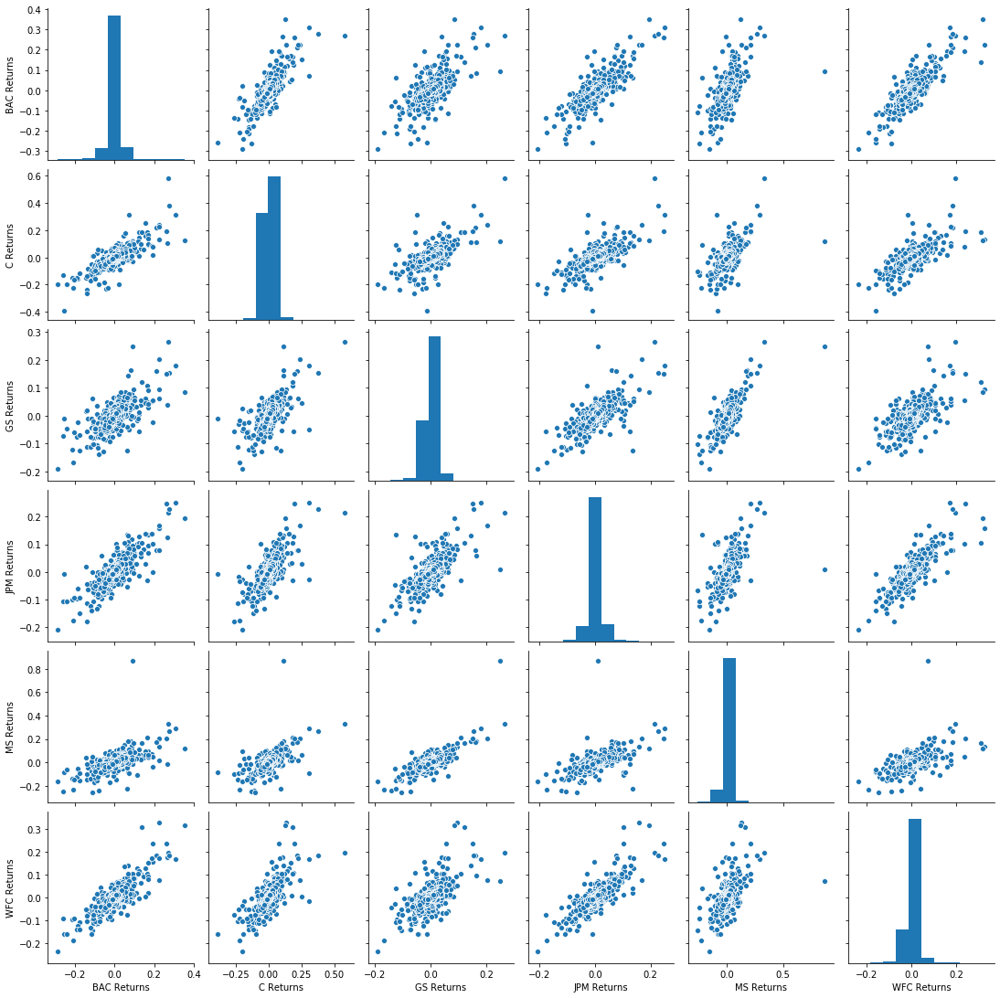
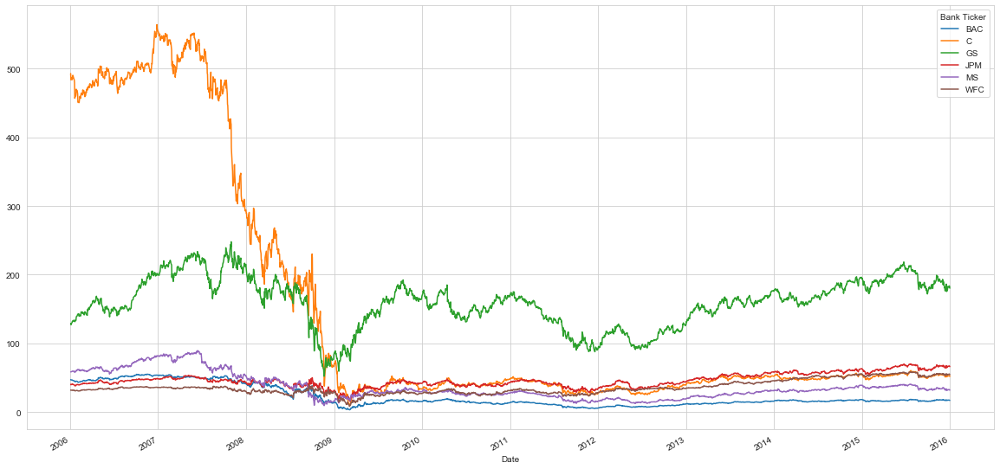

# Finance Data Project 

In this data project we will focus on exploratory data analysis of stock prices. Keep in mind, this project is just meant to practice your visualization and pandas skills, it is not meant to be a robust financial analysis or be taken as financial advice.
____
** NOTE: This project is extremely challenging because it will introduce a lot of new concepts and have you looking things up on your own (we'll point you in the right direction) to try to solve the tasks issued. Feel free to just go through the solutions lecture notebook and video as a "walkthrough" project if you don't want to have to look things up yourself. You'll still learn a lot that way! **
____
We'll focus on bank stocks and see how they progressed throughout the [financial crisis](https://en.wikipedia.org/wiki/Financial_crisis_of_2007%E2%80%9308) all the way to early 2016.

## Get the Data

In this section we will learn how to use pandas to directly read data from Google finance using pandas!

First we need to start with the proper imports, which we've already laid out for you here.

*Note: [You'll need to install pandas-datareader for this to work!](https://github.com/pydata/pandas-datareader) Pandas datareader allows you to [read stock information directly from the internet](http://pandas.pydata.org/pandas-docs/stable/remote_data.html) Use these links for install guidance (**pip install pandas-datareader**), or just follow along with the video lecture.*

### The Imports

Already filled out for you.


```python
from pandas_datareader import data, wb
import pandas as pd
import numpy as np
import datetime
%matplotlib inline
```

## Data

We need to get data using pandas datareader. We will get stock information for the following banks:
*  Bank of America
* CitiGroup
* Goldman Sachs
* JPMorgan Chase
* Morgan Stanley
* Wells Fargo

** Figure out how to get the stock data from Jan 1st 2006 to Jan 1st 2016 for each of these banks. Set each bank to be a separate dataframe, with the variable name for that bank being its ticker symbol. This will involve a few steps:**
1. Use datetime to set start and end datetime objects.
2. Figure out the ticker symbol for each bank.
2. Figure out how to use datareader to grab info on the stock.

** Use [this documentation page](https://pandas-datareader.readthedocs.io/en/latest/remote_data.html) for hints and instructions (it should just be a matter of replacing certain values. Use google finance as a source, for example:**
    
    # Bank of America
    BAC = data.DataReader("BAC", 'google', start, end)

### WARNING: MAKE SURE TO CHECK THE LINK ABOVE FOR THE LATEST WORKING API. "google" MAY NOT ALWAYS WORK. 
------------
### We also provide pickle file in the article lecture right before the video lectures.


```python
start = datetime.datetime(2006, 1, 1)
end = datetime.datetime(2016, 1, 1)
```


```python
# Bank of America
BAC = data.DataReader("BAC", 'yahoo', start, end)

# CitiGroup
C = data.DataReader("C", 'yahoo', start, end)

# Goldman Sachs
GS = data.DataReader("GS", 'yahoo', start, end)

# JPMorgan Chase
JPM = data.DataReader("JPM", 'yahoo', start, end)

# Morgan Stanley
MS = data.DataReader("MS", 'yahoo', start, end)

# Wells Fargo
WFC = data.DataReader("WFC", 'yahoo', start, end)
```

** Create a list of the ticker symbols (as strings) in alphabetical order. Call this list: tickers**


```python
tickers = ['BAC', 'C', 'GS', 'JPM', 'MS', 'WFC']
```

** Use pd.concat to concatenate the bank dataframes together to a single data frame called bank_stocks. Set the keys argument equal to the tickers list. Also pay attention to what axis you concatenate on.**


```python
bank_stocks = pd.concat([BAC, C, GS, JPM, MS, WFC], axis = 1, keys = tickers)
```

** Set the column name levels (this is filled out for you):**


```python
bank_stocks.columns.names = ['Bank Ticker','Stock Info']
```

** Check the head of the bank_stocks dataframe.**


```python
bank_stocks.head()
```


<div>
<style scoped>
    .dataframe tbody tr th:only-of-type {
        vertical-align: middle;
    }

    .dataframe tbody tr th {
        vertical-align: top;
    }

    .dataframe thead tr th {
        text-align: left;
    }

    .dataframe thead tr:last-of-type th {
        text-align: right;
    }
</style>
<table border="1" class="dataframe">
  <thead>
    <tr>
      <th>Bank Ticker</th>
      <th colspan="6" halign="left">BAC</th>
      <th colspan="4" halign="left">C</th>
      <th>...</th>
      <th colspan="4" halign="left">MS</th>
      <th colspan="6" halign="left">WFC</th>
    </tr>
    <tr>
      <th>Stock Info</th>
      <th>High</th>
      <th>Low</th>
      <th>Open</th>
      <th>Close</th>
      <th>Volume</th>
      <th>Adj Close</th>
      <th>High</th>
      <th>Low</th>
      <th>Open</th>
      <th>Close</th>
      <th>...</th>
      <th>Open</th>
      <th>Close</th>
      <th>Volume</th>
      <th>Adj Close</th>
      <th>High</th>
      <th>Low</th>
      <th>Open</th>
      <th>Close</th>
      <th>Volume</th>
      <th>Adj Close</th>
    </tr>
    <tr>
      <th>Date</th>
      <th></th>
      <th></th>
      <th></th>
      <th></th>
      <th></th>
      <th></th>
      <th></th>
      <th></th>
      <th></th>
      <th></th>
      <th></th>
      <th></th>
      <th></th>
      <th></th>
      <th></th>
      <th></th>
      <th></th>
      <th></th>
      <th></th>
      <th></th>
      <th></th>
    </tr>
  </thead>
  <tbody>
    <tr>
      <th>2006-01-03</th>
      <td>47.180000</td>
      <td>46.150002</td>
      <td>46.919998</td>
      <td>47.080002</td>
      <td>16296700.0</td>
      <td>35.298687</td>
      <td>493.799988</td>
      <td>481.100006</td>
      <td>490.000000</td>
      <td>492.899994</td>
      <td>...</td>
      <td>57.169998</td>
      <td>58.310001</td>
      <td>5377000.0</td>
      <td>37.399338</td>
      <td>31.975000</td>
      <td>31.195000</td>
      <td>31.600000</td>
      <td>31.900000</td>
      <td>11016400.0</td>
      <td>20.904305</td>
    </tr>
    <tr>
      <th>2006-01-04</th>
      <td>47.240002</td>
      <td>46.450001</td>
      <td>47.000000</td>
      <td>46.580002</td>
      <td>17757900.0</td>
      <td>34.923801</td>
      <td>491.000000</td>
      <td>483.500000</td>
      <td>488.600006</td>
      <td>483.799988</td>
      <td>...</td>
      <td>58.700001</td>
      <td>58.349998</td>
      <td>7977800.0</td>
      <td>37.424999</td>
      <td>31.820000</td>
      <td>31.365000</td>
      <td>31.799999</td>
      <td>31.530001</td>
      <td>10870000.0</td>
      <td>20.661839</td>
    </tr>
    <tr>
      <th>2006-01-05</th>
      <td>46.830002</td>
      <td>46.320000</td>
      <td>46.580002</td>
      <td>46.639999</td>
      <td>14970700.0</td>
      <td>34.968796</td>
      <td>487.799988</td>
      <td>484.000000</td>
      <td>484.399994</td>
      <td>486.200012</td>
      <td>...</td>
      <td>58.549999</td>
      <td>58.509998</td>
      <td>5778000.0</td>
      <td>37.527611</td>
      <td>31.555000</td>
      <td>31.309999</td>
      <td>31.500000</td>
      <td>31.495001</td>
      <td>10158000.0</td>
      <td>20.638908</td>
    </tr>
    <tr>
      <th>2006-01-06</th>
      <td>46.910000</td>
      <td>46.349998</td>
      <td>46.799999</td>
      <td>46.570000</td>
      <td>12599800.0</td>
      <td>34.916302</td>
      <td>489.000000</td>
      <td>482.000000</td>
      <td>488.799988</td>
      <td>486.200012</td>
      <td>...</td>
      <td>58.770000</td>
      <td>58.570000</td>
      <td>6889800.0</td>
      <td>37.566090</td>
      <td>31.775000</td>
      <td>31.385000</td>
      <td>31.580000</td>
      <td>31.680000</td>
      <td>8403800.0</td>
      <td>20.760138</td>
    </tr>
    <tr>
      <th>2006-01-09</th>
      <td>46.970001</td>
      <td>46.360001</td>
      <td>46.720001</td>
      <td>46.599998</td>
      <td>15619400.0</td>
      <td>34.938789</td>
      <td>487.399994</td>
      <td>483.000000</td>
      <td>486.000000</td>
      <td>483.899994</td>
      <td>...</td>
      <td>58.630001</td>
      <td>59.189999</td>
      <td>4144500.0</td>
      <td>37.963749</td>
      <td>31.825001</td>
      <td>31.555000</td>
      <td>31.674999</td>
      <td>31.674999</td>
      <td>5619600.0</td>
      <td>20.756863</td>
    </tr>
  </tbody>
</table>
<p>5 rows × 36 columns</p>
</div>


# EDA

Let's explore the data a bit! Before continuing, I encourage you to check out the documentation on [Multi-Level Indexing](http://pandas.pydata.org/pandas-docs/stable/advanced.html) and [Using .xs](http://pandas.pydata.org/pandas-docs/stable/generated/pandas.DataFrame.xs.html).
Reference the solutions if you can not figure out how to use .xs(), since that will be a major part of this project.

** What is the max Close price for each bank's stock throughout the time period?**


```python
bank_stocks.xs(key = 'Close', axis = 1, level = 'Stock Info').max()
```


    Bank Ticker
    BAC     54.900002
    C      564.099976
    GS     247.919998
    JPM     70.080002
    MS      89.300003
    WFC     58.520000
    dtype: float64


** Create a new empty DataFrame called returns. This dataframe will contain the returns for each bank's stock. returns are typically defined by:**

$$r_t = \frac{p_t - p_{t-1}}{p_{t-1}} = \frac{p_t}{p_{t-1}} - 1$$


```python
returns = pd.DataFrame()
```

** We can use pandas pct_change() method on the Close column to create a column representing this return value. Create a for loop that goes and for each Bank Stock Ticker creates this returns column and set's it as a column in the returns DataFrame.**


```python
for i in tickers:
    returns[i + ' Returns'] = bank_stocks[i]['Close'].pct_change()
    
returns.head()
```


<div>
<style scoped>
    .dataframe tbody tr th:only-of-type {
        vertical-align: middle;
    }

    .dataframe tbody tr th {
        vertical-align: top;
    }

    .dataframe thead th {
        text-align: right;
    }
</style>
<table border="1" class="dataframe">
  <thead>
    <tr style="text-align: right;">
      <th></th>
      <th>BAC Returns</th>
      <th>C Returns</th>
      <th>GS Returns</th>
      <th>JPM Returns</th>
      <th>MS Returns</th>
      <th>WFC Returns</th>
    </tr>
    <tr>
      <th>Date</th>
      <th></th>
      <th></th>
      <th></th>
      <th></th>
      <th></th>
      <th></th>
    </tr>
  </thead>
  <tbody>
    <tr>
      <th>2006-01-03</th>
      <td>NaN</td>
      <td>NaN</td>
      <td>NaN</td>
      <td>NaN</td>
      <td>NaN</td>
      <td>NaN</td>
    </tr>
    <tr>
      <th>2006-01-04</th>
      <td>-0.010620</td>
      <td>-0.018462</td>
      <td>-0.013812</td>
      <td>-0.014183</td>
      <td>0.000686</td>
      <td>-0.011599</td>
    </tr>
    <tr>
      <th>2006-01-05</th>
      <td>0.001288</td>
      <td>0.004961</td>
      <td>-0.000393</td>
      <td>0.003029</td>
      <td>0.002742</td>
      <td>-0.001110</td>
    </tr>
    <tr>
      <th>2006-01-06</th>
      <td>-0.001501</td>
      <td>0.000000</td>
      <td>0.014169</td>
      <td>0.007046</td>
      <td>0.001025</td>
      <td>0.005874</td>
    </tr>
    <tr>
      <th>2006-01-09</th>
      <td>0.000644</td>
      <td>-0.004731</td>
      <td>0.012030</td>
      <td>0.016242</td>
      <td>0.010586</td>
      <td>-0.000158</td>
    </tr>
  </tbody>
</table>
</div>


** Create a pairplot using seaborn of the returns dataframe. What stock stands out to you? Can you figure out why?**


```python
import seaborn as sns

sns.pairplot(returns)
```


    <seaborn.axisgrid.PairGrid at 0x11fa2b0d0>


    

    


Background on [Citigroup's Stock Crash available here.](https://en.wikipedia.org/wiki/Citigroup#November_2008.2C_Collapse_.26_US_Government_Intervention_.28part_of_the_Global_Financial_Crisis.29) 

You'll also see the enormous crash in value if you take a look a the stock price plot (which we do later in the visualizations.)

** Using this returns DataFrame, figure out on what dates each bank stock had the best and worst single day returns. You should notice that 4 of the banks share the same day for the worst drop, did anything significant happen that day?**


```python
returns.idxmax()
```


    BAC Returns   2009-04-09
    C Returns     2008-11-24
    GS Returns    2008-11-24
    JPM Returns   2009-01-21
    MS Returns    2008-10-13
    WFC Returns   2008-07-16
    dtype: datetime64[ns]


```python
returns.idxmin()
```


    BAC Returns   2009-01-20
    C Returns     2009-02-27
    GS Returns    2009-01-20
    JPM Returns   2009-01-20
    MS Returns    2008-10-09
    WFC Returns   2009-01-20
    dtype: datetime64[ns]


** You should have noticed that Citigroup's largest drop and biggest gain were very close to one another, did anythign significant happen in that time frame? **

** Take a look at the standard deviation of the returns, which stock would you classify as the riskiest over the entire time period? Which would you classify as the riskiest for the year 2015?**


```python
returns.std()
```


    BAC Returns    0.036647
    C Returns      0.038672
    GS Returns     0.025390
    JPM Returns    0.027667
    MS Returns     0.037819
    WFC Returns    0.030238
    dtype: float64


```python
returns.loc['2015-01-01':'2015-12-31'].std()
```


    BAC Returns    0.016163
    C Returns      0.015289
    GS Returns     0.014046
    JPM Returns    0.014017
    MS Returns     0.016249
    WFC Returns    0.012591
    dtype: float64


** Create a distplot using seaborn of the 2015 returns for Morgan Stanley **


```python
sns.distplot(returns.loc['2015-01-01':'2015-12-31']['MS Returns'], color = 'purple', bins = 50)
```


    <matplotlib.axes._subplots.AxesSubplot at 0x1a2398ac10>


    

    


** Create a distplot using seaborn of the 2008 returns for CitiGroup **


```python
sns.distplot(returns.loc['2008-01-01':'2008-12-31']['C Returns'],color='blue',bins=70)
```


    <matplotlib.axes._subplots.AxesSubplot at 0x1a23f2a090>


    

    


____
# More Visualization

A lot of this project will focus on visualizations. Feel free to use any of your preferred visualization libraries to try to recreate the described plots below, seaborn, matplotlib, plotly and cufflinks, or just pandas.

### Imports


```python
import matplotlib.pyplot as plt
import seaborn as sns
sns.set_style('whitegrid')
%matplotlib inline

# Optional Plotly Method Imports
import plotly
import plotly.express as px
import cufflinks as cf
cf.go_offline()
```


<script type="text/javascript">
window.PlotlyConfig = {MathJaxConfig: 'local'};
if (window.MathJax) {MathJax.Hub.Config({SVG: {font: "STIX-Web"}});}
if (typeof require !== 'undefined') {
require.undef("plotly");
requirejs.config({
    paths: {
        'plotly': ['https://cdn.plot.ly/plotly-latest.min']
    }
});
require(['plotly'], function(Plotly) {
    window._Plotly = Plotly;
});
}
</script>


** Create a line plot showing Close price for each bank for the entire index of time. (Hint: Try using a for loop, or use [.xs](http://pandas.pydata.org/pandas-docs/stable/generated/pandas.DataFrame.xs.html) to get a cross section of the data.)**


```python
bank_stocks.xs(key='Close',axis=1,level='Stock Info').plot(figsize= (20,10))
```


    <matplotlib.axes._subplots.AxesSubplot at 0x1a249bcd10>


    

    


## Moving Averages

Let's analyze the moving averages for these stocks in the year 2008. 

** Plot the rolling 30 day average against the Close Price for Bank Of America's stock for the year 2008**


```python
plt.figure(figsize=(20, 10))
BAC['Close'].loc['2008-01-01':'2009-01-01'].rolling(window=30).mean().plot(label='Rolling Thirty Day Average')
BAC['Close'].loc['2008-01-01':'2009-01-01'].plot(label='Bank of America Close Price')
plt.legend()
```


    <matplotlib.legend.Legend at 0x1a232b2150>


    

    


** Create a heatmap of the correlation between the stocks Close Price.**


```python
sns.heatmap(bank_stocks.xs(key='Close',axis=1,level='Stock Info').corr())
```


    <matplotlib.axes._subplots.AxesSubplot at 0x1a240abc10>


    

    


** Optional: Use seaborn's clustermap to cluster the correlations together:**


```python
fig2 = bank_stocks.xs(key='Close',axis=1,level='Stock Info').corr()
fig2.iplot(kind='heatmap',colorscale='rdylbu')
```


<div>


            <div id="fc657d45-7b0f-41c0-a988-7e7d3be3f2d5" class="plotly-graph-div" style="height:525px; width:100%;"></div>
            <script type="text/javascript">
                require(["plotly"], function(Plotly) {
                    window.PLOTLYENV=window.PLOTLYENV || {};
                    window.PLOTLYENV.BASE_URL='https://plot.ly';

                if (document.getElementById("fc657d45-7b0f-41c0-a988-7e7d3be3f2d5")) {
                    Plotly.newPlot(
                        'fc657d45-7b0f-41c0-a988-7e7d3be3f2d5',
                        [{"colorscale": [[0.0, "rgb(165,0,38)"], [0.1, "rgb(215,48,39)"], [0.2, "rgb(244,109,67)"], [0.3, "rgb(253,174,97)"], [0.4, "rgb(254,224,144)"], [0.5, "rgb(255,255,191)"], [0.6, "rgb(224,243,248)"], [0.7, "rgb(171,217,233)"], [0.8, "rgb(116,173,209)"], [0.9, "rgb(69,117,180)"], [1.0, "rgb(49,54,149)"]], "type": "heatmap", "x": ["BAC", "C", "GS", "JPM", "MS", "WFC"], "y": ["BAC", "C", "GS", "JPM", "MS", "WFC"], "z": [[1.0, 0.9715160166987223, 0.5508978624006282, 0.1038740723361946, 0.9442175199367346, 0.008541652723924808], [0.9715160166987223, 1.0, 0.43412323190625307, 0.0035146268236533468, 0.9336092937897708, -0.06853614656098095], [0.5508978624006282, 0.43412323190625307, 1.0, 0.6852863803498455, 0.6837923625047708, 0.4998970595196878], [0.1038740723361946, 0.0035146268236533468, 0.6852863803498455, 1.0, 0.2504270032246355, 0.9402687068912424], [0.9442175199367346, 0.9336092937897708, 0.6837923625047708, 0.2504270032246355, 1.0, 0.1318345255439416], [0.008541652723924808, -0.06853614656098095, 0.4998970595196878, 0.9402687068912424, 0.1318345255439416, 1.0]], "zmax": 1.0, "zmin": -0.06853614656098095}],
                        {"legend": {"bgcolor": "#F5F6F9", "font": {"color": "#4D5663"}}, "paper_bgcolor": "#F5F6F9", "plot_bgcolor": "#F5F6F9", "template": {"data": {"bar": [{"error_x": {"color": "#2a3f5f"}, "error_y": {"color": "#2a3f5f"}, "marker": {"line": {"color": "#E5ECF6", "width": 0.5}}, "type": "bar"}], "barpolar": [{"marker": {"line": {"color": "#E5ECF6", "width": 0.5}}, "type": "barpolar"}], "carpet": [{"aaxis": {"endlinecolor": "#2a3f5f", "gridcolor": "white", "linecolor": "white", "minorgridcolor": "white", "startlinecolor": "#2a3f5f"}, "baxis": {"endlinecolor": "#2a3f5f", "gridcolor": "white", "linecolor": "white", "minorgridcolor": "white", "startlinecolor": "#2a3f5f"}, "type": "carpet"}], "choropleth": [{"colorbar": {"outlinewidth": 0, "ticks": ""}, "type": "choropleth"}], "contour": [{"colorbar": {"outlinewidth": 0, "ticks": ""}, "colorscale": [[0.0, "#0d0887"], [0.1111111111111111, "#46039f"], [0.2222222222222222, "#7201a8"], [0.3333333333333333, "#9c179e"], [0.4444444444444444, "#bd3786"], [0.5555555555555556, "#d8576b"], [0.6666666666666666, "#ed7953"], [0.7777777777777778, "#fb9f3a"], [0.8888888888888888, "#fdca26"], [1.0, "#f0f921"]], "type": "contour"}], "contourcarpet": [{"colorbar": {"outlinewidth": 0, "ticks": ""}, "type": "contourcarpet"}], "heatmap": [{"colorbar": {"outlinewidth": 0, "ticks": ""}, "colorscale": [[0.0, "#0d0887"], [0.1111111111111111, "#46039f"], [0.2222222222222222, "#7201a8"], [0.3333333333333333, "#9c179e"], [0.4444444444444444, "#bd3786"], [0.5555555555555556, "#d8576b"], [0.6666666666666666, "#ed7953"], [0.7777777777777778, "#fb9f3a"], [0.8888888888888888, "#fdca26"], [1.0, "#f0f921"]], "type": "heatmap"}], "heatmapgl": [{"colorbar": {"outlinewidth": 0, "ticks": ""}, "colorscale": [[0.0, "#0d0887"], [0.1111111111111111, "#46039f"], [0.2222222222222222, "#7201a8"], [0.3333333333333333, "#9c179e"], [0.4444444444444444, "#bd3786"], [0.5555555555555556, "#d8576b"], [0.6666666666666666, "#ed7953"], [0.7777777777777778, "#fb9f3a"], [0.8888888888888888, "#fdca26"], [1.0, "#f0f921"]], "type": "heatmapgl"}], "histogram": [{"marker": {"colorbar": {"outlinewidth": 0, "ticks": ""}}, "type": "histogram"}], "histogram2d": [{"colorbar": {"outlinewidth": 0, "ticks": ""}, "colorscale": [[0.0, "#0d0887"], [0.1111111111111111, "#46039f"], [0.2222222222222222, "#7201a8"], [0.3333333333333333, "#9c179e"], [0.4444444444444444, "#bd3786"], [0.5555555555555556, "#d8576b"], [0.6666666666666666, "#ed7953"], [0.7777777777777778, "#fb9f3a"], [0.8888888888888888, "#fdca26"], [1.0, "#f0f921"]], "type": "histogram2d"}], "histogram2dcontour": [{"colorbar": {"outlinewidth": 0, "ticks": ""}, "colorscale": [[0.0, "#0d0887"], [0.1111111111111111, "#46039f"], [0.2222222222222222, "#7201a8"], [0.3333333333333333, "#9c179e"], [0.4444444444444444, "#bd3786"], [0.5555555555555556, "#d8576b"], [0.6666666666666666, "#ed7953"], [0.7777777777777778, "#fb9f3a"], [0.8888888888888888, "#fdca26"], [1.0, "#f0f921"]], "type": "histogram2dcontour"}], "mesh3d": [{"colorbar": {"outlinewidth": 0, "ticks": ""}, "type": "mesh3d"}], "parcoords": [{"line": {"colorbar": {"outlinewidth": 0, "ticks": ""}}, "type": "parcoords"}], "pie": [{"automargin": true, "type": "pie"}], "scatter": [{"marker": {"colorbar": {"outlinewidth": 0, "ticks": ""}}, "type": "scatter"}], "scatter3d": [{"line": {"colorbar": {"outlinewidth": 0, "ticks": ""}}, "marker": {"colorbar": {"outlinewidth": 0, "ticks": ""}}, "type": "scatter3d"}], "scattercarpet": [{"marker": {"colorbar": {"outlinewidth": 0, "ticks": ""}}, "type": "scattercarpet"}], "scattergeo": [{"marker": {"colorbar": {"outlinewidth": 0, "ticks": ""}}, "type": "scattergeo"}], "scattergl": [{"marker": {"colorbar": {"outlinewidth": 0, "ticks": ""}}, "type": "scattergl"}], "scattermapbox": [{"marker": {"colorbar": {"outlinewidth": 0, "ticks": ""}}, "type": "scattermapbox"}], "scatterpolar": [{"marker": {"colorbar": {"outlinewidth": 0, "ticks": ""}}, "type": "scatterpolar"}], "scatterpolargl": [{"marker": {"colorbar": {"outlinewidth": 0, "ticks": ""}}, "type": "scatterpolargl"}], "scatterternary": [{"marker": {"colorbar": {"outlinewidth": 0, "ticks": ""}}, "type": "scatterternary"}], "surface": [{"colorbar": {"outlinewidth": 0, "ticks": ""}, "colorscale": [[0.0, "#0d0887"], [0.1111111111111111, "#46039f"], [0.2222222222222222, "#7201a8"], [0.3333333333333333, "#9c179e"], [0.4444444444444444, "#bd3786"], [0.5555555555555556, "#d8576b"], [0.6666666666666666, "#ed7953"], [0.7777777777777778, "#fb9f3a"], [0.8888888888888888, "#fdca26"], [1.0, "#f0f921"]], "type": "surface"}], "table": [{"cells": {"fill": {"color": "#EBF0F8"}, "line": {"color": "white"}}, "header": {"fill": {"color": "#C8D4E3"}, "line": {"color": "white"}}, "type": "table"}]}, "layout": {"annotationdefaults": {"arrowcolor": "#2a3f5f", "arrowhead": 0, "arrowwidth": 1}, "coloraxis": {"colorbar": {"outlinewidth": 0, "ticks": ""}}, "colorscale": {"diverging": [[0, "#8e0152"], [0.1, "#c51b7d"], [0.2, "#de77ae"], [0.3, "#f1b6da"], [0.4, "#fde0ef"], [0.5, "#f7f7f7"], [0.6, "#e6f5d0"], [0.7, "#b8e186"], [0.8, "#7fbc41"], [0.9, "#4d9221"], [1, "#276419"]], "sequential": [[0.0, "#0d0887"], [0.1111111111111111, "#46039f"], [0.2222222222222222, "#7201a8"], [0.3333333333333333, "#9c179e"], [0.4444444444444444, "#bd3786"], [0.5555555555555556, "#d8576b"], [0.6666666666666666, "#ed7953"], [0.7777777777777778, "#fb9f3a"], [0.8888888888888888, "#fdca26"], [1.0, "#f0f921"]], "sequentialminus": [[0.0, "#0d0887"], [0.1111111111111111, "#46039f"], [0.2222222222222222, "#7201a8"], [0.3333333333333333, "#9c179e"], [0.4444444444444444, "#bd3786"], [0.5555555555555556, "#d8576b"], [0.6666666666666666, "#ed7953"], [0.7777777777777778, "#fb9f3a"], [0.8888888888888888, "#fdca26"], [1.0, "#f0f921"]]}, "colorway": ["#636efa", "#EF553B", "#00cc96", "#ab63fa", "#FFA15A", "#19d3f3", "#FF6692", "#B6E880", "#FF97FF", "#FECB52"], "font": {"color": "#2a3f5f"}, "geo": {"bgcolor": "white", "lakecolor": "white", "landcolor": "#E5ECF6", "showlakes": true, "showland": true, "subunitcolor": "white"}, "hoverlabel": {"align": "left"}, "hovermode": "closest", "mapbox": {"style": "light"}, "paper_bgcolor": "white", "plot_bgcolor": "#E5ECF6", "polar": {"angularaxis": {"gridcolor": "white", "linecolor": "white", "ticks": ""}, "bgcolor": "#E5ECF6", "radialaxis": {"gridcolor": "white", "linecolor": "white", "ticks": ""}}, "scene": {"xaxis": {"backgroundcolor": "#E5ECF6", "gridcolor": "white", "gridwidth": 2, "linecolor": "white", "showbackground": true, "ticks": "", "zerolinecolor": "white"}, "yaxis": {"backgroundcolor": "#E5ECF6", "gridcolor": "white", "gridwidth": 2, "linecolor": "white", "showbackground": true, "ticks": "", "zerolinecolor": "white"}, "zaxis": {"backgroundcolor": "#E5ECF6", "gridcolor": "white", "gridwidth": 2, "linecolor": "white", "showbackground": true, "ticks": "", "zerolinecolor": "white"}}, "shapedefaults": {"line": {"color": "#2a3f5f"}}, "ternary": {"aaxis": {"gridcolor": "white", "linecolor": "white", "ticks": ""}, "baxis": {"gridcolor": "white", "linecolor": "white", "ticks": ""}, "bgcolor": "#E5ECF6", "caxis": {"gridcolor": "white", "linecolor": "white", "ticks": ""}}, "title": {"x": 0.05}, "xaxis": {"automargin": true, "gridcolor": "white", "linecolor": "white", "ticks": "", "title": {"standoff": 15}, "zerolinecolor": "white", "zerolinewidth": 2}, "yaxis": {"automargin": true, "gridcolor": "white", "linecolor": "white", "ticks": "", "title": {"standoff": 15}, "zerolinecolor": "white", "zerolinewidth": 2}}}, "title": {"font": {"color": "#4D5663"}}, "xaxis": {"gridcolor": "#E1E5ED", "showgrid": true, "tickfont": {"color": "#4D5663"}, "title": {"font": {"color": "#4D5663"}, "text": ""}, "zerolinecolor": "#E1E5ED"}, "yaxis": {"gridcolor": "#E1E5ED", "showgrid": true, "tickfont": {"color": "#4D5663"}, "title": {"font": {"color": "#4D5663"}, "text": ""}, "zerolinecolor": "#E1E5ED"}},
                        {"showLink": true, "linkText": "Export to plot.ly", "plotlyServerURL": "https://plot.ly", "responsive": true}
                    ).then(function(){

var gd = document.getElementById('fc657d45-7b0f-41c0-a988-7e7d3be3f2d5');
var x = new MutationObserver(function (mutations, observer) {{
        var display = window.getComputedStyle(gd).display;
        if (!display || display === 'none') {{
            console.log([gd, 'removed!']);
            Plotly.purge(gd);
            observer.disconnect();
        }}
}});

// Listen for the removal of the full notebook cells
var notebookContainer = gd.closest('#notebook-container');
if (notebookContainer) {{
    x.observe(notebookContainer, {childList: true});
}}

// Listen for the clearing of the current output cell
var outputEl = gd.closest('.output');
if (outputEl) {{
    x.observe(outputEl, {childList: true});
}}

                        })
                };
                });
            </script>
        </div>


# Part 2 (Optional)

In this second part of the project we will rely on the cufflinks library to create some Technical Analysis plots. This part of the project is experimental due to its heavy reliance on the cuffinks project, so feel free to skip it if any functionality is broken in the future.

** Use .iplot(kind='candle) to create a candle plot of Bank of America's stock from Jan 1st 2015 to Jan 1st 2016.**


```python
BAC[['Open', 'High', 'Low', 'Close']].loc['2015-01-01':'2016-01-01'].iplot(kind='candle')
```


<div>


            <div id="1e30422b-2c9d-42ae-8c3d-fa2b7ef513f0" class="plotly-graph-div" style="height:525px; width:100%;"></div>
            <script type="text/javascript">
                require(["plotly"], function(Plotly) {
                    window.PLOTLYENV=window.PLOTLYENV || {};
                    window.PLOTLYENV.BASE_URL='https://plot.ly';

                if (document.getElementById("1e30422b-2c9d-42ae-8c3d-fa2b7ef513f0")) {
                    Plotly.newPlot(
                        '1e30422b-2c9d-42ae-8c3d-fa2b7ef513f0',
                        [{"close": [17.899999618530273, 17.3799991607666, 16.860000610351562, 16.940000534057617, 17.290000915527344, 16.979999542236328, 16.68000030517578, 16.450000762939453, 16.040000915527344, 15.199999809265137, 15.380000114440918, 15.260000228881836, 15.40999984741211, 16.09000015258789, 15.729999542236328, 15.850000381469727, 15.630000114440918, 15.199999809265137, 15.430000305175781, 15.149999618530273, 15.460000038146973, 15.890000343322754, 15.789999961853027, 15.970000267028809, 16.489999771118164, 16.350000381469727, 16.420000076293945, 16.360000610351562, 16.670000076293945, 16.610000610351562, 16.6299991607666, 16.299999237060547, 16.209999084472656, 16.3799991607666, 16.200000762939453, 16.3799991607666, 16.489999771118164, 16.040000915527344, 15.8100004196167, 16.010000228881836, 16.040000915527344, 15.84000015258789, 16.0, 16.219999313354492, 16.170000076293945, 15.789999961853027, 16.110000610351562, 16.09000015258789, 16.09000015258789, 16.1299991607666, 16.09000015258789, 15.979999542236328, 15.609999656677246, 15.84000015258789, 15.720000267028809, 15.609999656677246, 15.40999984741211, 15.420000076293945, 15.3100004196167, 15.520000457763672, 15.390000343322754, 15.40999984741211, 15.539999961853027, 15.510000228881836, 15.460000038146973, 15.609999656677246, 15.710000038146973, 15.720000267028809, 15.800000190734863, 15.819999694824219, 15.640000343322754, 15.789999961853027, 15.5600004196167, 15.569999694824219, 15.5, 15.739999771118164, 15.6899995803833, 15.640000343322754, 15.5600004196167, 15.649999618530273, 15.979999542236328, 15.930000305175781, 16.110000610351562, 16.440000534057617, 16.350000381469727, 16.290000915527344, 16.239999771118164, 16.450000762939453, 16.489999771118164, 16.43000030517578, 16.469999313354492, 16.520000457763672, 16.350000381469727, 16.510000228881836, 16.770000457763672, 16.739999771118164, 16.729999542236328, 16.75, 16.5, 16.739999771118164, 16.670000076293945, 16.5, 16.549999237060547, 16.719999313354492, 16.93000030517578, 16.780000686645508, 17.190000534057617, 17.079999923706055, 17.309999465942383, 17.59000015258789, 17.489999771118164, 17.489999771118164, 17.469999313354492, 17.549999237060547, 17.3700008392334, 17.3799991607666, 17.170000076293945, 17.469999313354492, 17.670000076293945, 17.489999771118164, 17.3700008392334, 17.40999984741211, 16.889999389648438, 17.020000457763672, 17.219999313354492, 17.030000686645508, 16.940000534057617, 16.690000534057617, 16.25, 16.479999542236328, 16.700000762939453, 17.020000457763672, 17.1299991607666, 17.68000030517578, 17.950000762939453, 18.100000381469727, 18.1200008392334, 18.079999923706055, 18.450000762939453, 18.18000030517578, 17.899999618530273, 17.670000076293945, 17.8799991607666, 18.15999984741211, 18.1299991607666, 17.8799991607666, 17.770000457763672, 17.799999237060547, 17.8700008392334, 17.809999465942383, 17.75, 18.040000915527344, 17.790000915527344, 17.520000457763672, 17.6200008392334, 17.700000762939453, 17.770000457763672, 17.690000534057617, 17.459999084472656, 16.719999313354492, 16.100000381469727, 15.289999961853027, 15.260000228881836, 16.059999465942383, 16.440000534057617, 16.360000610351562, 16.34000015258789, 15.579999923706055, 15.850000381469727, 15.9399995803833, 15.649999618530273, 16.15999984741211, 15.899999618530273, 16.040000915527344, 16.040000915527344, 15.960000038146973, 16.309999465942383, 16.329999923706055, 15.859999656677246, 15.5600004196167, 15.699999809265137, 15.569999694824219, 15.720000267028809, 15.550000190734863, 15.890000343322754, 15.470000267028809, 15.350000381469727, 15.579999923706055, 15.550000190734863, 15.380000114440918, 15.6899995803833, 15.6899995803833, 15.75, 15.75, 15.579999923706055, 15.520000457763672, 15.520000457763672, 15.640000343322754, 16.190000534057617, 16.1200008392334, 16.139999389648438, 16.200000762939453, 15.899999618530273, 16.15999984741211, 16.520000457763672, 16.510000228881836, 16.399999618530273, 17.280000686645508, 17.09000015258789, 16.780000686645508, 17.059999465942383, 17.18000030517578, 17.010000228881836, 17.309999465942383, 17.950000762939453, 17.68000030517578, 17.850000381469727, 17.75, 17.3700008392334, 17.200000762939453, 17.43000030517578, 17.420000076293945, 17.84000015258789, 17.690000534057617, 17.649999618530273, 17.469999313354492, 17.469999313354492, 17.440000534057617, 17.479999542236328, 17.43000030517578, 17.809999465942383, 17.6200008392334, 17.299999237060547, 17.799999237060547, 17.540000915527344, 17.190000534057617, 17.100000381469727, 17.200000762939453, 16.729999542236328, 16.799999237060547, 17.420000076293945, 17.75, 17.299999237060547, 16.760000228881836, 16.969999313354492, 17.079999923706055, 17.34000015258789, 17.270000457763672, 17.1299991607666, 17.280000686645508, 17.049999237060547, 16.829999923706055], "high": [18.030000686645508, 17.809999465942383, 17.440000534057617, 17.18000030517578, 17.34000015258789, 17.3799991607666, 17.030000686645508, 16.889999389648438, 16.219999313354492, 15.760000228881836, 15.399999618530273, 15.630000114440918, 15.569999694824219, 16.190000534057617, 16.190000534057617, 15.930000305175781, 15.789999961853027, 15.729999542236328, 15.489999771118164, 15.470000267028809, 15.489999771118164, 15.930000305175781, 16.0, 16.09000015258789, 16.75, 16.5, 16.6200008392334, 16.450000762939453, 16.729999542236328, 16.790000915527344, 16.68000030517578, 16.559999465942383, 16.3799991607666, 16.43000030517578, 16.31999969482422, 16.549999237060547, 16.5, 16.440000534057617, 15.880000114440918, 16.030000686645508, 16.149999618530273, 15.979999542236328, 16.030000686645508, 16.6200008392334, 16.329999923706055, 16.1299991607666, 16.15999984741211, 16.209999084472656, 16.149999618530273, 16.219999313354492, 16.1200008392334, 16.100000381469727, 15.970000267028809, 15.930000305175781, 15.880000114440918, 15.800000190734863, 15.649999618530273, 15.539999961853027, 15.489999771118164, 15.609999656677246, 15.520000457763672, 15.460000038146973, 15.619999885559082, 15.600000381469727, 15.649999618530273, 15.739999771118164, 15.760000228881836, 15.789999961853027, 15.859999656677246, 15.949999809265137, 15.850000381469727, 15.9399995803833, 15.75, 15.6899995803833, 15.640000343322754, 15.829999923706055, 15.800000190734863, 15.75, 15.760000228881836, 15.710000038146973, 16.040000915527344, 16.049999237060547, 16.149999618530273, 16.450000762939453, 16.610000610351562, 16.489999771118164, 16.329999923706055, 16.459999084472656, 16.59000015258789, 16.479999542236328, 16.520000457763672, 16.59000015258789, 16.520000457763672, 16.540000915527344, 16.780000686645508, 16.850000381469727, 16.75, 16.799999237060547, 16.729999542236328, 16.75, 16.729999542236328, 16.670000076293945, 16.639999389648438, 16.760000228881836, 17.020000457763672, 16.979999542236328, 17.350000381469727, 17.329999923706055, 17.350000381469727, 17.6200008392334, 17.68000030517578, 17.579999923706055, 17.5, 17.559999465942383, 17.600000381469727, 17.399999618530273, 17.389999389648438, 17.530000686645508, 17.719999313354492, 17.690000534057617, 17.6200008392334, 17.520000457763672, 17.25, 17.1299991607666, 17.309999465942383, 17.209999084472656, 17.010000228881836, 16.93000030517578, 16.5, 16.719999313354492, 16.84000015258789, 17.049999237060547, 17.149999618530273, 17.850000381469727, 18.06999969482422, 18.15999984741211, 18.229999542236328, 18.170000076293945, 18.479999542236328, 18.43000030517578, 18.229999542236328, 17.780000686645508, 17.889999389648438, 18.200000762939453, 18.290000915527344, 18.059999465942383, 17.969999313354492, 17.93000030517578, 18.049999237060547, 17.979999542236328, 18.06999969482422, 18.049999237060547, 17.969999313354492, 17.649999618530273, 17.690000534057617, 17.700000762939453, 17.809999465942383, 17.899999618530273, 17.690000534057617, 17.200000762939453, 16.65999984741211, 15.979999542236328, 16.200000762939453, 16.059999465942383, 16.450000762939453, 16.440000534057617, 16.3799991607666, 16.049999237060547, 15.859999656677246, 16.190000534057617, 15.859999656677246, 16.15999984741211, 16.459999084472656, 16.110000610351562, 16.059999465942383, 16.06999969482422, 16.389999389648438, 16.389999389648438, 16.479999542236328, 15.710000038146973, 15.75, 15.579999923706055, 15.850000381469727, 15.619999885559082, 16.020000457763672, 15.819999694824219, 15.529999732971191, 15.600000381469727, 15.640000343322754, 15.380000114440918, 15.789999961853027, 15.819999694824219, 15.930000305175781, 15.779999732971191, 15.819999694824219, 15.619999885559082, 15.59000015258789, 15.920000076293945, 16.280000686645508, 16.290000915527344, 16.209999084472656, 16.290000915527344, 16.290000915527344, 16.200000762939453, 16.549999237060547, 16.549999237060547, 16.469999313354492, 17.309999465942383, 17.440000534057617, 17.18000030517578, 17.139999389648438, 17.260000228881836, 17.309999465942383, 17.3700008392334, 18.09000015258789, 18.079999923706055, 17.940000534057617, 17.989999771118164, 17.6299991607666, 17.309999465942383, 17.459999084472656, 17.600000381469727, 17.8700008392334, 17.850000381469727, 17.829999923706055, 17.729999542236328, 17.56999969482422, 17.56999969482422, 17.5, 17.579999923706055, 17.809999465942383, 17.889999389648438, 17.770000457763672, 17.829999923706055, 17.799999237060547, 17.459999084472656, 17.3799991607666, 17.40999984741211, 17.059999465942383, 16.889999389648438, 17.489999771118164, 17.780000686645508, 17.829999923706055, 17.270000457763672, 17.030000686645508, 17.110000610351562, 17.34000015258789, 17.3799991607666, 17.229999542236328, 17.350000381469727, 17.239999771118164, 17.06999969482422], "low": [17.68000030517578, 17.290000915527344, 16.780000686645508, 16.8700008392334, 17.100000381469727, 16.950000762939453, 16.65999984741211, 16.31999969482422, 15.770000457763672, 15.149999618530273, 14.970000267028809, 15.199999809265137, 15.149999618530273, 15.430000305175781, 15.729999542236328, 15.699999809265137, 15.479999542236328, 15.180000305175781, 15.199999809265137, 15.149999618530273, 15.119999885559082, 15.609999656677246, 15.75, 15.899999618530273, 16.219999313354492, 16.25, 16.350000381469727, 16.209999084472656, 16.3700008392334, 16.540000915527344, 16.3700008392334, 16.239999771118164, 16.079999923706055, 16.010000228881836, 16.100000381469727, 16.25, 16.31999969482422, 15.899999618530273, 15.619999885559082, 15.720000267028809, 15.960000038146973, 15.760000228881836, 15.75, 16.0, 16.1200008392334, 15.789999961853027, 15.869999885559082, 15.899999618530273, 15.9399995803833, 15.850000381469727, 15.960000038146973, 15.90999984741211, 15.609999656677246, 15.640000343322754, 15.720000267028809, 15.609999656677246, 15.399999618530273, 15.260000228881836, 15.270000457763672, 15.399999618530273, 15.380000114440918, 15.25, 15.430000305175781, 15.34000015258789, 15.449999809265137, 15.5, 15.529999732971191, 15.600000381469727, 15.739999771118164, 15.710000038146973, 15.59000015258789, 15.579999923706055, 15.5, 15.5600004196167, 15.430000305175781, 15.489999771118164, 15.680000305175781, 15.609999656677246, 15.5600004196167, 15.5, 15.569999694824219, 15.800000190734863, 15.920000076293945, 16.1200008392334, 16.329999923706055, 16.079999923706055, 16.09000015258789, 16.219999313354492, 16.43000030517578, 16.350000381469727, 16.360000610351562, 16.450000762939453, 16.299999237060547, 16.309999465942383, 16.579999923706055, 16.6299991607666, 16.559999465942383, 16.700000762939453, 16.43000030517578, 16.540000915527344, 16.579999923706055, 16.469999313354492, 16.469999313354492, 16.5, 16.670000076293945, 16.719999313354492, 16.969999313354492, 17.049999237060547, 17.0, 17.360000610351562, 17.440000534057617, 17.360000610351562, 17.25, 17.3700008392334, 17.299999237060547, 17.219999313354492, 17.1200008392334, 17.350000381469727, 17.559999465942383, 17.450000762939453, 17.350000381469727, 17.350000381469727, 16.860000610351562, 16.850000381469727, 17.09000015258789, 16.889999389648438, 16.709999084472656, 16.34000015258789, 16.219999313354492, 16.450000762939453, 16.65999984741211, 16.899999618530273, 16.860000610351562, 17.489999771118164, 17.860000610351562, 17.889999389648438, 18.079999923706055, 18.020000457763672, 18.030000686645508, 18.079999923706055, 17.84000015258789, 17.5, 17.600000381469727, 17.920000076293945, 18.049999237060547, 17.860000610351562, 17.639999389648438, 17.709999084472656, 17.799999237060547, 17.770000457763672, 17.600000381469727, 17.860000610351562, 17.719999313354492, 17.020000457763672, 17.440000534057617, 17.540000915527344, 17.559999465942383, 17.649999618530273, 17.440000534057617, 16.719999313354492, 16.100000381469727, 14.600000381469727, 15.25, 15.34000015258789, 16.09000015258789, 16.200000762939453, 16.18000030517578, 15.460000038146973, 15.569999694824219, 15.869999885559082, 15.5, 15.899999618530273, 15.829999923706055, 15.8100004196167, 15.899999618530273, 15.899999618530273, 16.010000228881836, 16.09000015258789, 15.779999732971191, 15.5, 15.569999694824219, 15.449999809265137, 15.579999923706055, 15.399999618530273, 15.8100004196167, 15.380000114440918, 15.25, 15.319999694824219, 15.359999656677246, 14.630000114440918, 15.4399995803833, 15.569999694824219, 15.569999694824219, 15.510000228881836, 15.5, 15.430000305175781, 15.399999618530273, 15.550000190734863, 15.720000267028809, 16.030000686645508, 15.979999542236328, 16.100000381469727, 15.899999618530273, 16.0, 16.25, 16.34000015258789, 16.299999237060547, 16.450000762939453, 16.969999313354492, 16.760000228881836, 16.8700008392334, 16.989999771118164, 16.959999084472656, 17.030000686645508, 17.760000228881836, 17.559999465942383, 17.559999465942383, 17.68000030517578, 17.350000381469727, 17.09000015258789, 17.010000228881836, 17.34000015258789, 17.43000030517578, 17.6200008392334, 17.59000015258789, 17.459999084472656, 17.25, 17.40999984741211, 17.329999923706055, 17.420000076293945, 17.479999542236328, 17.549999237060547, 17.25, 17.3799991607666, 17.440000534057617, 17.1299991607666, 16.8700008392334, 16.959999084472656, 16.639999389648438, 16.5, 16.989999771118164, 17.229999542236328, 17.299999237060547, 16.760000228881836, 16.770000457763672, 16.850000381469727, 17.100000381469727, 17.219999313354492, 16.979999542236328, 17.15999984741211, 17.040000915527344, 16.829999923706055], "open": [17.989999771118164, 17.790000915527344, 17.420000076293945, 17.139999389648438, 17.15999984741211, 17.3799991607666, 17.020000457763672, 16.81999969482422, 16.0, 15.59000015258789, 15.15999984741211, 15.59000015258789, 15.279999732971191, 15.550000190734863, 16.040000915527344, 15.720000267028809, 15.550000190734863, 15.720000267028809, 15.3100004196167, 15.229999542236328, 15.270000457763672, 15.619999885559082, 15.789999961853027, 15.979999542236328, 16.299999237060547, 16.350000381469727, 16.559999465942383, 16.329999923706055, 16.40999984741211, 16.729999542236328, 16.520000457763672, 16.549999237060547, 16.209999084472656, 16.139999389648438, 16.31999969482422, 16.270000457763672, 16.3700008392334, 16.420000076293945, 15.779999732971191, 15.789999961853027, 16.030000686645508, 15.960000038146973, 15.920000076293945, 16.0, 16.309999465942383, 16.040000915527344, 15.920000076293945, 16.049999237060547, 16.079999923706055, 16.110000610351562, 16.06999969482422, 16.010000228881836, 15.960000038146973, 15.699999809265137, 15.819999694824219, 15.729999542236328, 15.630000114440918, 15.390000343322754, 15.479999542236328, 15.420000076293945, 15.5, 15.420000076293945, 15.430000305175781, 15.390000343322754, 15.529999732971191, 15.510000228881836, 15.630000114440918, 15.6899995803833, 15.779999732971191, 15.880000114440918, 15.699999809265137, 15.640000343322754, 15.710000038146973, 15.619999885559082, 15.600000381469727, 15.550000190734863, 15.720000267028809, 15.710000038146973, 15.630000114440918, 15.579999923706055, 15.600000381469727, 16.0, 16.0, 16.139999389648438, 16.420000076293945, 16.360000610351562, 16.229999542236328, 16.31999969482422, 16.450000762939453, 16.459999084472656, 16.440000534057617, 16.530000686645508, 16.520000457763672, 16.309999465942383, 16.59000015258789, 16.780000686645508, 16.709999084472656, 16.719999313354492, 16.729999542236328, 16.559999465942383, 16.719999313354492, 16.65999984741211, 16.579999923706055, 16.520000457763672, 16.670000076293945, 16.8700008392334, 17.040000915527344, 17.270000457763672, 17.049999237060547, 17.389999389648438, 17.6200008392334, 17.450000762939453, 17.329999923706055, 17.459999084472656, 17.59000015258789, 17.350000381469727, 17.280000686645508, 17.360000610351562, 17.559999465942383, 17.530000686645508, 17.56999969482422, 17.479999542236328, 17.1299991607666, 17.079999923706055, 17.25, 17.15999984741211, 16.780000686645508, 16.899999618530273, 16.420000076293945, 16.530000686645508, 16.799999237060547, 16.969999313354492, 16.93000030517578, 17.530000686645508, 17.90999984741211, 17.959999084472656, 18.149999618530273, 18.110000610351562, 18.030000686645508, 18.389999389648438, 18.18000030517578, 17.65999984741211, 17.790000915527344, 17.950000762939453, 18.200000762939453, 18.030000686645508, 17.90999984741211, 17.790000915527344, 17.93000030517578, 17.90999984741211, 17.920000076293945, 17.8700008392334, 17.850000381469727, 17.6200008392334, 17.559999465942383, 17.56999969482422, 17.610000610351562, 17.719999313354492, 17.549999237060547, 17.190000534057617, 16.200000762939453, 15.020000457763672, 16.200000762939453, 15.8100004196167, 16.3799991607666, 16.399999618530273, 16.329999923706055, 15.949999809265137, 15.819999694824219, 15.970000267028809, 15.789999961853027, 15.960000038146973, 16.3700008392334, 15.869999885559082, 15.989999771118164, 15.970000267028809, 16.040000915527344, 16.350000381469727, 16.290000915527344, 15.680000305175781, 15.670000076293945, 15.489999771118164, 15.600000381469727, 15.539999961853027, 15.880000114440918, 15.789999961853027, 15.5, 15.550000190734863, 15.520000457763672, 15.079999923706055, 15.449999809265137, 15.680000305175781, 15.779999732971191, 15.720000267028809, 15.75, 15.600000381469727, 15.449999809265137, 15.770000457763672, 15.8100004196167, 16.290000915527344, 16.0, 16.15999984741211, 16.260000228881836, 16.0, 16.290000915527344, 16.520000457763672, 16.399999618530273, 16.450000762939453, 17.15999984741211, 17.18000030517578, 16.899999618530273, 17.010000228881836, 17.299999237060547, 17.030000686645508, 17.84000015258789, 18.030000686645508, 17.6299991607666, 17.989999771118164, 17.579999923706055, 17.1299991607666, 17.1299991607666, 17.5, 17.43000030517578, 17.780000686645508, 17.809999465942383, 17.6200008392334, 17.260000228881836, 17.510000228881836, 17.459999084472656, 17.479999542236328, 17.520000457763672, 17.8799991607666, 17.68000030517578, 17.440000534057617, 17.790000915527344, 17.389999389648438, 17.110000610351562, 17.149999618530273, 16.969999313354492, 16.760000228881836, 17.020000457763672, 17.649999618530273, 17.799999237060547, 17.190000534057617, 16.979999542236328, 17.049999237060547, 17.15999984741211, 17.31999969482422, 17.219999313354492, 17.25, 17.200000762939453, 17.010000228881836], "showlegend": false, "type": "candlestick", "x": ["2015-01-02", "2015-01-05", "2015-01-06", "2015-01-07", "2015-01-08", "2015-01-09", "2015-01-12", "2015-01-13", "2015-01-14", "2015-01-15", "2015-01-16", "2015-01-20", "2015-01-21", "2015-01-22", "2015-01-23", "2015-01-26", "2015-01-27", "2015-01-28", "2015-01-29", "2015-01-30", "2015-02-02", "2015-02-03", "2015-02-04", "2015-02-05", "2015-02-06", "2015-02-09", "2015-02-10", "2015-02-11", "2015-02-12", "2015-02-13", "2015-02-17", "2015-02-18", "2015-02-19", "2015-02-20", "2015-02-23", "2015-02-24", "2015-02-25", "2015-02-26", "2015-02-27", "2015-03-02", "2015-03-03", "2015-03-04", "2015-03-05", "2015-03-06", "2015-03-09", "2015-03-10", "2015-03-11", "2015-03-12", "2015-03-13", "2015-03-16", "2015-03-17", "2015-03-18", "2015-03-19", "2015-03-20", "2015-03-23", "2015-03-24", "2015-03-25", "2015-03-26", "2015-03-27", "2015-03-30", "2015-03-31", "2015-04-01", "2015-04-02", "2015-04-06", "2015-04-07", "2015-04-08", "2015-04-09", "2015-04-10", "2015-04-13", "2015-04-14", "2015-04-15", "2015-04-16", "2015-04-17", "2015-04-20", "2015-04-21", "2015-04-22", "2015-04-23", "2015-04-24", "2015-04-27", "2015-04-28", "2015-04-29", "2015-04-30", "2015-05-01", "2015-05-04", "2015-05-05", "2015-05-06", "2015-05-07", "2015-05-08", "2015-05-11", "2015-05-12", "2015-05-13", "2015-05-14", "2015-05-15", "2015-05-18", "2015-05-19", "2015-05-20", "2015-05-21", "2015-05-22", "2015-05-26", "2015-05-27", "2015-05-28", "2015-05-29", "2015-06-01", "2015-06-02", "2015-06-03", "2015-06-04", "2015-06-05", "2015-06-08", "2015-06-09", "2015-06-10", "2015-06-11", "2015-06-12", "2015-06-15", "2015-06-16", "2015-06-17", "2015-06-18", "2015-06-19", "2015-06-22", "2015-06-23", "2015-06-24", "2015-06-25", "2015-06-26", "2015-06-29", "2015-06-30", "2015-07-01", "2015-07-02", "2015-07-06", "2015-07-07", "2015-07-08", "2015-07-09", "2015-07-10", "2015-07-13", "2015-07-14", "2015-07-15", "2015-07-16", "2015-07-17", "2015-07-20", "2015-07-21", "2015-07-22", "2015-07-23", "2015-07-24", "2015-07-27", "2015-07-28", "2015-07-29", "2015-07-30", "2015-07-31", "2015-08-03", "2015-08-04", "2015-08-05", "2015-08-06", "2015-08-07", "2015-08-10", "2015-08-11", "2015-08-12", "2015-08-13", "2015-08-14", "2015-08-17", "2015-08-18", "2015-08-19", "2015-08-20", "2015-08-21", "2015-08-24", "2015-08-25", "2015-08-26", "2015-08-27", "2015-08-28", "2015-08-31", "2015-09-01", "2015-09-02", "2015-09-03", "2015-09-04", "2015-09-08", "2015-09-09", "2015-09-10", "2015-09-11", "2015-09-14", "2015-09-15", "2015-09-16", "2015-09-17", "2015-09-18", "2015-09-21", "2015-09-22", "2015-09-23", "2015-09-24", "2015-09-25", "2015-09-28", "2015-09-29", "2015-09-30", "2015-10-01", "2015-10-02", "2015-10-05", "2015-10-06", "2015-10-07", "2015-10-08", "2015-10-09", "2015-10-12", "2015-10-13", "2015-10-14", "2015-10-15", "2015-10-16", "2015-10-19", "2015-10-20", "2015-10-21", "2015-10-22", "2015-10-23", "2015-10-26", "2015-10-27", "2015-10-28", "2015-10-29", "2015-10-30", "2015-11-02", "2015-11-03", "2015-11-04", "2015-11-05", "2015-11-06", "2015-11-09", "2015-11-10", "2015-11-11", "2015-11-12", "2015-11-13", "2015-11-16", "2015-11-17", "2015-11-18", "2015-11-19", "2015-11-20", "2015-11-23", "2015-11-24", "2015-11-25", "2015-11-27", "2015-11-30", "2015-12-01", "2015-12-02", "2015-12-03", "2015-12-04", "2015-12-07", "2015-12-08", "2015-12-09", "2015-12-10", "2015-12-11", "2015-12-14", "2015-12-15", "2015-12-16", "2015-12-17", "2015-12-18", "2015-12-21", "2015-12-22", "2015-12-23", "2015-12-24", "2015-12-28", "2015-12-29", "2015-12-30", "2015-12-31"], "yaxis": "y2"}],
                        {"legend": {"bgcolor": "#F5F6F9", "font": {"color": "#4D5663"}}, "paper_bgcolor": "#F5F6F9", "plot_bgcolor": "#F5F6F9", "template": {"data": {"bar": [{"error_x": {"color": "#2a3f5f"}, "error_y": {"color": "#2a3f5f"}, "marker": {"line": {"color": "#E5ECF6", "width": 0.5}}, "type": "bar"}], "barpolar": [{"marker": {"line": {"color": "#E5ECF6", "width": 0.5}}, "type": "barpolar"}], "carpet": [{"aaxis": {"endlinecolor": "#2a3f5f", "gridcolor": "white", "linecolor": "white", "minorgridcolor": "white", "startlinecolor": "#2a3f5f"}, "baxis": {"endlinecolor": "#2a3f5f", "gridcolor": "white", "linecolor": "white", "minorgridcolor": "white", "startlinecolor": "#2a3f5f"}, "type": "carpet"}], "choropleth": [{"colorbar": {"outlinewidth": 0, "ticks": ""}, "type": "choropleth"}], "contour": [{"colorbar": {"outlinewidth": 0, "ticks": ""}, "colorscale": [[0.0, "#0d0887"], [0.1111111111111111, "#46039f"], [0.2222222222222222, "#7201a8"], [0.3333333333333333, "#9c179e"], [0.4444444444444444, "#bd3786"], [0.5555555555555556, "#d8576b"], [0.6666666666666666, "#ed7953"], [0.7777777777777778, "#fb9f3a"], [0.8888888888888888, "#fdca26"], [1.0, "#f0f921"]], "type": "contour"}], "contourcarpet": [{"colorbar": {"outlinewidth": 0, "ticks": ""}, "type": "contourcarpet"}], "heatmap": [{"colorbar": {"outlinewidth": 0, "ticks": ""}, "colorscale": [[0.0, "#0d0887"], [0.1111111111111111, "#46039f"], [0.2222222222222222, "#7201a8"], [0.3333333333333333, "#9c179e"], [0.4444444444444444, "#bd3786"], [0.5555555555555556, "#d8576b"], [0.6666666666666666, "#ed7953"], [0.7777777777777778, "#fb9f3a"], [0.8888888888888888, "#fdca26"], [1.0, "#f0f921"]], "type": "heatmap"}], "heatmapgl": [{"colorbar": {"outlinewidth": 0, "ticks": ""}, "colorscale": [[0.0, "#0d0887"], [0.1111111111111111, "#46039f"], [0.2222222222222222, "#7201a8"], [0.3333333333333333, "#9c179e"], [0.4444444444444444, "#bd3786"], [0.5555555555555556, "#d8576b"], [0.6666666666666666, "#ed7953"], [0.7777777777777778, "#fb9f3a"], [0.8888888888888888, "#fdca26"], [1.0, "#f0f921"]], "type": "heatmapgl"}], "histogram": [{"marker": {"colorbar": {"outlinewidth": 0, "ticks": ""}}, "type": "histogram"}], "histogram2d": [{"colorbar": {"outlinewidth": 0, "ticks": ""}, "colorscale": [[0.0, "#0d0887"], [0.1111111111111111, "#46039f"], [0.2222222222222222, "#7201a8"], [0.3333333333333333, "#9c179e"], [0.4444444444444444, "#bd3786"], [0.5555555555555556, "#d8576b"], [0.6666666666666666, "#ed7953"], [0.7777777777777778, "#fb9f3a"], [0.8888888888888888, "#fdca26"], [1.0, "#f0f921"]], "type": "histogram2d"}], "histogram2dcontour": [{"colorbar": {"outlinewidth": 0, "ticks": ""}, "colorscale": [[0.0, "#0d0887"], [0.1111111111111111, "#46039f"], [0.2222222222222222, "#7201a8"], [0.3333333333333333, "#9c179e"], [0.4444444444444444, "#bd3786"], [0.5555555555555556, "#d8576b"], [0.6666666666666666, "#ed7953"], [0.7777777777777778, "#fb9f3a"], [0.8888888888888888, "#fdca26"], [1.0, "#f0f921"]], "type": "histogram2dcontour"}], "mesh3d": [{"colorbar": {"outlinewidth": 0, "ticks": ""}, "type": "mesh3d"}], "parcoords": [{"line": {"colorbar": {"outlinewidth": 0, "ticks": ""}}, "type": "parcoords"}], "pie": [{"automargin": true, "type": "pie"}], "scatter": [{"marker": {"colorbar": {"outlinewidth": 0, "ticks": ""}}, "type": "scatter"}], "scatter3d": [{"line": {"colorbar": {"outlinewidth": 0, "ticks": ""}}, "marker": {"colorbar": {"outlinewidth": 0, "ticks": ""}}, "type": "scatter3d"}], "scattercarpet": [{"marker": {"colorbar": {"outlinewidth": 0, "ticks": ""}}, "type": "scattercarpet"}], "scattergeo": [{"marker": {"colorbar": {"outlinewidth": 0, "ticks": ""}}, "type": "scattergeo"}], "scattergl": [{"marker": {"colorbar": {"outlinewidth": 0, "ticks": ""}}, "type": "scattergl"}], "scattermapbox": [{"marker": {"colorbar": {"outlinewidth": 0, "ticks": ""}}, "type": "scattermapbox"}], "scatterpolar": [{"marker": {"colorbar": {"outlinewidth": 0, "ticks": ""}}, "type": "scatterpolar"}], "scatterpolargl": [{"marker": {"colorbar": {"outlinewidth": 0, "ticks": ""}}, "type": "scatterpolargl"}], "scatterternary": [{"marker": {"colorbar": {"outlinewidth": 0, "ticks": ""}}, "type": "scatterternary"}], "surface": [{"colorbar": {"outlinewidth": 0, "ticks": ""}, "colorscale": [[0.0, "#0d0887"], [0.1111111111111111, "#46039f"], [0.2222222222222222, "#7201a8"], [0.3333333333333333, "#9c179e"], [0.4444444444444444, "#bd3786"], [0.5555555555555556, "#d8576b"], [0.6666666666666666, "#ed7953"], [0.7777777777777778, "#fb9f3a"], [0.8888888888888888, "#fdca26"], [1.0, "#f0f921"]], "type": "surface"}], "table": [{"cells": {"fill": {"color": "#EBF0F8"}, "line": {"color": "white"}}, "header": {"fill": {"color": "#C8D4E3"}, "line": {"color": "white"}}, "type": "table"}]}, "layout": {"annotationdefaults": {"arrowcolor": "#2a3f5f", "arrowhead": 0, "arrowwidth": 1}, "coloraxis": {"colorbar": {"outlinewidth": 0, "ticks": ""}}, "colorscale": {"diverging": [[0, "#8e0152"], [0.1, "#c51b7d"], [0.2, "#de77ae"], [0.3, "#f1b6da"], [0.4, "#fde0ef"], [0.5, "#f7f7f7"], [0.6, "#e6f5d0"], [0.7, "#b8e186"], [0.8, "#7fbc41"], [0.9, "#4d9221"], [1, "#276419"]], "sequential": [[0.0, "#0d0887"], [0.1111111111111111, "#46039f"], [0.2222222222222222, "#7201a8"], [0.3333333333333333, "#9c179e"], [0.4444444444444444, "#bd3786"], [0.5555555555555556, "#d8576b"], [0.6666666666666666, "#ed7953"], [0.7777777777777778, "#fb9f3a"], [0.8888888888888888, "#fdca26"], [1.0, "#f0f921"]], "sequentialminus": [[0.0, "#0d0887"], [0.1111111111111111, "#46039f"], [0.2222222222222222, "#7201a8"], [0.3333333333333333, "#9c179e"], [0.4444444444444444, "#bd3786"], [0.5555555555555556, "#d8576b"], [0.6666666666666666, "#ed7953"], [0.7777777777777778, "#fb9f3a"], [0.8888888888888888, "#fdca26"], [1.0, "#f0f921"]]}, "colorway": ["#636efa", "#EF553B", "#00cc96", "#ab63fa", "#FFA15A", "#19d3f3", "#FF6692", "#B6E880", "#FF97FF", "#FECB52"], "font": {"color": "#2a3f5f"}, "geo": {"bgcolor": "white", "lakecolor": "white", "landcolor": "#E5ECF6", "showlakes": true, "showland": true, "subunitcolor": "white"}, "hoverlabel": {"align": "left"}, "hovermode": "closest", "mapbox": {"style": "light"}, "paper_bgcolor": "white", "plot_bgcolor": "#E5ECF6", "polar": {"angularaxis": {"gridcolor": "white", "linecolor": "white", "ticks": ""}, "bgcolor": "#E5ECF6", "radialaxis": {"gridcolor": "white", "linecolor": "white", "ticks": ""}}, "scene": {"xaxis": {"backgroundcolor": "#E5ECF6", "gridcolor": "white", "gridwidth": 2, "linecolor": "white", "showbackground": true, "ticks": "", "zerolinecolor": "white"}, "yaxis": {"backgroundcolor": "#E5ECF6", "gridcolor": "white", "gridwidth": 2, "linecolor": "white", "showbackground": true, "ticks": "", "zerolinecolor": "white"}, "zaxis": {"backgroundcolor": "#E5ECF6", "gridcolor": "white", "gridwidth": 2, "linecolor": "white", "showbackground": true, "ticks": "", "zerolinecolor": "white"}}, "shapedefaults": {"line": {"color": "#2a3f5f"}}, "ternary": {"aaxis": {"gridcolor": "white", "linecolor": "white", "ticks": ""}, "baxis": {"gridcolor": "white", "linecolor": "white", "ticks": ""}, "bgcolor": "#E5ECF6", "caxis": {"gridcolor": "white", "linecolor": "white", "ticks": ""}}, "title": {"x": 0.05}, "xaxis": {"automargin": true, "gridcolor": "white", "linecolor": "white", "ticks": "", "title": {"standoff": 15}, "zerolinecolor": "white", "zerolinewidth": 2}, "yaxis": {"automargin": true, "gridcolor": "white", "linecolor": "white", "ticks": "", "title": {"standoff": 15}, "zerolinecolor": "white", "zerolinewidth": 2}}}, "title": {"font": {"color": "#4D5663"}}, "xaxis": {"gridcolor": "#E1E5ED", "rangeslider": {"visible": false}, "showgrid": true, "tickfont": {"color": "#4D5663"}, "title": {"font": {"color": "#4D5663"}, "text": ""}, "zerolinecolor": "#E1E5ED"}, "yaxis": {"gridcolor": "#E1E5ED", "showgrid": true, "showticklabels": false, "tickfont": {"color": "#4D5663"}, "title": {"font": {"color": "#4D5663"}, "text": ""}, "zerolinecolor": "#E1E5ED"}, "yaxis2": {"gridcolor": "#E1E5ED", "showgrid": true, "tickfont": {"color": "#4D5663"}, "title": {"font": {"color": "#4D5663"}, "text": ""}, "zerolinecolor": "#E1E5ED"}},
                        {"showLink": true, "linkText": "Export to plot.ly", "plotlyServerURL": "https://plot.ly", "responsive": true}
                    ).then(function(){

var gd = document.getElementById('1e30422b-2c9d-42ae-8c3d-fa2b7ef513f0');
var x = new MutationObserver(function (mutations, observer) {{
        var display = window.getComputedStyle(gd).display;
        if (!display || display === 'none') {{
            console.log([gd, 'removed!']);
            Plotly.purge(gd);
            observer.disconnect();
        }}
}});

// Listen for the removal of the full notebook cells
var notebookContainer = gd.closest('#notebook-container');
if (notebookContainer) {{
    x.observe(notebookContainer, {childList: true});
}}

// Listen for the clearing of the current output cell
var outputEl = gd.closest('.output');
if (outputEl) {{
    x.observe(outputEl, {childList: true});
}}

                        })
                };
                });
            </script>
        </div>


** Use .ta_plot(study='sma') to create a Simple Moving Averages plot of Morgan Stanley for the year 2015.**


```python
MS['Close'].loc['2015-01-01':'2016-01-01'].ta_plot(study='sma', periods=[13,21,55],title='Simple Moving Averages Plot')
```


<div>


            <div id="07863614-b1db-4dcf-ad18-a54c6f14fa21" class="plotly-graph-div" style="height:525px; width:100%;"></div>
            <script type="text/javascript">
                require(["plotly"], function(Plotly) {
                    window.PLOTLYENV=window.PLOTLYENV || {};
                    window.PLOTLYENV.BASE_URL='https://plot.ly';

                if (document.getElementById("07863614-b1db-4dcf-ad18-a54c6f14fa21")) {
                    Plotly.newPlot(
                        '07863614-b1db-4dcf-ad18-a54c6f14fa21',
                        [{"line": {"color": "rgba(255, 153, 51, 1.0)", "dash": "solid", "shape": "linear", "width": 1.3}, "mode": "lines", "name": "Close", "text": "", "type": "scatter", "x": ["2015-01-02", "2015-01-05", "2015-01-06", "2015-01-07", "2015-01-08", "2015-01-09", "2015-01-12", "2015-01-13", "2015-01-14", "2015-01-15", "2015-01-16", "2015-01-20", "2015-01-21", "2015-01-22", "2015-01-23", "2015-01-26", "2015-01-27", "2015-01-28", "2015-01-29", "2015-01-30", "2015-02-02", "2015-02-03", "2015-02-04", "2015-02-05", "2015-02-06", "2015-02-09", "2015-02-10", "2015-02-11", "2015-02-12", "2015-02-13", "2015-02-17", "2015-02-18", "2015-02-19", "2015-02-20", "2015-02-23", "2015-02-24", "2015-02-25", "2015-02-26", "2015-02-27", "2015-03-02", "2015-03-03", "2015-03-04", "2015-03-05", "2015-03-06", "2015-03-09", "2015-03-10", "2015-03-11", "2015-03-12", "2015-03-13", "2015-03-16", "2015-03-17", "2015-03-18", "2015-03-19", "2015-03-20", "2015-03-23", "2015-03-24", "2015-03-25", "2015-03-26", "2015-03-27", "2015-03-30", "2015-03-31", "2015-04-01", "2015-04-02", "2015-04-06", "2015-04-07", "2015-04-08", "2015-04-09", "2015-04-10", "2015-04-13", "2015-04-14", "2015-04-15", "2015-04-16", "2015-04-17", "2015-04-20", "2015-04-21", "2015-04-22", "2015-04-23", "2015-04-24", "2015-04-27", "2015-04-28", "2015-04-29", "2015-04-30", "2015-05-01", "2015-05-04", "2015-05-05", "2015-05-06", "2015-05-07", "2015-05-08", "2015-05-11", "2015-05-12", "2015-05-13", "2015-05-14", "2015-05-15", "2015-05-18", "2015-05-19", "2015-05-20", "2015-05-21", "2015-05-22", "2015-05-26", "2015-05-27", "2015-05-28", "2015-05-29", "2015-06-01", "2015-06-02", "2015-06-03", "2015-06-04", "2015-06-05", "2015-06-08", "2015-06-09", "2015-06-10", "2015-06-11", "2015-06-12", "2015-06-15", "2015-06-16", "2015-06-17", "2015-06-18", "2015-06-19", "2015-06-22", "2015-06-23", "2015-06-24", "2015-06-25", "2015-06-26", "2015-06-29", "2015-06-30", "2015-07-01", "2015-07-02", "2015-07-06", "2015-07-07", "2015-07-08", "2015-07-09", "2015-07-10", "2015-07-13", "2015-07-14", "2015-07-15", "2015-07-16", "2015-07-17", "2015-07-20", "2015-07-21", "2015-07-22", "2015-07-23", "2015-07-24", "2015-07-27", "2015-07-28", "2015-07-29", "2015-07-30", "2015-07-31", "2015-08-03", "2015-08-04", "2015-08-05", "2015-08-06", "2015-08-07", "2015-08-10", "2015-08-11", "2015-08-12", "2015-08-13", "2015-08-14", "2015-08-17", "2015-08-18", "2015-08-19", "2015-08-20", "2015-08-21", "2015-08-24", "2015-08-25", "2015-08-26", "2015-08-27", "2015-08-28", "2015-08-31", "2015-09-01", "2015-09-02", "2015-09-03", "2015-09-04", "2015-09-08", "2015-09-09", "2015-09-10", "2015-09-11", "2015-09-14", "2015-09-15", "2015-09-16", "2015-09-17", "2015-09-18", "2015-09-21", "2015-09-22", "2015-09-23", "2015-09-24", "2015-09-25", "2015-09-28", "2015-09-29", "2015-09-30", "2015-10-01", "2015-10-02", "2015-10-05", "2015-10-06", "2015-10-07", "2015-10-08", "2015-10-09", "2015-10-12", "2015-10-13", "2015-10-14", "2015-10-15", "2015-10-16", "2015-10-19", "2015-10-20", "2015-10-21", "2015-10-22", "2015-10-23", "2015-10-26", "2015-10-27", "2015-10-28", "2015-10-29", "2015-10-30", "2015-11-02", "2015-11-03", "2015-11-04", "2015-11-05", "2015-11-06", "2015-11-09", "2015-11-10", "2015-11-11", "2015-11-12", "2015-11-13", "2015-11-16", "2015-11-17", "2015-11-18", "2015-11-19", "2015-11-20", "2015-11-23", "2015-11-24", "2015-11-25", "2015-11-27", "2015-11-30", "2015-12-01", "2015-12-02", "2015-12-03", "2015-12-04", "2015-12-07", "2015-12-08", "2015-12-09", "2015-12-10", "2015-12-11", "2015-12-14", "2015-12-15", "2015-12-16", "2015-12-17", "2015-12-18", "2015-12-21", "2015-12-22", "2015-12-23", "2015-12-24", "2015-12-28", "2015-12-29", "2015-12-30", "2015-12-31"], "y": [38.709999084472656, 37.5, 36.41999816894531, 36.939998626708984, 37.4900016784668, 36.880001068115234, 36.369998931884766, 36.029998779296875, 35.209999084472656, 34.58000183105469, 34.88999938964844, 34.75, 34.72999954223633, 35.529998779296875, 35.150001525878906, 35.11000061035156, 34.65999984741211, 33.77000045776367, 34.369998931884766, 33.810001373291016, 34.41999816894531, 35.040000915527344, 34.77000045776367, 34.93000030517578, 35.790000915527344, 35.630001068115234, 36.15999984741211, 36.369998931884766, 36.900001525878906, 36.779998779296875, 36.91999816894531, 36.369998931884766, 36.33000183105469, 36.7400016784668, 36.27000045776367, 36.7400016784668, 36.59000015258789, 36.060001373291016, 35.790000915527344, 36.2400016784668, 35.81999969482422, 35.09000015258789, 35.52000045776367, 35.529998779296875, 35.66999816894531, 34.880001068115234, 34.95000076293945, 37.09000015258789, 36.349998474121094, 36.72999954223633, 36.54999923706055, 36.72999954223633, 36.11000061035156, 36.5, 36.310001373291016, 36.2400016784668, 35.45000076293945, 35.619998931884766, 35.83000183105469, 36.310001373291016, 35.689998626708984, 35.970001220703125, 36.060001373291016, 35.90999984741211, 35.939998626708984, 36.2599983215332, 36.63999938964844, 36.2400016784668, 36.29999923706055, 36.84000015258789, 37.38999938964844, 37.36000061035156, 36.75, 36.959999084472656, 36.75, 37.20000076293945, 37.380001068115234, 37.36000061035156, 37.04999923706055, 37.040000915527344, 37.4900016784668, 37.310001373291016, 37.5099983215332, 37.90999984741211, 37.45000076293945, 37.04999923706055, 37.540000915527344, 37.88999938964844, 38.25, 37.720001220703125, 37.779998779296875, 38.13999938964844, 37.849998474121094, 38.33000183105469, 38.689998626708984, 38.33000183105469, 38.040000915527344, 38.16999816894531, 37.790000915527344, 38.619998931884766, 38.72999954223633, 38.20000076293945, 38.58000183105469, 38.52000045776367, 39.0099983215332, 38.70000076293945, 39.290000915527344, 39.09000015258789, 39.130001068115234, 39.88999938964844, 39.869998931884766, 39.61000061035156, 39.529998779296875, 39.7400016784668, 39.58000183105469, 39.790000915527344, 39.369998931884766, 39.849998474121094, 40.209999084472656, 39.63999938964844, 39.220001220703125, 39.5, 38.310001373291016, 38.790000915527344, 39.36000061035156, 39.0, 38.849998474121094, 38.619998931884766, 37.790000915527344, 38.099998474121094, 38.63999938964844, 39.31999969482422, 39.709999084472656, 39.70000076293945, 39.90999984741211, 40.20000076293945, 40.040000915527344, 40.08000183105469, 40.540000915527344, 39.939998626708984, 39.599998474121094, 39.25, 39.25, 39.290000915527344, 39.29999923706055, 38.84000015258789, 38.7599983215332, 38.91999816894531, 39.0, 38.93000030517578, 38.58000183105469, 39.08000183105469, 37.91999816894531, 37.56999969482422, 37.75, 38.04999923706055, 38.13999938964844, 37.81999969482422, 37.439998626708984, 36.16999816894531, 34.209999084472656, 32.2599983215332, 31.760000228881836, 33.29999923706055, 34.29999923706055, 34.04999923706055, 34.45000076293945, 33.119998931884766, 33.790000915527344, 33.79999923706055, 33.189998626708984, 34.27000045776367, 33.75, 33.869998931884766, 33.9900016784668, 33.810001373291016, 34.58000183105469, 34.619998931884766, 34.04999923706055, 33.029998779296875, 33.34000015258789, 32.439998626708984, 32.31999969482422, 31.969999313354492, 32.189998626708984, 31.09000015258789, 31.010000228881836, 31.5, 31.5, 31.43000030517578, 32.290000915527344, 32.36000061035156, 32.93000030517578, 32.9900016784668, 32.720001220703125, 32.79999923706055, 32.61000061035156, 32.540000915527344, 33.61000061035156, 33.95000076293945, 32.31999969482422, 32.25, 31.479999542236328, 32.349998474121094, 32.619998931884766, 32.54999923706055, 32.22999954223633, 33.439998626708984, 33.540000915527344, 32.970001220703125, 33.47999954223633, 33.290000915527344, 33.400001525878906, 33.880001068115234, 35.40999984741211, 35.11000061035156, 35.2400016784668, 35.02000045776367, 34.22999954223633, 33.93000030517578, 34.04999923706055, 33.59000015258789, 34.25, 34.16999816894531, 33.90999984741211, 33.63999938964844, 33.59000015258789, 33.61000061035156, 33.779998779296875, 34.29999923706055, 35.27000045776367, 34.88999938964844, 34.45000076293945, 35.31999969482422, 34.68000030517578, 34.060001373291016, 33.369998931884766, 33.41999816894531, 32.08000183105469, 31.8799991607666, 32.84000015258789, 33.61000061035156, 32.380001068115234, 31.290000915527344, 31.68000030517578, 32.220001220703125, 32.599998474121094, 32.47999954223633, 32.16999816894531, 32.54999923706055, 32.22999954223633, 31.809999465942383]}, {"line": {"color": "rgba(55, 128, 191, 1.0)", "dash": "solid", "shape": "linear", "width": 1.3}, "mode": "lines", "name": "SMA(13)", "text": "", "type": "scatter", "x": ["2015-01-02", "2015-01-05", "2015-01-06", "2015-01-07", "2015-01-08", "2015-01-09", "2015-01-12", "2015-01-13", "2015-01-14", "2015-01-15", "2015-01-16", "2015-01-20", "2015-01-21", "2015-01-22", "2015-01-23", "2015-01-26", "2015-01-27", "2015-01-28", "2015-01-29", "2015-01-30", "2015-02-02", "2015-02-03", "2015-02-04", "2015-02-05", "2015-02-06", "2015-02-09", "2015-02-10", "2015-02-11", "2015-02-12", "2015-02-13", "2015-02-17", "2015-02-18", "2015-02-19", "2015-02-20", "2015-02-23", "2015-02-24", "2015-02-25", "2015-02-26", "2015-02-27", "2015-03-02", "2015-03-03", "2015-03-04", "2015-03-05", "2015-03-06", "2015-03-09", "2015-03-10", "2015-03-11", "2015-03-12", "2015-03-13", "2015-03-16", "2015-03-17", "2015-03-18", "2015-03-19", "2015-03-20", "2015-03-23", "2015-03-24", "2015-03-25", "2015-03-26", "2015-03-27", "2015-03-30", "2015-03-31", "2015-04-01", "2015-04-02", "2015-04-06", "2015-04-07", "2015-04-08", "2015-04-09", "2015-04-10", "2015-04-13", "2015-04-14", "2015-04-15", "2015-04-16", "2015-04-17", "2015-04-20", "2015-04-21", "2015-04-22", "2015-04-23", "2015-04-24", "2015-04-27", "2015-04-28", "2015-04-29", "2015-04-30", "2015-05-01", "2015-05-04", "2015-05-05", "2015-05-06", "2015-05-07", "2015-05-08", "2015-05-11", "2015-05-12", "2015-05-13", "2015-05-14", "2015-05-15", "2015-05-18", "2015-05-19", "2015-05-20", "2015-05-21", "2015-05-22", "2015-05-26", "2015-05-27", "2015-05-28", "2015-05-29", "2015-06-01", "2015-06-02", "2015-06-03", "2015-06-04", "2015-06-05", "2015-06-08", "2015-06-09", "2015-06-10", "2015-06-11", "2015-06-12", "2015-06-15", "2015-06-16", "2015-06-17", "2015-06-18", "2015-06-19", "2015-06-22", "2015-06-23", "2015-06-24", "2015-06-25", "2015-06-26", "2015-06-29", "2015-06-30", "2015-07-01", "2015-07-02", "2015-07-06", "2015-07-07", "2015-07-08", "2015-07-09", "2015-07-10", "2015-07-13", "2015-07-14", "2015-07-15", "2015-07-16", "2015-07-17", "2015-07-20", "2015-07-21", "2015-07-22", "2015-07-23", "2015-07-24", "2015-07-27", "2015-07-28", "2015-07-29", "2015-07-30", "2015-07-31", "2015-08-03", "2015-08-04", "2015-08-05", "2015-08-06", "2015-08-07", "2015-08-10", "2015-08-11", "2015-08-12", "2015-08-13", "2015-08-14", "2015-08-17", "2015-08-18", "2015-08-19", "2015-08-20", "2015-08-21", "2015-08-24", "2015-08-25", "2015-08-26", "2015-08-27", "2015-08-28", "2015-08-31", "2015-09-01", "2015-09-02", "2015-09-03", "2015-09-04", "2015-09-08", "2015-09-09", "2015-09-10", "2015-09-11", "2015-09-14", "2015-09-15", "2015-09-16", "2015-09-17", "2015-09-18", "2015-09-21", "2015-09-22", "2015-09-23", "2015-09-24", "2015-09-25", "2015-09-28", "2015-09-29", "2015-09-30", "2015-10-01", "2015-10-02", "2015-10-05", "2015-10-06", "2015-10-07", "2015-10-08", "2015-10-09", "2015-10-12", "2015-10-13", "2015-10-14", "2015-10-15", "2015-10-16", "2015-10-19", "2015-10-20", "2015-10-21", "2015-10-22", "2015-10-23", "2015-10-26", "2015-10-27", "2015-10-28", "2015-10-29", "2015-10-30", "2015-11-02", "2015-11-03", "2015-11-04", "2015-11-05", "2015-11-06", "2015-11-09", "2015-11-10", "2015-11-11", "2015-11-12", "2015-11-13", "2015-11-16", "2015-11-17", "2015-11-18", "2015-11-19", "2015-11-20", "2015-11-23", "2015-11-24", "2015-11-25", "2015-11-27", "2015-11-30", "2015-12-01", "2015-12-02", "2015-12-03", "2015-12-04", "2015-12-07", "2015-12-08", "2015-12-09", "2015-12-10", "2015-12-11", "2015-12-14", "2015-12-15", "2015-12-16", "2015-12-17", "2015-12-18", "2015-12-21", "2015-12-22", "2015-12-23", "2015-12-24", "2015-12-28", "2015-12-29", "2015-12-30", "2015-12-31"], "y": ["", "", "", "", "", "", "", "", "", "", "", "", 36.19230739886944, 35.947691990779, 35.76692287738506, 35.66615383441631, 35.49076931293194, 35.20461537287785, 35.01153828547551, 34.81461539635291, 34.69076919555664, 34.67769241333008, 34.69230769230769, 34.6953846858098, 34.77538475623498, 34.84461564284105, 34.893077263465294, 34.98692321777344, 35.12461559589092, 35.28769243680514, 35.52999995304988, 35.683846106896034, 35.87769229595478, 36.05615410437951, 36.1507694537823, 36.302308009221, 36.43000030517578, 36.4507695711576, 36.46307725172777, 36.46923123873197, 36.42692360511193, 36.28769273024339, 36.190769782433144, 36.08384675246019, 36.030000539926384, 35.91846201970027, 35.78076964158278, 35.84384654118465, 35.81384629469652, 35.824615478515625, 35.862307621882515, 35.93461520855244, 35.924615126389725, 35.97692284217248, 36.07076908991887, 36.12615379920373, 36.12000010563777, 36.11615401047926, 36.18923099224384, 36.29384642380934, 36.18615399874174, 36.15692344078651, 36.105385120098404, 36.05615439781776, 35.995385096623345, 36.00692338209886, 36.01769256591797, 36.012307974008415, 36.01692317082332, 36.12384620079627, 36.26000008216271, 36.37769229595478, 36.41153834416316, 36.50923068706806, 36.569230593167816, 36.656922853910004, 36.76999987088717, 36.879230792705826, 36.94000009390024, 36.97076944204477, 37.066923288198616, 37.14461576021635, 37.19615408090445, 37.236154116117035, 37.24307720477764, 37.266154069166916, 37.31076959463266, 37.39846185537485, 37.47923102745643, 37.50538488534781, 37.53769243680514, 37.621538602388824, 37.683846106896034, 37.74846150324895, 37.85461513812725, 37.917692331167366, 37.92769241333008, 37.98307682917668, 38.04000003521259, 38.12307680570162, 38.187692202054535, 38.183846106896034, 38.25, 38.306923206035904, 38.37384620079627, 38.43923099224384, 38.51307707566481, 38.54384642380934, 38.605384826660156, 38.747692401592545, 38.87846169104943, 39.01846166757437, 39.08846165583684, 39.16615412785457, 39.27230805617113, 39.36538490882287, 39.430769406832184, 39.4953848031851, 39.61153852022611, 39.63846147977389, 39.6484615619366, 39.67692301823543, 39.55538470928486, 39.47230793879582, 39.453077169565056, 39.41230803269606, 39.34384624774639, 39.26999987088717, 39.116153717041016, 39.018461374136116, 38.925384521484375, 38.856923029972954, 38.862307621882515, 38.899230663593, 38.93076911339393, 39.07615368182842, 39.17230752798227, 39.22769223726713, 39.34615384615385, 39.43000001173753, 39.505384591909554, 39.61769221379207, 39.706153869628906, 39.756153987004204, 39.75461549025316, 39.68769249549279, 39.61538461538461, 39.539230640117935, 39.4469228891226, 39.36153822678786, 39.246153611403244, 39.13384598952074, 38.97846133892353, 38.82230758666992, 38.70692297128531, 38.61461522028996, 38.526153564453125, 38.412307445819565, 38.30461502075195, 38.10538423978365, 37.74307661790114, 37.224614950326774, 36.67307648291955, 36.26692243722769, 35.89922992999737, 35.60153770446777, 35.361537786630485, 35.00538385831393, 34.67769167973445, 34.343845514150765, 33.98769158583421, 33.74384557283842, 33.55769186753493, 33.531538009643555, 33.66461519094614, 33.82230758666992, 33.92076932466947, 33.9453846858098, 33.9453846858098, 33.836153763991135, 33.85307693481445, 33.74923060490535, 33.63538448627178, 33.541538385244515, 33.38153824439416, 33.176922871516304, 32.95692297128531, 32.76538438063402, 32.58769196730394, 32.34538415762094, 32.166153540978065, 32.03615364661584, 32.02846145629883, 32.00153849675105, 32.02307715782752, 32.06000019953801, 32.10923106853779, 32.13615432152381, 32.33000051058256, 32.55615439781776, 32.619231297419624, 32.67692360511193, 32.68076970027043, 32.685384897085335, 32.705384767972504, 32.676153916579025, 32.61769221379207, 32.67307662963867, 32.729999835674576, 32.75769219031701, 32.82999977698693, 32.8053844158466, 32.76307678222656, 32.883076887864334, 33.12615379920373, 33.405384650597206, 33.62769258939303, 33.81230809138371, 33.941538884089546, 34.072308173546425, 34.119231297419624, 34.123077392578125, 34.22153883713942, 34.274615654578575, 34.32230788010817, 34.34076925424429, 34.31846149151142, 34.18000001173753, 34.077692178579476, 34.005384298471306, 34.02461506770207, 34.07538428673377, 34.115384321946365, 34.213076664851265, 34.296922830434944, 34.28230755145733, 34.22076914860652, 34.183076711801384, 34.06307689960186, 33.931538361769455, 33.872307557326096, 33.85923077509953, 33.711538608257584, 33.40538479731633, 33.158461790818436, 32.98692336449256, 32.77769250136156, 32.60846167344313, 32.46307681157039, 32.39999991196852, 32.30846155606783, 32.28769214336689]}, {"line": {"color": "rgba(55, 128, 191, 0.8999999999999999)", "dash": "solid", "shape": "linear", "width": 1.3}, "mode": "lines", "name": "SMA(21)", "text": "", "type": "scatter", "x": ["2015-01-02", "2015-01-05", "2015-01-06", "2015-01-07", "2015-01-08", "2015-01-09", "2015-01-12", "2015-01-13", "2015-01-14", "2015-01-15", "2015-01-16", "2015-01-20", "2015-01-21", "2015-01-22", "2015-01-23", "2015-01-26", "2015-01-27", "2015-01-28", "2015-01-29", "2015-01-30", "2015-02-02", "2015-02-03", "2015-02-04", "2015-02-05", "2015-02-06", "2015-02-09", "2015-02-10", "2015-02-11", "2015-02-12", "2015-02-13", "2015-02-17", "2015-02-18", "2015-02-19", "2015-02-20", "2015-02-23", "2015-02-24", "2015-02-25", "2015-02-26", "2015-02-27", "2015-03-02", "2015-03-03", "2015-03-04", "2015-03-05", "2015-03-06", "2015-03-09", "2015-03-10", "2015-03-11", "2015-03-12", "2015-03-13", "2015-03-16", "2015-03-17", "2015-03-18", "2015-03-19", "2015-03-20", "2015-03-23", "2015-03-24", "2015-03-25", "2015-03-26", "2015-03-27", "2015-03-30", "2015-03-31", "2015-04-01", "2015-04-02", "2015-04-06", "2015-04-07", "2015-04-08", "2015-04-09", "2015-04-10", "2015-04-13", "2015-04-14", "2015-04-15", "2015-04-16", "2015-04-17", "2015-04-20", "2015-04-21", "2015-04-22", "2015-04-23", "2015-04-24", "2015-04-27", "2015-04-28", "2015-04-29", "2015-04-30", "2015-05-01", "2015-05-04", "2015-05-05", "2015-05-06", "2015-05-07", "2015-05-08", "2015-05-11", "2015-05-12", "2015-05-13", "2015-05-14", "2015-05-15", "2015-05-18", "2015-05-19", "2015-05-20", "2015-05-21", "2015-05-22", "2015-05-26", "2015-05-27", "2015-05-28", "2015-05-29", "2015-06-01", "2015-06-02", "2015-06-03", "2015-06-04", "2015-06-05", "2015-06-08", "2015-06-09", "2015-06-10", "2015-06-11", "2015-06-12", "2015-06-15", "2015-06-16", "2015-06-17", "2015-06-18", "2015-06-19", "2015-06-22", "2015-06-23", "2015-06-24", "2015-06-25", "2015-06-26", "2015-06-29", "2015-06-30", "2015-07-01", "2015-07-02", "2015-07-06", "2015-07-07", "2015-07-08", "2015-07-09", "2015-07-10", "2015-07-13", "2015-07-14", "2015-07-15", "2015-07-16", "2015-07-17", "2015-07-20", "2015-07-21", "2015-07-22", "2015-07-23", "2015-07-24", "2015-07-27", "2015-07-28", "2015-07-29", "2015-07-30", "2015-07-31", "2015-08-03", "2015-08-04", "2015-08-05", "2015-08-06", "2015-08-07", "2015-08-10", "2015-08-11", "2015-08-12", "2015-08-13", "2015-08-14", "2015-08-17", "2015-08-18", "2015-08-19", "2015-08-20", "2015-08-21", "2015-08-24", "2015-08-25", "2015-08-26", "2015-08-27", "2015-08-28", "2015-08-31", "2015-09-01", "2015-09-02", "2015-09-03", "2015-09-04", "2015-09-08", "2015-09-09", "2015-09-10", "2015-09-11", "2015-09-14", "2015-09-15", "2015-09-16", "2015-09-17", "2015-09-18", "2015-09-21", "2015-09-22", "2015-09-23", "2015-09-24", "2015-09-25", "2015-09-28", "2015-09-29", "2015-09-30", "2015-10-01", "2015-10-02", "2015-10-05", "2015-10-06", "2015-10-07", "2015-10-08", "2015-10-09", "2015-10-12", "2015-10-13", "2015-10-14", "2015-10-15", "2015-10-16", "2015-10-19", "2015-10-20", "2015-10-21", "2015-10-22", "2015-10-23", "2015-10-26", "2015-10-27", "2015-10-28", "2015-10-29", "2015-10-30", "2015-11-02", "2015-11-03", "2015-11-04", "2015-11-05", "2015-11-06", "2015-11-09", "2015-11-10", "2015-11-11", "2015-11-12", "2015-11-13", "2015-11-16", "2015-11-17", "2015-11-18", "2015-11-19", "2015-11-20", "2015-11-23", "2015-11-24", "2015-11-25", "2015-11-27", "2015-11-30", "2015-12-01", "2015-12-02", "2015-12-03", "2015-12-04", "2015-12-07", "2015-12-08", "2015-12-09", "2015-12-10", "2015-12-11", "2015-12-14", "2015-12-15", "2015-12-16", "2015-12-17", "2015-12-18", "2015-12-21", "2015-12-22", "2015-12-23", "2015-12-24", "2015-12-28", "2015-12-29", "2015-12-30", "2015-12-31"], "y": ["", "", "", "", "", "", "", "", "", "", "", "", "", "", "", "", "", "", "", "", 35.586666470482236, 35.411904652913414, 35.28190467471168, 35.21095239548456, 35.15619059971401, 35.067619142078215, 35.03333336966379, 35.03333336966379, 35.07476207188198, 35.1495239621117, 35.26095235915411, 35.33142852783203, 35.40666671026321, 35.50238109770275, 35.537619272867836, 35.613333565848215, 35.683809734526136, 35.7504764738537, 35.846666971842446, 35.93571472167969, 36.03142892746698, 36.06333378383091, 36.08619090488979, 36.122381301153276, 36.157619294666105, 36.114285968598864, 36.08190500168573, 36.12619073050363, 36.125238327752974, 36.11714299519857, 36.10619063604446, 36.097143082391646, 36.084762209937686, 36.092857360839844, 36.07238115583147, 36.07095264253162, 36.00952402750651, 35.963333493187314, 35.9523811340332, 35.97714306059338, 35.9509524390811, 35.958095368884855, 36.00428590320406, 36.022857302711124, 36.04238110496884, 36.07047635033017, 36.154285794212704, 36.21571440923782, 36.17809531802223, 36.201428731282554, 36.23285729544504, 36.271428789411274, 36.27238119216192, 36.31285730997721, 36.32476207188198, 36.36714299519857, 36.42142868041992, 36.512381054106214, 36.58047630673363, 36.638095310756135, 36.69428580147879, 36.771428789411274, 36.844761984688894, 36.93285715012323, 37.00619052705311, 37.05904769897461, 37.12000020345052, 37.17952401297433, 37.27523821876163, 37.342857360839844, 37.38761920020694, 37.423333485921226, 37.4466667175293, 37.521904899960475, 37.604285830543155, 37.67952401297433, 37.71952402024042, 37.757142929803756, 37.77761913481213, 37.85238102504185, 37.93285715012323, 37.96666663033621, 38.02714284261068, 38.07523818243118, 38.127619062151226, 38.187142871675036, 38.293809618268696, 38.36761910574777, 38.42666680472238, 38.50476201375326, 38.607142857142854, 38.69428580147879, 38.76047624860491, 38.8504764011928, 38.91000021071661, 38.96238127208891, 39.01190494355701, 39.09809530349005, 39.19523820422945, 39.28333336966379, 39.31190490722656, 39.348571595691496, 39.353809719993954, 39.363809676397416, 39.4038096836635, 39.4033335731143, 39.41047632126581, 39.37857146490188, 39.316666739327566, 39.26761899675642, 39.20809518723261, 39.181904747372585, 39.18666657947359, 39.19476191202799, 39.20285706293015, 39.232380821591335, 39.244285583496094, 39.27809524536133, 39.310952504475914, 39.2980953398205, 39.296190534319194, 39.29761904761905, 39.285714285714285, 39.33238093058268, 39.356666564941406, 39.33190463838123, 39.32047598702567, 39.32380930582682, 39.341904594784694, 39.396190280006046, 39.41904758271717, 39.44000007992699, 39.37333334059942, 39.27142860775902, 39.17857142857143, 39.08999997093564, 38.99190466744559, 38.886190323602584, 38.76047588530041, 38.55238051641555, 38.27952339535668, 37.92999957856678, 37.573332922799246, 37.289999553135466, 37.052380425589426, 36.802380425589426, 36.59333283560617, 36.324761436099095, 36.080475852603, 35.83285676865351, 35.55952335539318, 35.35428519476028, 35.10047558375767, 34.90761847723098, 34.73714238121396, 34.54952339898972, 34.38428542727516, 34.21666635785784, 34.03714252653576, 33.82714253380185, 33.69238072349911, 33.60809498741513, 33.61095219566708, 33.620952152070544, 33.56809498014904, 33.41523788088844, 33.27047602335612, 33.12999979654948, 33.052856990269255, 32.94047600882394, 32.868571326846165, 32.829047611781526, 32.76523808070591, 32.72904768444243, 32.674285888671875, 32.61761910574777, 32.56047621227446, 32.46333331153507, 32.415238153366815, 32.41047632126581, 32.376666841052824, 32.32476207188198, 32.27904782976423, 32.28047634306408, 32.311428705851235, 32.32857159205845, 32.38285727727981, 32.49857148670015, 32.59571438743954, 32.66571444556827, 32.76333345685686, 32.810952504475914, 32.86047635759626, 32.90571448916481, 33.02095249720982, 33.13476199195499, 33.2509525844029, 33.36571448189871, 33.446190606980096, 33.46142868768601, 33.46619051978702, 33.52666673206148, 33.62190482729957, 33.75, 33.82428577968052, 33.87285723005022, 33.92238108317057, 33.98809541974749, 34.00428590320406, 34.04047629946754, 34.1500000726609, 34.21714292253767, 34.272381010509676, 34.36380949474516, 34.40190469650995, 34.33761905488514, 34.254761832101, 34.16809499831427, 34.028095063709074, 33.91619028363909, 33.864285514468236, 33.84333319891067, 33.78571419488816, 33.644761857532316, 33.52619053068615, 33.44571440560477, 33.39619055248442, 33.34333338056292, 33.27476183573405, 33.21619042896089, 33.117619014921644, 32.95285706293015]}, {"line": {"color": "rgba(55, 128, 191, 0.7999999999999998)", "dash": "solid", "shape": "linear", "width": 1.3}, "mode": "lines", "name": "SMA(55)", "text": "", "type": "scatter", "x": ["2015-01-02", "2015-01-05", "2015-01-06", "2015-01-07", "2015-01-08", "2015-01-09", "2015-01-12", "2015-01-13", "2015-01-14", "2015-01-15", "2015-01-16", "2015-01-20", "2015-01-21", "2015-01-22", "2015-01-23", "2015-01-26", "2015-01-27", "2015-01-28", "2015-01-29", "2015-01-30", "2015-02-02", "2015-02-03", "2015-02-04", "2015-02-05", "2015-02-06", "2015-02-09", "2015-02-10", "2015-02-11", "2015-02-12", "2015-02-13", "2015-02-17", "2015-02-18", "2015-02-19", "2015-02-20", "2015-02-23", "2015-02-24", "2015-02-25", "2015-02-26", "2015-02-27", "2015-03-02", "2015-03-03", "2015-03-04", "2015-03-05", "2015-03-06", "2015-03-09", "2015-03-10", "2015-03-11", "2015-03-12", "2015-03-13", "2015-03-16", "2015-03-17", "2015-03-18", "2015-03-19", "2015-03-20", "2015-03-23", "2015-03-24", "2015-03-25", "2015-03-26", "2015-03-27", "2015-03-30", "2015-03-31", "2015-04-01", "2015-04-02", "2015-04-06", "2015-04-07", "2015-04-08", "2015-04-09", "2015-04-10", "2015-04-13", "2015-04-14", "2015-04-15", "2015-04-16", "2015-04-17", "2015-04-20", "2015-04-21", "2015-04-22", "2015-04-23", "2015-04-24", "2015-04-27", "2015-04-28", "2015-04-29", "2015-04-30", "2015-05-01", "2015-05-04", "2015-05-05", "2015-05-06", "2015-05-07", "2015-05-08", "2015-05-11", "2015-05-12", "2015-05-13", "2015-05-14", "2015-05-15", "2015-05-18", "2015-05-19", "2015-05-20", "2015-05-21", "2015-05-22", "2015-05-26", "2015-05-27", "2015-05-28", "2015-05-29", "2015-06-01", "2015-06-02", "2015-06-03", "2015-06-04", "2015-06-05", "2015-06-08", "2015-06-09", "2015-06-10", "2015-06-11", "2015-06-12", "2015-06-15", "2015-06-16", "2015-06-17", "2015-06-18", "2015-06-19", "2015-06-22", "2015-06-23", "2015-06-24", "2015-06-25", "2015-06-26", "2015-06-29", "2015-06-30", "2015-07-01", "2015-07-02", "2015-07-06", "2015-07-07", "2015-07-08", "2015-07-09", "2015-07-10", "2015-07-13", "2015-07-14", "2015-07-15", "2015-07-16", "2015-07-17", "2015-07-20", "2015-07-21", "2015-07-22", "2015-07-23", "2015-07-24", "2015-07-27", "2015-07-28", "2015-07-29", "2015-07-30", "2015-07-31", "2015-08-03", "2015-08-04", "2015-08-05", "2015-08-06", "2015-08-07", "2015-08-10", "2015-08-11", "2015-08-12", "2015-08-13", "2015-08-14", "2015-08-17", "2015-08-18", "2015-08-19", "2015-08-20", "2015-08-21", "2015-08-24", "2015-08-25", "2015-08-26", "2015-08-27", "2015-08-28", "2015-08-31", "2015-09-01", "2015-09-02", "2015-09-03", "2015-09-04", "2015-09-08", "2015-09-09", "2015-09-10", "2015-09-11", "2015-09-14", "2015-09-15", "2015-09-16", "2015-09-17", "2015-09-18", "2015-09-21", "2015-09-22", "2015-09-23", "2015-09-24", "2015-09-25", "2015-09-28", "2015-09-29", "2015-09-30", "2015-10-01", "2015-10-02", "2015-10-05", "2015-10-06", "2015-10-07", "2015-10-08", "2015-10-09", "2015-10-12", "2015-10-13", "2015-10-14", "2015-10-15", "2015-10-16", "2015-10-19", "2015-10-20", "2015-10-21", "2015-10-22", "2015-10-23", "2015-10-26", "2015-10-27", "2015-10-28", "2015-10-29", "2015-10-30", "2015-11-02", "2015-11-03", "2015-11-04", "2015-11-05", "2015-11-06", "2015-11-09", "2015-11-10", "2015-11-11", "2015-11-12", "2015-11-13", "2015-11-16", "2015-11-17", "2015-11-18", "2015-11-19", "2015-11-20", "2015-11-23", "2015-11-24", "2015-11-25", "2015-11-27", "2015-11-30", "2015-12-01", "2015-12-02", "2015-12-03", "2015-12-04", "2015-12-07", "2015-12-08", "2015-12-09", "2015-12-10", "2015-12-11", "2015-12-14", "2015-12-15", "2015-12-16", "2015-12-17", "2015-12-18", "2015-12-21", "2015-12-22", "2015-12-23", "2015-12-24", "2015-12-28", "2015-12-29", "2015-12-30", "2015-12-31"], "y": ["", "", "", "", "", "", "", "", "", "", "", "", "", "", "", "", "", "", "", "", "", "", "", "", "", "", "", "", "", "", "", "", "", "", "", "", "", "", "", "", "", "", "", "", "", "", "", "", "", "", "", "", "", "", 35.88309097290039, 35.83818192915483, 35.80090921575373, 35.7863637750799, 35.76618201515891, 35.744727464155716, 35.72309105613015, 35.7158183704723, 35.71636387218128, 35.729091158780186, 35.753818373246624, 35.77872744473544, 35.813091070001775, 35.840545654296875, 35.85454566261985, 35.8852729103782, 35.92672743363814, 35.975818356600676, 36.030000166459516, 36.07709107832475, 36.13054559881037, 36.18109110051935, 36.223636557839136, 36.27072746970437, 36.30927290482955, 36.33200017755682, 36.365818370472304, 36.386727489124645, 36.40745475075462, 36.42581835660067, 36.43800021084872, 36.44036386663264, 36.46163662997159, 36.490000221946026, 36.51745473688299, 36.54381838711825, 36.56272742531517, 36.59090922962535, 36.62345463145863, 36.6696364662864, 36.714181865345346, 36.75981826782227, 36.81345464533025, 36.861636421897195, 36.90272736982866, 36.956363747336646, 37.0263637195934, 37.0854546286843, 37.11254556829279, 37.15200014981357, 37.19345467307351, 37.23254560990767, 37.27909108942205, 37.33327289928089, 37.381091100519356, 37.446181973544036, 37.51218192360618, 37.58781828446822, 37.658909190784804, 37.73000009710138, 37.78945465087891, 37.86400014703924, 37.92581828724254, 37.994727325439456, 38.07290912974965, 38.140181870894, 38.19400010542436, 38.246000116521664, 38.283636474609374, 38.32890923239968, 38.374727422540836, 38.40400016091087, 38.43109103116122, 38.465091011740945, 38.48018195412376, 38.50472738092596, 38.53090917413885, 38.56618187644265, 38.60890912142667, 38.65709096735174, 38.70927276611328, 38.75854547674005, 38.80818183205344, 38.8549091685902, 38.90272736982866, 38.94800005826083, 38.99436368075284, 39.0254545731978, 39.05018185702237, 39.06909096457741, 39.09781820123846, 39.117090953480115, 39.128363661332564, 39.14781820123846, 39.159999986128376, 39.16436365300959, 39.168909107555045, 39.187818215110084, 39.183272760564634, 39.17927273837003, 39.163454575972125, 39.15109093405984, 39.15, 39.136181779341264, 39.116545382412994, 39.06490901600231, 38.983272621848364, 38.855454392866655, 38.72218166698109, 38.61618163368919, 38.5145452672785, 38.40872709100897, 38.31490891196511, 38.19836346019398, 38.090181628140535, 37.9850906718861, 37.86509063027122, 37.7723633852872, 37.66145432212136, 37.546181592074305, 37.443454360961915, 37.3450907273726, 37.25563621520996, 37.18854526172985, 37.10236341303045, 36.98727247064764, 36.88436338251287, 36.76781793074174, 36.65327249006791, 36.54745427911932, 36.4399997364391, 36.302727023037995, 36.15163612365723, 36.00236341303045, 35.853272490067916, 35.699090680209075, 35.55527250116522, 35.4156361319802, 35.28563610423695, 35.14836339083585, 35.01709071072665, 34.89345436096191, 34.772727099331945, 34.650727115977894, 34.54745438315651, 34.450181683627044, 34.33163622075861, 34.213272614912555, 34.07799991260875, 33.95709079395641, 33.84236349626021, 33.73272708546032, 33.60818158929998, 33.52672705216841, 33.453454347090286, 33.366545278375796, 33.28345437483354, 33.19527258439498, 33.11490898132324, 33.050181752985175, 33.03636360168457, 33.05272726579146, 33.10690914500844, 33.16618187644265, 33.18309097290039, 33.1763637195934, 33.1763637195934, 33.16072734485973, 33.18127281882546, 33.1881818597967, 33.190181870894, 33.19836370294745, 33.18600006103516, 33.183454617587, 33.18181825117632, 33.187454570423476, 33.21400000832298, 33.219636327570136, 33.21654545177113, 33.239636369185014, 33.26963639692827, 33.28272732821378, 33.29963642467152, 33.31963639692827, 33.32163644270464, 33.31600008877841, 33.34781827059659, 33.39509100480513, 33.411091024225406, 33.40727285905318, 33.41181831359863, 33.41054559187456, 33.41490918939764, 33.406727357344195, 33.39181820262562, 33.38872725746848, 33.378363626653496, 33.363818151300606]}],
                        {"legend": {"bgcolor": "#F5F6F9", "font": {"color": "#4D5663"}}, "paper_bgcolor": "#F5F6F9", "plot_bgcolor": "#F5F6F9", "template": {"data": {"bar": [{"error_x": {"color": "#2a3f5f"}, "error_y": {"color": "#2a3f5f"}, "marker": {"line": {"color": "#E5ECF6", "width": 0.5}}, "type": "bar"}], "barpolar": [{"marker": {"line": {"color": "#E5ECF6", "width": 0.5}}, "type": "barpolar"}], "carpet": [{"aaxis": {"endlinecolor": "#2a3f5f", "gridcolor": "white", "linecolor": "white", "minorgridcolor": "white", "startlinecolor": "#2a3f5f"}, "baxis": {"endlinecolor": "#2a3f5f", "gridcolor": "white", "linecolor": "white", "minorgridcolor": "white", "startlinecolor": "#2a3f5f"}, "type": "carpet"}], "choropleth": [{"colorbar": {"outlinewidth": 0, "ticks": ""}, "type": "choropleth"}], "contour": [{"colorbar": {"outlinewidth": 0, "ticks": ""}, "colorscale": [[0.0, "#0d0887"], [0.1111111111111111, "#46039f"], [0.2222222222222222, "#7201a8"], [0.3333333333333333, "#9c179e"], [0.4444444444444444, "#bd3786"], [0.5555555555555556, "#d8576b"], [0.6666666666666666, "#ed7953"], [0.7777777777777778, "#fb9f3a"], [0.8888888888888888, "#fdca26"], [1.0, "#f0f921"]], "type": "contour"}], "contourcarpet": [{"colorbar": {"outlinewidth": 0, "ticks": ""}, "type": "contourcarpet"}], "heatmap": [{"colorbar": {"outlinewidth": 0, "ticks": ""}, "colorscale": [[0.0, "#0d0887"], [0.1111111111111111, "#46039f"], [0.2222222222222222, "#7201a8"], [0.3333333333333333, "#9c179e"], [0.4444444444444444, "#bd3786"], [0.5555555555555556, "#d8576b"], [0.6666666666666666, "#ed7953"], [0.7777777777777778, "#fb9f3a"], [0.8888888888888888, "#fdca26"], [1.0, "#f0f921"]], "type": "heatmap"}], "heatmapgl": [{"colorbar": {"outlinewidth": 0, "ticks": ""}, "colorscale": [[0.0, "#0d0887"], [0.1111111111111111, "#46039f"], [0.2222222222222222, "#7201a8"], [0.3333333333333333, "#9c179e"], [0.4444444444444444, "#bd3786"], [0.5555555555555556, "#d8576b"], [0.6666666666666666, "#ed7953"], [0.7777777777777778, "#fb9f3a"], [0.8888888888888888, "#fdca26"], [1.0, "#f0f921"]], "type": "heatmapgl"}], "histogram": [{"marker": {"colorbar": {"outlinewidth": 0, "ticks": ""}}, "type": "histogram"}], "histogram2d": [{"colorbar": {"outlinewidth": 0, "ticks": ""}, "colorscale": [[0.0, "#0d0887"], [0.1111111111111111, "#46039f"], [0.2222222222222222, "#7201a8"], [0.3333333333333333, "#9c179e"], [0.4444444444444444, "#bd3786"], [0.5555555555555556, "#d8576b"], [0.6666666666666666, "#ed7953"], [0.7777777777777778, "#fb9f3a"], [0.8888888888888888, "#fdca26"], [1.0, "#f0f921"]], "type": "histogram2d"}], "histogram2dcontour": [{"colorbar": {"outlinewidth": 0, "ticks": ""}, "colorscale": [[0.0, "#0d0887"], [0.1111111111111111, "#46039f"], [0.2222222222222222, "#7201a8"], [0.3333333333333333, "#9c179e"], [0.4444444444444444, "#bd3786"], [0.5555555555555556, "#d8576b"], [0.6666666666666666, "#ed7953"], [0.7777777777777778, "#fb9f3a"], [0.8888888888888888, "#fdca26"], [1.0, "#f0f921"]], "type": "histogram2dcontour"}], "mesh3d": [{"colorbar": {"outlinewidth": 0, "ticks": ""}, "type": "mesh3d"}], "parcoords": [{"line": {"colorbar": {"outlinewidth": 0, "ticks": ""}}, "type": "parcoords"}], "pie": [{"automargin": true, "type": "pie"}], "scatter": [{"marker": {"colorbar": {"outlinewidth": 0, "ticks": ""}}, "type": "scatter"}], "scatter3d": [{"line": {"colorbar": {"outlinewidth": 0, "ticks": ""}}, "marker": {"colorbar": {"outlinewidth": 0, "ticks": ""}}, "type": "scatter3d"}], "scattercarpet": [{"marker": {"colorbar": {"outlinewidth": 0, "ticks": ""}}, "type": "scattercarpet"}], "scattergeo": [{"marker": {"colorbar": {"outlinewidth": 0, "ticks": ""}}, "type": "scattergeo"}], "scattergl": [{"marker": {"colorbar": {"outlinewidth": 0, "ticks": ""}}, "type": "scattergl"}], "scattermapbox": [{"marker": {"colorbar": {"outlinewidth": 0, "ticks": ""}}, "type": "scattermapbox"}], "scatterpolar": [{"marker": {"colorbar": {"outlinewidth": 0, "ticks": ""}}, "type": "scatterpolar"}], "scatterpolargl": [{"marker": {"colorbar": {"outlinewidth": 0, "ticks": ""}}, "type": "scatterpolargl"}], "scatterternary": [{"marker": {"colorbar": {"outlinewidth": 0, "ticks": ""}}, "type": "scatterternary"}], "surface": [{"colorbar": {"outlinewidth": 0, "ticks": ""}, "colorscale": [[0.0, "#0d0887"], [0.1111111111111111, "#46039f"], [0.2222222222222222, "#7201a8"], [0.3333333333333333, "#9c179e"], [0.4444444444444444, "#bd3786"], [0.5555555555555556, "#d8576b"], [0.6666666666666666, "#ed7953"], [0.7777777777777778, "#fb9f3a"], [0.8888888888888888, "#fdca26"], [1.0, "#f0f921"]], "type": "surface"}], "table": [{"cells": {"fill": {"color": "#EBF0F8"}, "line": {"color": "white"}}, "header": {"fill": {"color": "#C8D4E3"}, "line": {"color": "white"}}, "type": "table"}]}, "layout": {"annotationdefaults": {"arrowcolor": "#2a3f5f", "arrowhead": 0, "arrowwidth": 1}, "coloraxis": {"colorbar": {"outlinewidth": 0, "ticks": ""}}, "colorscale": {"diverging": [[0, "#8e0152"], [0.1, "#c51b7d"], [0.2, "#de77ae"], [0.3, "#f1b6da"], [0.4, "#fde0ef"], [0.5, "#f7f7f7"], [0.6, "#e6f5d0"], [0.7, "#b8e186"], [0.8, "#7fbc41"], [0.9, "#4d9221"], [1, "#276419"]], "sequential": [[0.0, "#0d0887"], [0.1111111111111111, "#46039f"], [0.2222222222222222, "#7201a8"], [0.3333333333333333, "#9c179e"], [0.4444444444444444, "#bd3786"], [0.5555555555555556, "#d8576b"], [0.6666666666666666, "#ed7953"], [0.7777777777777778, "#fb9f3a"], [0.8888888888888888, "#fdca26"], [1.0, "#f0f921"]], "sequentialminus": [[0.0, "#0d0887"], [0.1111111111111111, "#46039f"], [0.2222222222222222, "#7201a8"], [0.3333333333333333, "#9c179e"], [0.4444444444444444, "#bd3786"], [0.5555555555555556, "#d8576b"], [0.6666666666666666, "#ed7953"], [0.7777777777777778, "#fb9f3a"], [0.8888888888888888, "#fdca26"], [1.0, "#f0f921"]]}, "colorway": ["#636efa", "#EF553B", "#00cc96", "#ab63fa", "#FFA15A", "#19d3f3", "#FF6692", "#B6E880", "#FF97FF", "#FECB52"], "font": {"color": "#2a3f5f"}, "geo": {"bgcolor": "white", "lakecolor": "white", "landcolor": "#E5ECF6", "showlakes": true, "showland": true, "subunitcolor": "white"}, "hoverlabel": {"align": "left"}, "hovermode": "closest", "mapbox": {"style": "light"}, "paper_bgcolor": "white", "plot_bgcolor": "#E5ECF6", "polar": {"angularaxis": {"gridcolor": "white", "linecolor": "white", "ticks": ""}, "bgcolor": "#E5ECF6", "radialaxis": {"gridcolor": "white", "linecolor": "white", "ticks": ""}}, "scene": {"xaxis": {"backgroundcolor": "#E5ECF6", "gridcolor": "white", "gridwidth": 2, "linecolor": "white", "showbackground": true, "ticks": "", "zerolinecolor": "white"}, "yaxis": {"backgroundcolor": "#E5ECF6", "gridcolor": "white", "gridwidth": 2, "linecolor": "white", "showbackground": true, "ticks": "", "zerolinecolor": "white"}, "zaxis": {"backgroundcolor": "#E5ECF6", "gridcolor": "white", "gridwidth": 2, "linecolor": "white", "showbackground": true, "ticks": "", "zerolinecolor": "white"}}, "shapedefaults": {"line": {"color": "#2a3f5f"}}, "ternary": {"aaxis": {"gridcolor": "white", "linecolor": "white", "ticks": ""}, "baxis": {"gridcolor": "white", "linecolor": "white", "ticks": ""}, "bgcolor": "#E5ECF6", "caxis": {"gridcolor": "white", "linecolor": "white", "ticks": ""}}, "title": {"x": 0.05}, "xaxis": {"automargin": true, "gridcolor": "white", "linecolor": "white", "ticks": "", "title": {"standoff": 15}, "zerolinecolor": "white", "zerolinewidth": 2}, "yaxis": {"automargin": true, "gridcolor": "white", "linecolor": "white", "ticks": "", "title": {"standoff": 15}, "zerolinecolor": "white", "zerolinewidth": 2}}}, "title": {"font": {"color": "#4D5663"}}, "xaxis": {"gridcolor": "#E1E5ED", "showgrid": true, "tickfont": {"color": "#4D5663"}, "title": {"font": {"color": "#4D5663"}, "text": ""}, "zerolinecolor": "#E1E5ED"}, "yaxis": {"gridcolor": "#E1E5ED", "showgrid": true, "tickfont": {"color": "#4D5663"}, "title": {"font": {"color": "#4D5663"}, "text": ""}, "zerolinecolor": "#E1E5ED"}},
                        {"showLink": true, "linkText": "Export to plot.ly", "plotlyServerURL": "https://plot.ly", "responsive": true}
                    ).then(function(){

var gd = document.getElementById('07863614-b1db-4dcf-ad18-a54c6f14fa21');
var x = new MutationObserver(function (mutations, observer) {{
        var display = window.getComputedStyle(gd).display;
        if (!display || display === 'none') {{
            console.log([gd, 'removed!']);
            Plotly.purge(gd);
            observer.disconnect();
        }}
}});

// Listen for the removal of the full notebook cells
var notebookContainer = gd.closest('#notebook-container');
if (notebookContainer) {{
    x.observe(notebookContainer, {childList: true});
}}

// Listen for the clearing of the current output cell
var outputEl = gd.closest('.output');
if (outputEl) {{
    x.observe(outputEl, {childList: true});
}}

                        })
                };
                });
            </script>
        </div>


**Use .ta_plot(study='boll') to create a Bollinger Band Plot for Bank of America for the year 2015.**


```python
BAC['Close'].loc['2015-01-01':'2016-01-01'].ta_plot(study='boll')
```


<div>


            <div id="d884e14a-a0a3-4f3f-b199-54ee8192b9c7" class="plotly-graph-div" style="height:525px; width:100%;"></div>
            <script type="text/javascript">
                require(["plotly"], function(Plotly) {
                    window.PLOTLYENV=window.PLOTLYENV || {};
                    window.PLOTLYENV.BASE_URL='https://plot.ly';

                if (document.getElementById("d884e14a-a0a3-4f3f-b199-54ee8192b9c7")) {
                    Plotly.newPlot(
                        'd884e14a-a0a3-4f3f-b199-54ee8192b9c7',
                        [{"line": {"color": "rgba(255, 153, 51, 1.0)", "dash": "solid", "shape": "linear", "width": 1.3}, "mode": "lines", "name": "Close", "text": "", "type": "scatter", "x": ["2015-01-02", "2015-01-05", "2015-01-06", "2015-01-07", "2015-01-08", "2015-01-09", "2015-01-12", "2015-01-13", "2015-01-14", "2015-01-15", "2015-01-16", "2015-01-20", "2015-01-21", "2015-01-22", "2015-01-23", "2015-01-26", "2015-01-27", "2015-01-28", "2015-01-29", "2015-01-30", "2015-02-02", "2015-02-03", "2015-02-04", "2015-02-05", "2015-02-06", "2015-02-09", "2015-02-10", "2015-02-11", "2015-02-12", "2015-02-13", "2015-02-17", "2015-02-18", "2015-02-19", "2015-02-20", "2015-02-23", "2015-02-24", "2015-02-25", "2015-02-26", "2015-02-27", "2015-03-02", "2015-03-03", "2015-03-04", "2015-03-05", "2015-03-06", "2015-03-09", "2015-03-10", "2015-03-11", "2015-03-12", "2015-03-13", "2015-03-16", "2015-03-17", "2015-03-18", "2015-03-19", "2015-03-20", "2015-03-23", "2015-03-24", "2015-03-25", "2015-03-26", "2015-03-27", "2015-03-30", "2015-03-31", "2015-04-01", "2015-04-02", "2015-04-06", "2015-04-07", "2015-04-08", "2015-04-09", "2015-04-10", "2015-04-13", "2015-04-14", "2015-04-15", "2015-04-16", "2015-04-17", "2015-04-20", "2015-04-21", "2015-04-22", "2015-04-23", "2015-04-24", "2015-04-27", "2015-04-28", "2015-04-29", "2015-04-30", "2015-05-01", "2015-05-04", "2015-05-05", "2015-05-06", "2015-05-07", "2015-05-08", "2015-05-11", "2015-05-12", "2015-05-13", "2015-05-14", "2015-05-15", "2015-05-18", "2015-05-19", "2015-05-20", "2015-05-21", "2015-05-22", "2015-05-26", "2015-05-27", "2015-05-28", "2015-05-29", "2015-06-01", "2015-06-02", "2015-06-03", "2015-06-04", "2015-06-05", "2015-06-08", "2015-06-09", "2015-06-10", "2015-06-11", "2015-06-12", "2015-06-15", "2015-06-16", "2015-06-17", "2015-06-18", "2015-06-19", "2015-06-22", "2015-06-23", "2015-06-24", "2015-06-25", "2015-06-26", "2015-06-29", "2015-06-30", "2015-07-01", "2015-07-02", "2015-07-06", "2015-07-07", "2015-07-08", "2015-07-09", "2015-07-10", "2015-07-13", "2015-07-14", "2015-07-15", "2015-07-16", "2015-07-17", "2015-07-20", "2015-07-21", "2015-07-22", "2015-07-23", "2015-07-24", "2015-07-27", "2015-07-28", "2015-07-29", "2015-07-30", "2015-07-31", "2015-08-03", "2015-08-04", "2015-08-05", "2015-08-06", "2015-08-07", "2015-08-10", "2015-08-11", "2015-08-12", "2015-08-13", "2015-08-14", "2015-08-17", "2015-08-18", "2015-08-19", "2015-08-20", "2015-08-21", "2015-08-24", "2015-08-25", "2015-08-26", "2015-08-27", "2015-08-28", "2015-08-31", "2015-09-01", "2015-09-02", "2015-09-03", "2015-09-04", "2015-09-08", "2015-09-09", "2015-09-10", "2015-09-11", "2015-09-14", "2015-09-15", "2015-09-16", "2015-09-17", "2015-09-18", "2015-09-21", "2015-09-22", "2015-09-23", "2015-09-24", "2015-09-25", "2015-09-28", "2015-09-29", "2015-09-30", "2015-10-01", "2015-10-02", "2015-10-05", "2015-10-06", "2015-10-07", "2015-10-08", "2015-10-09", "2015-10-12", "2015-10-13", "2015-10-14", "2015-10-15", "2015-10-16", "2015-10-19", "2015-10-20", "2015-10-21", "2015-10-22", "2015-10-23", "2015-10-26", "2015-10-27", "2015-10-28", "2015-10-29", "2015-10-30", "2015-11-02", "2015-11-03", "2015-11-04", "2015-11-05", "2015-11-06", "2015-11-09", "2015-11-10", "2015-11-11", "2015-11-12", "2015-11-13", "2015-11-16", "2015-11-17", "2015-11-18", "2015-11-19", "2015-11-20", "2015-11-23", "2015-11-24", "2015-11-25", "2015-11-27", "2015-11-30", "2015-12-01", "2015-12-02", "2015-12-03", "2015-12-04", "2015-12-07", "2015-12-08", "2015-12-09", "2015-12-10", "2015-12-11", "2015-12-14", "2015-12-15", "2015-12-16", "2015-12-17", "2015-12-18", "2015-12-21", "2015-12-22", "2015-12-23", "2015-12-24", "2015-12-28", "2015-12-29", "2015-12-30", "2015-12-31"], "y": [17.899999618530273, 17.3799991607666, 16.860000610351562, 16.940000534057617, 17.290000915527344, 16.979999542236328, 16.68000030517578, 16.450000762939453, 16.040000915527344, 15.199999809265137, 15.380000114440918, 15.260000228881836, 15.40999984741211, 16.09000015258789, 15.729999542236328, 15.850000381469727, 15.630000114440918, 15.199999809265137, 15.430000305175781, 15.149999618530273, 15.460000038146973, 15.890000343322754, 15.789999961853027, 15.970000267028809, 16.489999771118164, 16.350000381469727, 16.420000076293945, 16.360000610351562, 16.670000076293945, 16.610000610351562, 16.6299991607666, 16.299999237060547, 16.209999084472656, 16.3799991607666, 16.200000762939453, 16.3799991607666, 16.489999771118164, 16.040000915527344, 15.8100004196167, 16.010000228881836, 16.040000915527344, 15.84000015258789, 16.0, 16.219999313354492, 16.170000076293945, 15.789999961853027, 16.110000610351562, 16.09000015258789, 16.09000015258789, 16.1299991607666, 16.09000015258789, 15.979999542236328, 15.609999656677246, 15.84000015258789, 15.720000267028809, 15.609999656677246, 15.40999984741211, 15.420000076293945, 15.3100004196167, 15.520000457763672, 15.390000343322754, 15.40999984741211, 15.539999961853027, 15.510000228881836, 15.460000038146973, 15.609999656677246, 15.710000038146973, 15.720000267028809, 15.800000190734863, 15.819999694824219, 15.640000343322754, 15.789999961853027, 15.5600004196167, 15.569999694824219, 15.5, 15.739999771118164, 15.6899995803833, 15.640000343322754, 15.5600004196167, 15.649999618530273, 15.979999542236328, 15.930000305175781, 16.110000610351562, 16.440000534057617, 16.350000381469727, 16.290000915527344, 16.239999771118164, 16.450000762939453, 16.489999771118164, 16.43000030517578, 16.469999313354492, 16.520000457763672, 16.350000381469727, 16.510000228881836, 16.770000457763672, 16.739999771118164, 16.729999542236328, 16.75, 16.5, 16.739999771118164, 16.670000076293945, 16.5, 16.549999237060547, 16.719999313354492, 16.93000030517578, 16.780000686645508, 17.190000534057617, 17.079999923706055, 17.309999465942383, 17.59000015258789, 17.489999771118164, 17.489999771118164, 17.469999313354492, 17.549999237060547, 17.3700008392334, 17.3799991607666, 17.170000076293945, 17.469999313354492, 17.670000076293945, 17.489999771118164, 17.3700008392334, 17.40999984741211, 16.889999389648438, 17.020000457763672, 17.219999313354492, 17.030000686645508, 16.940000534057617, 16.690000534057617, 16.25, 16.479999542236328, 16.700000762939453, 17.020000457763672, 17.1299991607666, 17.68000030517578, 17.950000762939453, 18.100000381469727, 18.1200008392334, 18.079999923706055, 18.450000762939453, 18.18000030517578, 17.899999618530273, 17.670000076293945, 17.8799991607666, 18.15999984741211, 18.1299991607666, 17.8799991607666, 17.770000457763672, 17.799999237060547, 17.8700008392334, 17.809999465942383, 17.75, 18.040000915527344, 17.790000915527344, 17.520000457763672, 17.6200008392334, 17.700000762939453, 17.770000457763672, 17.690000534057617, 17.459999084472656, 16.719999313354492, 16.100000381469727, 15.289999961853027, 15.260000228881836, 16.059999465942383, 16.440000534057617, 16.360000610351562, 16.34000015258789, 15.579999923706055, 15.850000381469727, 15.9399995803833, 15.649999618530273, 16.15999984741211, 15.899999618530273, 16.040000915527344, 16.040000915527344, 15.960000038146973, 16.309999465942383, 16.329999923706055, 15.859999656677246, 15.5600004196167, 15.699999809265137, 15.569999694824219, 15.720000267028809, 15.550000190734863, 15.890000343322754, 15.470000267028809, 15.350000381469727, 15.579999923706055, 15.550000190734863, 15.380000114440918, 15.6899995803833, 15.6899995803833, 15.75, 15.75, 15.579999923706055, 15.520000457763672, 15.520000457763672, 15.640000343322754, 16.190000534057617, 16.1200008392334, 16.139999389648438, 16.200000762939453, 15.899999618530273, 16.15999984741211, 16.520000457763672, 16.510000228881836, 16.399999618530273, 17.280000686645508, 17.09000015258789, 16.780000686645508, 17.059999465942383, 17.18000030517578, 17.010000228881836, 17.309999465942383, 17.950000762939453, 17.68000030517578, 17.850000381469727, 17.75, 17.3700008392334, 17.200000762939453, 17.43000030517578, 17.420000076293945, 17.84000015258789, 17.690000534057617, 17.649999618530273, 17.469999313354492, 17.469999313354492, 17.440000534057617, 17.479999542236328, 17.43000030517578, 17.809999465942383, 17.6200008392334, 17.299999237060547, 17.799999237060547, 17.540000915527344, 17.190000534057617, 17.100000381469727, 17.200000762939453, 16.729999542236328, 16.799999237060547, 17.420000076293945, 17.75, 17.299999237060547, 16.760000228881836, 16.969999313354492, 17.079999923706055, 17.34000015258789, 17.270000457763672, 17.1299991607666, 17.280000686645508, 17.049999237060547, 16.829999923706055]}, {"line": {"color": "rgba(55, 128, 191, 1.0)", "dash": "solid", "shape": "linear", "width": 1.3}, "mode": "lines", "name": "SMA(14)", "text": "", "type": "scatter", "x": ["2015-01-02", "2015-01-05", "2015-01-06", "2015-01-07", "2015-01-08", "2015-01-09", "2015-01-12", "2015-01-13", "2015-01-14", "2015-01-15", "2015-01-16", "2015-01-20", "2015-01-21", "2015-01-22", "2015-01-23", "2015-01-26", "2015-01-27", "2015-01-28", "2015-01-29", "2015-01-30", "2015-02-02", "2015-02-03", "2015-02-04", "2015-02-05", "2015-02-06", "2015-02-09", "2015-02-10", "2015-02-11", "2015-02-12", "2015-02-13", "2015-02-17", "2015-02-18", "2015-02-19", "2015-02-20", "2015-02-23", "2015-02-24", "2015-02-25", "2015-02-26", "2015-02-27", "2015-03-02", "2015-03-03", "2015-03-04", "2015-03-05", "2015-03-06", "2015-03-09", "2015-03-10", "2015-03-11", "2015-03-12", "2015-03-13", "2015-03-16", "2015-03-17", "2015-03-18", "2015-03-19", "2015-03-20", "2015-03-23", "2015-03-24", "2015-03-25", "2015-03-26", "2015-03-27", "2015-03-30", "2015-03-31", "2015-04-01", "2015-04-02", "2015-04-06", "2015-04-07", "2015-04-08", "2015-04-09", "2015-04-10", "2015-04-13", "2015-04-14", "2015-04-15", "2015-04-16", "2015-04-17", "2015-04-20", "2015-04-21", "2015-04-22", "2015-04-23", "2015-04-24", "2015-04-27", "2015-04-28", "2015-04-29", "2015-04-30", "2015-05-01", "2015-05-04", "2015-05-05", "2015-05-06", "2015-05-07", "2015-05-08", "2015-05-11", "2015-05-12", "2015-05-13", "2015-05-14", "2015-05-15", "2015-05-18", "2015-05-19", "2015-05-20", "2015-05-21", "2015-05-22", "2015-05-26", "2015-05-27", "2015-05-28", "2015-05-29", "2015-06-01", "2015-06-02", "2015-06-03", "2015-06-04", "2015-06-05", "2015-06-08", "2015-06-09", "2015-06-10", "2015-06-11", "2015-06-12", "2015-06-15", "2015-06-16", "2015-06-17", "2015-06-18", "2015-06-19", "2015-06-22", "2015-06-23", "2015-06-24", "2015-06-25", "2015-06-26", "2015-06-29", "2015-06-30", "2015-07-01", "2015-07-02", "2015-07-06", "2015-07-07", "2015-07-08", "2015-07-09", "2015-07-10", "2015-07-13", "2015-07-14", "2015-07-15", "2015-07-16", "2015-07-17", "2015-07-20", "2015-07-21", "2015-07-22", "2015-07-23", "2015-07-24", "2015-07-27", "2015-07-28", "2015-07-29", "2015-07-30", "2015-07-31", "2015-08-03", "2015-08-04", "2015-08-05", "2015-08-06", "2015-08-07", "2015-08-10", "2015-08-11", "2015-08-12", "2015-08-13", "2015-08-14", "2015-08-17", "2015-08-18", "2015-08-19", "2015-08-20", "2015-08-21", "2015-08-24", "2015-08-25", "2015-08-26", "2015-08-27", "2015-08-28", "2015-08-31", "2015-09-01", "2015-09-02", "2015-09-03", "2015-09-04", "2015-09-08", "2015-09-09", "2015-09-10", "2015-09-11", "2015-09-14", "2015-09-15", "2015-09-16", "2015-09-17", "2015-09-18", "2015-09-21", "2015-09-22", "2015-09-23", "2015-09-24", "2015-09-25", "2015-09-28", "2015-09-29", "2015-09-30", "2015-10-01", "2015-10-02", "2015-10-05", "2015-10-06", "2015-10-07", "2015-10-08", "2015-10-09", "2015-10-12", "2015-10-13", "2015-10-14", "2015-10-15", "2015-10-16", "2015-10-19", "2015-10-20", "2015-10-21", "2015-10-22", "2015-10-23", "2015-10-26", "2015-10-27", "2015-10-28", "2015-10-29", "2015-10-30", "2015-11-02", "2015-11-03", "2015-11-04", "2015-11-05", "2015-11-06", "2015-11-09", "2015-11-10", "2015-11-11", "2015-11-12", "2015-11-13", "2015-11-16", "2015-11-17", "2015-11-18", "2015-11-19", "2015-11-20", "2015-11-23", "2015-11-24", "2015-11-25", "2015-11-27", "2015-11-30", "2015-12-01", "2015-12-02", "2015-12-03", "2015-12-04", "2015-12-07", "2015-12-08", "2015-12-09", "2015-12-10", "2015-12-11", "2015-12-14", "2015-12-15", "2015-12-16", "2015-12-17", "2015-12-18", "2015-12-21", "2015-12-22", "2015-12-23", "2015-12-24", "2015-12-28", "2015-12-29", "2015-12-30", "2015-12-31"], "y": ["", "", "", "", "", "", "", "", "", "", "", "", "", 16.418571608407156, 16.26357160295759, 16.154285975864955, 16.066428797585623, 15.942143031529017, 15.809285845075335, 15.678571564810616, 15.591428688594274, 15.551428658621651, 15.533571447644915, 15.58857148034232, 15.66785717010498, 15.74571432386126, 15.817857197352819, 15.837142944335938, 15.904285839625768, 15.958571570260185, 16.030000073569163, 16.108571461268834, 16.16428565979004, 16.252142769949778, 16.30499996457781, 16.339999880109513, 16.389999866485596, 16.39499991280692, 16.346428530556814, 16.322142805371964, 16.295000008174352, 16.25785711833409, 16.20999997002738, 16.182142734527588, 16.149285657065256, 16.112857137407577, 16.105714389256068, 16.08500017438616, 16.07714298793248, 16.059285845075333, 16.030714443751744, 16.026428631373815, 16.012142862592423, 16.0, 15.977142810821533, 15.960714203970772, 15.91857133592878, 15.861428533281599, 15.799999986376081, 15.780714307512556, 15.729285717010498, 15.6807142666408, 15.641428538731166, 15.597142900739398, 15.552142892565046, 15.525714329310826, 15.53285721370152, 15.524285793304443, 15.53000007356916, 15.545000076293945, 15.561428683144706, 15.587857246398926, 15.605714389256068, 15.609285763331822, 15.617142881665911, 15.640714304787773, 15.65142856325422, 15.660714285714286, 15.66785717010498, 15.67071431023734, 15.689999989100865, 15.704999991825648, 15.727142878941127, 15.771428653172084, 15.822142941611153, 15.857857295445033, 15.906428677695137, 15.969285896846227, 16.040000166211808, 16.089285918644496, 16.145000185285294, 16.20785733631679, 16.26428590502058, 16.32571452004569, 16.38214315686907, 16.44000026157924, 16.48428589957101, 16.506428718566895, 16.51714297703334, 16.549285752432688, 16.58000005994524, 16.583571434020996, 16.58785711015974, 16.608571325029647, 16.641428538731166, 16.659999983651296, 16.71999999455043, 16.760714258466447, 16.799285616193497, 16.859999929155624, 16.91428565979004, 16.967142786298478, 17.036428451538086, 17.094285556248256, 17.144285610743932, 17.207142693655832, 17.25142846788679, 17.304999896458217, 17.35785702296666, 17.408571243286133, 17.421428407941544, 17.444999831063406, 17.41499982561384, 17.374285561697825, 17.354999814714706, 17.32214273725237, 17.284285681588308, 17.222857202802384, 17.142857142857142, 17.078571455819265, 17.045000076293945, 17.012857300894602, 16.97428580692836, 16.987857273646764, 17.029285839625768, 17.078571592058456, 17.16642883845738, 17.242143086024694, 17.33000033242362, 17.41214316231864, 17.480714525495255, 17.55071449279785, 17.66714300428118, 17.787143026079452, 17.889285768781388, 17.950714247567312, 17.996428625924246, 18.00499997820173, 17.99928569793701, 17.978571346827916, 17.9521427154541, 17.949285643441335, 17.902142797197616, 17.854999950953893, 17.835000038146973, 17.837142944335938, 17.829285894121444, 17.79571451459612, 17.747857366289413, 17.665000234331405, 17.54571451459612, 17.3664288520813, 17.180000237056188, 17.055000237056188, 16.96142884663173, 16.84142882483346, 16.737857341766357, 16.599285875047958, 16.47285727092198, 16.347142900739396, 16.195714269365585, 16.086428506033762, 15.974999972752162, 15.926428658621651, 15.92214298248291, 15.97000013078962, 16.045000076293945, 16.064285823277064, 16.022857189178467, 15.96571431841169, 15.920000008174352, 15.919285706111364, 15.909999983651298, 15.882142884390694, 15.899285793304443, 15.85000010899135, 15.810714449201312, 15.777857235499791, 15.7428571837289, 15.701428617749896, 15.657142911638532, 15.611428601401192, 15.603571483067103, 15.617142881665911, 15.608571461268834, 15.60500008719308, 15.590714386531285, 15.597142968858991, 15.618571553911481, 15.66500016621181, 15.721428666796003, 15.76571444102696, 15.790714400155204, 15.846428666796003, 15.905714443751744, 15.964285918644496, 16.01071446282523, 16.120000226157053, 16.2278573853629, 16.3178574017116, 16.427857330867223, 16.53785732814244, 16.596428734915598, 16.68142863682338, 16.81071444920131, 16.91642870221819, 17.055714470999582, 17.169285910470144, 17.230000223432267, 17.279285975864955, 17.352857453482493, 17.36285740988595, 17.41642883845738, 17.481428827558243, 17.523571695600236, 17.544285910470144, 17.57714298793248, 17.586428778512136, 17.55285726274763, 17.535000119890487, 17.532142911638534, 17.52285725729806, 17.517857142857142, 17.560714176722936, 17.56857136317662, 17.55214282444545, 17.49928569793701, 17.464285714285715, 17.39857142312186, 17.35071427481515, 17.347142900739396, 17.36928571973528, 17.35642855507987, 17.308571406773158, 17.248571395874023, 17.209999901907786, 17.21285711015974, 17.175000054495676, 17.14571421486991, 17.152142797197616, 17.148571286882675, 17.12214265550886]}, {"line": {"color": "rgba(55, 128, 191, 0.8999999999999999)", "dash": "solid", "shape": "linear", "width": 1.3}, "mode": "lines", "name": "UPPER(14)", "text": "", "type": "scatter", "x": ["2015-01-02", "2015-01-05", "2015-01-06", "2015-01-07", "2015-01-08", "2015-01-09", "2015-01-12", "2015-01-13", "2015-01-14", "2015-01-15", "2015-01-16", "2015-01-20", "2015-01-21", "2015-01-22", "2015-01-23", "2015-01-26", "2015-01-27", "2015-01-28", "2015-01-29", "2015-01-30", "2015-02-02", "2015-02-03", "2015-02-04", "2015-02-05", "2015-02-06", "2015-02-09", "2015-02-10", "2015-02-11", "2015-02-12", "2015-02-13", "2015-02-17", "2015-02-18", "2015-02-19", "2015-02-20", "2015-02-23", "2015-02-24", "2015-02-25", "2015-02-26", "2015-02-27", "2015-03-02", "2015-03-03", "2015-03-04", "2015-03-05", "2015-03-06", "2015-03-09", "2015-03-10", "2015-03-11", "2015-03-12", "2015-03-13", "2015-03-16", "2015-03-17", "2015-03-18", "2015-03-19", "2015-03-20", "2015-03-23", "2015-03-24", "2015-03-25", "2015-03-26", "2015-03-27", "2015-03-30", "2015-03-31", "2015-04-01", "2015-04-02", "2015-04-06", "2015-04-07", "2015-04-08", "2015-04-09", "2015-04-10", "2015-04-13", "2015-04-14", "2015-04-15", "2015-04-16", "2015-04-17", "2015-04-20", "2015-04-21", "2015-04-22", "2015-04-23", "2015-04-24", "2015-04-27", "2015-04-28", "2015-04-29", "2015-04-30", "2015-05-01", "2015-05-04", "2015-05-05", "2015-05-06", "2015-05-07", "2015-05-08", "2015-05-11", "2015-05-12", "2015-05-13", "2015-05-14", "2015-05-15", "2015-05-18", "2015-05-19", "2015-05-20", "2015-05-21", "2015-05-22", "2015-05-26", "2015-05-27", "2015-05-28", "2015-05-29", "2015-06-01", "2015-06-02", "2015-06-03", "2015-06-04", "2015-06-05", "2015-06-08", "2015-06-09", "2015-06-10", "2015-06-11", "2015-06-12", "2015-06-15", "2015-06-16", "2015-06-17", "2015-06-18", "2015-06-19", "2015-06-22", "2015-06-23", "2015-06-24", "2015-06-25", "2015-06-26", "2015-06-29", "2015-06-30", "2015-07-01", "2015-07-02", "2015-07-06", "2015-07-07", "2015-07-08", "2015-07-09", "2015-07-10", "2015-07-13", "2015-07-14", "2015-07-15", "2015-07-16", "2015-07-17", "2015-07-20", "2015-07-21", "2015-07-22", "2015-07-23", "2015-07-24", "2015-07-27", "2015-07-28", "2015-07-29", "2015-07-30", "2015-07-31", "2015-08-03", "2015-08-04", "2015-08-05", "2015-08-06", "2015-08-07", "2015-08-10", "2015-08-11", "2015-08-12", "2015-08-13", "2015-08-14", "2015-08-17", "2015-08-18", "2015-08-19", "2015-08-20", "2015-08-21", "2015-08-24", "2015-08-25", "2015-08-26", "2015-08-27", "2015-08-28", "2015-08-31", "2015-09-01", "2015-09-02", "2015-09-03", "2015-09-04", "2015-09-08", "2015-09-09", "2015-09-10", "2015-09-11", "2015-09-14", "2015-09-15", "2015-09-16", "2015-09-17", "2015-09-18", "2015-09-21", "2015-09-22", "2015-09-23", "2015-09-24", "2015-09-25", "2015-09-28", "2015-09-29", "2015-09-30", "2015-10-01", "2015-10-02", "2015-10-05", "2015-10-06", "2015-10-07", "2015-10-08", "2015-10-09", "2015-10-12", "2015-10-13", "2015-10-14", "2015-10-15", "2015-10-16", "2015-10-19", "2015-10-20", "2015-10-21", "2015-10-22", "2015-10-23", "2015-10-26", "2015-10-27", "2015-10-28", "2015-10-29", "2015-10-30", "2015-11-02", "2015-11-03", "2015-11-04", "2015-11-05", "2015-11-06", "2015-11-09", "2015-11-10", "2015-11-11", "2015-11-12", "2015-11-13", "2015-11-16", "2015-11-17", "2015-11-18", "2015-11-19", "2015-11-20", "2015-11-23", "2015-11-24", "2015-11-25", "2015-11-27", "2015-11-30", "2015-12-01", "2015-12-02", "2015-12-03", "2015-12-04", "2015-12-07", "2015-12-08", "2015-12-09", "2015-12-10", "2015-12-11", "2015-12-14", "2015-12-15", "2015-12-16", "2015-12-17", "2015-12-18", "2015-12-21", "2015-12-22", "2015-12-23", "2015-12-24", "2015-12-28", "2015-12-29", "2015-12-30", "2015-12-31"], "y": ["", "", "", "", "", "", "", "", "", "", "", "", "", 18.1642449658764, 17.817437531057877, 17.57982733975467, 17.45576452506111, 17.305920480308576, 16.951900104052136, 16.650164153618455, 16.377181472875915, 16.19262301679857, 16.128401032250498, 16.192856764204453, 16.42595928404503, 16.54608806657898, 16.668384032022217, 16.725648551480106, 16.894195568450456, 17.016664686769886, 17.126848813290444, 17.102022538763862, 17.07810151954489, 16.958952518856, 16.848421995711757, 16.828639959800586, 16.76662444618331, 16.748770519164534, 16.812812413960447, 16.821937949729527, 16.81285003574482, 16.827616470100885, 16.741933386673757, 16.662153274733363, 16.554365222232533, 16.5500101065312, 16.539283183476332, 16.488808534256666, 16.47555693636305, 16.419837588660194, 16.2947030229483, 16.291712810132857, 16.341447849048883, 16.341940165707342, 16.349034218405826, 16.376440763907127, 16.42652999301193, 16.40224608195035, 16.38351712242802, 16.38319441711564, 16.33360141435878, 16.269243519065093, 16.183893038643024, 16.063713114458146, 15.92632307040281, 15.811555944915764, 15.83243926094321, 15.791086051567564, 15.817482439380257, 15.869937800744609, 15.88016228626851, 15.91725544823231, 15.894873712308028, 15.895100504954112, 15.882290572607129, 15.884336161424649, 15.889091060982755, 15.884316088136718, 15.869111331751595, 15.869551419393526, 15.948635164002479, 15.993737100580391, 16.086238234747444, 16.295076280828564, 16.422818694606182, 16.507741929562126, 16.562037207043996, 16.65404188899643, 16.72045286031095, 16.776060822935474, 16.818669870532776, 16.84158533172787, 16.779035673411745, 16.714536426660594, 16.7839220925564, 16.79143665122122, 16.812048598252854, 16.862008757856273, 16.861274058141863, 16.886008681500645, 16.870463638366022, 16.868322969522747, 16.868315782933347, 16.88154422162914, 16.95085540016279, 16.969242270923004, 17.090114690510433, 17.15587491360156, 17.291781091121532, 17.506505519384422, 17.6369183118035, 17.74421540643886, 17.807026878628832, 17.890225649995813, 17.912889285586694, 17.887659573779427, 17.81906061115238, 17.792488913137618, 17.83043886310567, 17.747515711740217, 17.73754480511937, 17.693410011798544, 17.798405674035255, 17.796711672894002, 17.779318171528, 17.771906757509853, 17.768352378617116, 17.775134884976787, 17.892520519060238, 17.892256538636424, 17.880914894743697, 17.812181162151393, 17.684116233121657, 17.74579698803216, 17.92760800365422, 18.129603771561705, 18.34718790963728, 18.514818976085117, 18.75660501857615, 18.89563581532604, 18.958935470991577, 18.958789692888764, 18.865922906372496, 18.795185496108395, 18.691608232223167, 18.579191091745017, 18.430912289635067, 18.416732245625113, 18.41649029890718, 18.402970508118013, 18.38460847214836, 18.378629997755255, 18.226837015342443, 18.197097234119408, 18.197872744155966, 18.196152042454383, 18.189068595040396, 18.10701048601162, 18.043380981513643, 18.279379880418944, 18.578372767313034, 18.93920938915569, 19.080300092523306, 19.006327691036443, 18.894746258499282, 18.693195203286493, 18.522047639812804, 18.422714263977948, 18.23586929729169, 17.97936515133316, 17.642082889003188, 17.249993172675453, 16.829733404425994, 16.668675293299135, 16.660756463796552, 16.612782821223618, 16.56403793167378, 16.605322927252118, 16.527569256505767, 16.48687951461082, 16.411152472699452, 16.412592580426743, 16.413709307594655, 16.420640979016586, 16.420967268901382, 16.395414480753086, 16.416505074026407, 16.37996506417719, 16.336226816753864, 16.310278760468613, 16.15547401128473, 15.928225529119556, 15.898514051796203, 15.920805371038908, 15.90891547358075, 15.90849241843264, 15.889683097205566, 15.896210920378305, 16.0299375335889, 16.14511254932081, 16.227080299605902, 16.32388275293975, 16.338519379239163, 16.372523675199574, 16.53317416104663, 16.654914010729893, 16.726233147730827, 17.087121395301658, 17.269488665455082, 17.312711369490614, 17.382431132601837, 17.455552877453975, 17.52311392381922, 17.6376990459066, 17.92759123067002, 18.064044869347597, 18.143711213172036, 18.183992243654004, 18.17680078854452, 18.131774556937515, 18.040257499630343, 18.049764908243464, 18.128202733919352, 18.103379222414226, 18.10086553107789, 18.08832865726787, 18.030128381490528, 18.020770533583466, 17.935755285615986, 17.91566739023005, 17.903102079778602, 17.876425863026224, 17.882542703191195, 17.904938116072703, 17.904873205180195, 17.93846091101097, 17.917152844244914, 17.89522080970323, 17.966366296388877, 17.999711900568407, 17.99385916717769, 18.05003040483392, 18.03496138021853, 18.05578607800372, 17.956194216209024, 17.8886865406721, 17.893509838338062, 17.76833527818474, 17.70067615152014, 17.711383201322487, 17.709880975701246, 17.70735450370267]}, {"line": {"color": "rgba(55, 128, 191, 0.7999999999999998)", "dash": "solid", "shape": "linear", "width": 1.3}, "mode": "lines", "name": "LOWER(14)", "text": "", "type": "scatter", "x": ["2015-01-02", "2015-01-05", "2015-01-06", "2015-01-07", "2015-01-08", "2015-01-09", "2015-01-12", "2015-01-13", "2015-01-14", "2015-01-15", "2015-01-16", "2015-01-20", "2015-01-21", "2015-01-22", "2015-01-23", "2015-01-26", "2015-01-27", "2015-01-28", "2015-01-29", "2015-01-30", "2015-02-02", "2015-02-03", "2015-02-04", "2015-02-05", "2015-02-06", "2015-02-09", "2015-02-10", "2015-02-11", "2015-02-12", "2015-02-13", "2015-02-17", "2015-02-18", "2015-02-19", "2015-02-20", "2015-02-23", "2015-02-24", "2015-02-25", "2015-02-26", "2015-02-27", "2015-03-02", "2015-03-03", "2015-03-04", "2015-03-05", "2015-03-06", "2015-03-09", "2015-03-10", "2015-03-11", "2015-03-12", "2015-03-13", "2015-03-16", "2015-03-17", "2015-03-18", "2015-03-19", "2015-03-20", "2015-03-23", "2015-03-24", "2015-03-25", "2015-03-26", "2015-03-27", "2015-03-30", "2015-03-31", "2015-04-01", "2015-04-02", "2015-04-06", "2015-04-07", "2015-04-08", "2015-04-09", "2015-04-10", "2015-04-13", "2015-04-14", "2015-04-15", "2015-04-16", "2015-04-17", "2015-04-20", "2015-04-21", "2015-04-22", "2015-04-23", "2015-04-24", "2015-04-27", "2015-04-28", "2015-04-29", "2015-04-30", "2015-05-01", "2015-05-04", "2015-05-05", "2015-05-06", "2015-05-07", "2015-05-08", "2015-05-11", "2015-05-12", "2015-05-13", "2015-05-14", "2015-05-15", "2015-05-18", "2015-05-19", "2015-05-20", "2015-05-21", "2015-05-22", "2015-05-26", "2015-05-27", "2015-05-28", "2015-05-29", "2015-06-01", "2015-06-02", "2015-06-03", "2015-06-04", "2015-06-05", "2015-06-08", "2015-06-09", "2015-06-10", "2015-06-11", "2015-06-12", "2015-06-15", "2015-06-16", "2015-06-17", "2015-06-18", "2015-06-19", "2015-06-22", "2015-06-23", "2015-06-24", "2015-06-25", "2015-06-26", "2015-06-29", "2015-06-30", "2015-07-01", "2015-07-02", "2015-07-06", "2015-07-07", "2015-07-08", "2015-07-09", "2015-07-10", "2015-07-13", "2015-07-14", "2015-07-15", "2015-07-16", "2015-07-17", "2015-07-20", "2015-07-21", "2015-07-22", "2015-07-23", "2015-07-24", "2015-07-27", "2015-07-28", "2015-07-29", "2015-07-30", "2015-07-31", "2015-08-03", "2015-08-04", "2015-08-05", "2015-08-06", "2015-08-07", "2015-08-10", "2015-08-11", "2015-08-12", "2015-08-13", "2015-08-14", "2015-08-17", "2015-08-18", "2015-08-19", "2015-08-20", "2015-08-21", "2015-08-24", "2015-08-25", "2015-08-26", "2015-08-27", "2015-08-28", "2015-08-31", "2015-09-01", "2015-09-02", "2015-09-03", "2015-09-04", "2015-09-08", "2015-09-09", "2015-09-10", "2015-09-11", "2015-09-14", "2015-09-15", "2015-09-16", "2015-09-17", "2015-09-18", "2015-09-21", "2015-09-22", "2015-09-23", "2015-09-24", "2015-09-25", "2015-09-28", "2015-09-29", "2015-09-30", "2015-10-01", "2015-10-02", "2015-10-05", "2015-10-06", "2015-10-07", "2015-10-08", "2015-10-09", "2015-10-12", "2015-10-13", "2015-10-14", "2015-10-15", "2015-10-16", "2015-10-19", "2015-10-20", "2015-10-21", "2015-10-22", "2015-10-23", "2015-10-26", "2015-10-27", "2015-10-28", "2015-10-29", "2015-10-30", "2015-11-02", "2015-11-03", "2015-11-04", "2015-11-05", "2015-11-06", "2015-11-09", "2015-11-10", "2015-11-11", "2015-11-12", "2015-11-13", "2015-11-16", "2015-11-17", "2015-11-18", "2015-11-19", "2015-11-20", "2015-11-23", "2015-11-24", "2015-11-25", "2015-11-27", "2015-11-30", "2015-12-01", "2015-12-02", "2015-12-03", "2015-12-04", "2015-12-07", "2015-12-08", "2015-12-09", "2015-12-10", "2015-12-11", "2015-12-14", "2015-12-15", "2015-12-16", "2015-12-17", "2015-12-18", "2015-12-21", "2015-12-22", "2015-12-23", "2015-12-24", "2015-12-28", "2015-12-29", "2015-12-30", "2015-12-31"], "y": ["", "", "", "", "", "", "", "", "", "", "", "", "", 14.672898250937912, 14.709705674857304, 14.728744611975241, 14.677093070110137, 14.57836558274946, 14.666671586098534, 14.706978976002777, 14.805675904312631, 14.91023430044473, 14.938741863039331, 14.984286196480188, 14.909755056164931, 14.945340581143537, 14.967330362683418, 14.948637337191771, 14.91437611080108, 14.900478453750486, 14.93315133384788, 15.115120383773805, 15.250469800035185, 15.545333021043556, 15.761577933443863, 15.85135980041844, 16.01337528678788, 16.041229306449306, 15.88004464715318, 15.822347661014403, 15.777149980603884, 15.688097766567296, 15.678066553381, 15.70213219432181, 15.744206091897977, 15.675704168283954, 15.672145595035804, 15.681191814515653, 15.678729039501912, 15.698734101490473, 15.766725864555188, 15.761144452614774, 15.682837876135963, 15.658059834292656, 15.605251403237238, 15.544987644034418, 15.410612678845629, 15.320610984612848, 15.216482850324141, 15.178234197909472, 15.124970019662216, 15.092185014216506, 15.098964038819306, 15.130572687020651, 15.17796271472728, 15.23987271370589, 15.233275166459832, 15.257485535041322, 15.242517707758065, 15.220062351843282, 15.242695080020903, 15.25845904456554, 15.316555066204108, 15.323471021709533, 15.351995190724693, 15.397092448150897, 15.413766065525683, 15.437112483291855, 15.466603008458366, 15.471877201081154, 15.431364814199252, 15.416262883070905, 15.368047523134809, 15.247781025515602, 15.221467188616122, 15.20797266132794, 15.250820148346278, 15.28452990469602, 15.359547472112665, 15.402511014353516, 15.471330500037814, 15.574129340905705, 15.749536136629413, 15.936892613430786, 15.98036422118174, 16.08856387193726, 16.156523200889165, 16.150848679277516, 16.17301189592482, 16.21256282336473, 16.28953648152446, 16.298819898519245, 16.30739843738613, 16.335598428430153, 16.33200167729954, 16.35075769637959, 16.34988529859043, 16.365553603331332, 16.306790141265463, 16.213494338926825, 16.19165300777658, 16.190070166158094, 16.26583002444734, 16.2983454625007, 16.37568193590117, 16.526625813532238, 16.6837963246212, 16.817510879778816, 16.885275182827648, 17.06962677483205, 17.10531201076372, 17.196589650328267, 17.031593977192426, 16.951859450501647, 16.93068145790141, 16.872378716994888, 16.8002189845595, 16.67057952062798, 16.393193766654047, 16.264886373002106, 16.209085257844194, 16.21353343963781, 16.264455380735065, 16.229917559261366, 16.130963675597314, 16.027539412555207, 15.985669767277482, 15.969467195964272, 15.90339564627109, 15.928650509311234, 16.002493579998934, 16.14263929270694, 16.468363102189862, 16.77910055605051, 17.08696330533961, 17.322237403389607, 17.561944962213424, 17.59326771077835, 17.582081096966842, 17.55417218553782, 17.51967695875984, 17.519941289127416, 17.57744857905279, 17.512902667788378, 17.47212733213798, 17.478133846217492, 17.469503193202492, 17.48441854318062, 17.452333751065183, 17.050620588243866, 16.513056261879207, 15.79364831500691, 15.27970038158907, 15.103672783075933, 15.028111434764178, 14.989662446380429, 14.95366704371991, 14.775857486117967, 14.709845244552275, 14.714920650145633, 14.749345649727982, 14.922863839392074, 15.120266541078331, 15.184182023944167, 15.183529501169268, 15.327217440355621, 15.52596222091411, 15.52324871930201, 15.518145121851164, 15.44454912221256, 15.42884754364925, 15.425978831795982, 15.40629065970794, 15.343644789764802, 15.377604317707505, 15.304585737229614, 15.204923824376214, 15.175749406822394, 15.149487550703935, 15.092578475031178, 15.158811811992333, 15.294631673682828, 15.308628914338003, 15.313480392292915, 15.308227448956918, 15.30150775595352, 15.291745675857005, 15.298075017339677, 15.207205574234065, 15.184887783102807, 15.215777033986106, 15.20754612911417, 15.242909421071245, 15.32033365839243, 15.278254726456858, 15.273657826559099, 15.295195777919632, 15.152879057012449, 15.186226105270716, 15.323003433932584, 15.473283529132607, 15.620161778830907, 15.669743546011976, 15.725158227740161, 15.693837667732598, 15.768812535088784, 15.96771772882713, 16.154579577286285, 16.283199658320015, 16.426797394792395, 16.665457407334642, 16.675949911528438, 16.70465494299541, 16.85947843270226, 16.94627786012258, 17.00024316367242, 17.12415759437443, 17.152087023440806, 17.169959239879272, 17.154332849550926, 17.161183743498466, 17.169288651569897, 17.15317158252309, 17.21649023737317, 17.232269521173045, 17.16582473787993, 17.08141855162911, 17.0333506188682, 16.830776549854846, 16.701716649061893, 16.700426634301103, 16.688541034636643, 16.67789572994121, 16.561356735542596, 16.540948575539023, 16.53131326314347, 16.532204381981416, 16.581664830806613, 16.59075227821968, 16.592902393072745, 16.587261598064103, 16.53693080731505]}],
                        {"legend": {"bgcolor": "#F5F6F9", "font": {"color": "#4D5663"}}, "paper_bgcolor": "#F5F6F9", "plot_bgcolor": "#F5F6F9", "template": {"data": {"bar": [{"error_x": {"color": "#2a3f5f"}, "error_y": {"color": "#2a3f5f"}, "marker": {"line": {"color": "#E5ECF6", "width": 0.5}}, "type": "bar"}], "barpolar": [{"marker": {"line": {"color": "#E5ECF6", "width": 0.5}}, "type": "barpolar"}], "carpet": [{"aaxis": {"endlinecolor": "#2a3f5f", "gridcolor": "white", "linecolor": "white", "minorgridcolor": "white", "startlinecolor": "#2a3f5f"}, "baxis": {"endlinecolor": "#2a3f5f", "gridcolor": "white", "linecolor": "white", "minorgridcolor": "white", "startlinecolor": "#2a3f5f"}, "type": "carpet"}], "choropleth": [{"colorbar": {"outlinewidth": 0, "ticks": ""}, "type": "choropleth"}], "contour": [{"colorbar": {"outlinewidth": 0, "ticks": ""}, "colorscale": [[0.0, "#0d0887"], [0.1111111111111111, "#46039f"], [0.2222222222222222, "#7201a8"], [0.3333333333333333, "#9c179e"], [0.4444444444444444, "#bd3786"], [0.5555555555555556, "#d8576b"], [0.6666666666666666, "#ed7953"], [0.7777777777777778, "#fb9f3a"], [0.8888888888888888, "#fdca26"], [1.0, "#f0f921"]], "type": "contour"}], "contourcarpet": [{"colorbar": {"outlinewidth": 0, "ticks": ""}, "type": "contourcarpet"}], "heatmap": [{"colorbar": {"outlinewidth": 0, "ticks": ""}, "colorscale": [[0.0, "#0d0887"], [0.1111111111111111, "#46039f"], [0.2222222222222222, "#7201a8"], [0.3333333333333333, "#9c179e"], [0.4444444444444444, "#bd3786"], [0.5555555555555556, "#d8576b"], [0.6666666666666666, "#ed7953"], [0.7777777777777778, "#fb9f3a"], [0.8888888888888888, "#fdca26"], [1.0, "#f0f921"]], "type": "heatmap"}], "heatmapgl": [{"colorbar": {"outlinewidth": 0, "ticks": ""}, "colorscale": [[0.0, "#0d0887"], [0.1111111111111111, "#46039f"], [0.2222222222222222, "#7201a8"], [0.3333333333333333, "#9c179e"], [0.4444444444444444, "#bd3786"], [0.5555555555555556, "#d8576b"], [0.6666666666666666, "#ed7953"], [0.7777777777777778, "#fb9f3a"], [0.8888888888888888, "#fdca26"], [1.0, "#f0f921"]], "type": "heatmapgl"}], "histogram": [{"marker": {"colorbar": {"outlinewidth": 0, "ticks": ""}}, "type": "histogram"}], "histogram2d": [{"colorbar": {"outlinewidth": 0, "ticks": ""}, "colorscale": [[0.0, "#0d0887"], [0.1111111111111111, "#46039f"], [0.2222222222222222, "#7201a8"], [0.3333333333333333, "#9c179e"], [0.4444444444444444, "#bd3786"], [0.5555555555555556, "#d8576b"], [0.6666666666666666, "#ed7953"], [0.7777777777777778, "#fb9f3a"], [0.8888888888888888, "#fdca26"], [1.0, "#f0f921"]], "type": "histogram2d"}], "histogram2dcontour": [{"colorbar": {"outlinewidth": 0, "ticks": ""}, "colorscale": [[0.0, "#0d0887"], [0.1111111111111111, "#46039f"], [0.2222222222222222, "#7201a8"], [0.3333333333333333, "#9c179e"], [0.4444444444444444, "#bd3786"], [0.5555555555555556, "#d8576b"], [0.6666666666666666, "#ed7953"], [0.7777777777777778, "#fb9f3a"], [0.8888888888888888, "#fdca26"], [1.0, "#f0f921"]], "type": "histogram2dcontour"}], "mesh3d": [{"colorbar": {"outlinewidth": 0, "ticks": ""}, "type": "mesh3d"}], "parcoords": [{"line": {"colorbar": {"outlinewidth": 0, "ticks": ""}}, "type": "parcoords"}], "pie": [{"automargin": true, "type": "pie"}], "scatter": [{"marker": {"colorbar": {"outlinewidth": 0, "ticks": ""}}, "type": "scatter"}], "scatter3d": [{"line": {"colorbar": {"outlinewidth": 0, "ticks": ""}}, "marker": {"colorbar": {"outlinewidth": 0, "ticks": ""}}, "type": "scatter3d"}], "scattercarpet": [{"marker": {"colorbar": {"outlinewidth": 0, "ticks": ""}}, "type": "scattercarpet"}], "scattergeo": [{"marker": {"colorbar": {"outlinewidth": 0, "ticks": ""}}, "type": "scattergeo"}], "scattergl": [{"marker": {"colorbar": {"outlinewidth": 0, "ticks": ""}}, "type": "scattergl"}], "scattermapbox": [{"marker": {"colorbar": {"outlinewidth": 0, "ticks": ""}}, "type": "scattermapbox"}], "scatterpolar": [{"marker": {"colorbar": {"outlinewidth": 0, "ticks": ""}}, "type": "scatterpolar"}], "scatterpolargl": [{"marker": {"colorbar": {"outlinewidth": 0, "ticks": ""}}, "type": "scatterpolargl"}], "scatterternary": [{"marker": {"colorbar": {"outlinewidth": 0, "ticks": ""}}, "type": "scatterternary"}], "surface": [{"colorbar": {"outlinewidth": 0, "ticks": ""}, "colorscale": [[0.0, "#0d0887"], [0.1111111111111111, "#46039f"], [0.2222222222222222, "#7201a8"], [0.3333333333333333, "#9c179e"], [0.4444444444444444, "#bd3786"], [0.5555555555555556, "#d8576b"], [0.6666666666666666, "#ed7953"], [0.7777777777777778, "#fb9f3a"], [0.8888888888888888, "#fdca26"], [1.0, "#f0f921"]], "type": "surface"}], "table": [{"cells": {"fill": {"color": "#EBF0F8"}, "line": {"color": "white"}}, "header": {"fill": {"color": "#C8D4E3"}, "line": {"color": "white"}}, "type": "table"}]}, "layout": {"annotationdefaults": {"arrowcolor": "#2a3f5f", "arrowhead": 0, "arrowwidth": 1}, "coloraxis": {"colorbar": {"outlinewidth": 0, "ticks": ""}}, "colorscale": {"diverging": [[0, "#8e0152"], [0.1, "#c51b7d"], [0.2, "#de77ae"], [0.3, "#f1b6da"], [0.4, "#fde0ef"], [0.5, "#f7f7f7"], [0.6, "#e6f5d0"], [0.7, "#b8e186"], [0.8, "#7fbc41"], [0.9, "#4d9221"], [1, "#276419"]], "sequential": [[0.0, "#0d0887"], [0.1111111111111111, "#46039f"], [0.2222222222222222, "#7201a8"], [0.3333333333333333, "#9c179e"], [0.4444444444444444, "#bd3786"], [0.5555555555555556, "#d8576b"], [0.6666666666666666, "#ed7953"], [0.7777777777777778, "#fb9f3a"], [0.8888888888888888, "#fdca26"], [1.0, "#f0f921"]], "sequentialminus": [[0.0, "#0d0887"], [0.1111111111111111, "#46039f"], [0.2222222222222222, "#7201a8"], [0.3333333333333333, "#9c179e"], [0.4444444444444444, "#bd3786"], [0.5555555555555556, "#d8576b"], [0.6666666666666666, "#ed7953"], [0.7777777777777778, "#fb9f3a"], [0.8888888888888888, "#fdca26"], [1.0, "#f0f921"]]}, "colorway": ["#636efa", "#EF553B", "#00cc96", "#ab63fa", "#FFA15A", "#19d3f3", "#FF6692", "#B6E880", "#FF97FF", "#FECB52"], "font": {"color": "#2a3f5f"}, "geo": {"bgcolor": "white", "lakecolor": "white", "landcolor": "#E5ECF6", "showlakes": true, "showland": true, "subunitcolor": "white"}, "hoverlabel": {"align": "left"}, "hovermode": "closest", "mapbox": {"style": "light"}, "paper_bgcolor": "white", "plot_bgcolor": "#E5ECF6", "polar": {"angularaxis": {"gridcolor": "white", "linecolor": "white", "ticks": ""}, "bgcolor": "#E5ECF6", "radialaxis": {"gridcolor": "white", "linecolor": "white", "ticks": ""}}, "scene": {"xaxis": {"backgroundcolor": "#E5ECF6", "gridcolor": "white", "gridwidth": 2, "linecolor": "white", "showbackground": true, "ticks": "", "zerolinecolor": "white"}, "yaxis": {"backgroundcolor": "#E5ECF6", "gridcolor": "white", "gridwidth": 2, "linecolor": "white", "showbackground": true, "ticks": "", "zerolinecolor": "white"}, "zaxis": {"backgroundcolor": "#E5ECF6", "gridcolor": "white", "gridwidth": 2, "linecolor": "white", "showbackground": true, "ticks": "", "zerolinecolor": "white"}}, "shapedefaults": {"line": {"color": "#2a3f5f"}}, "ternary": {"aaxis": {"gridcolor": "white", "linecolor": "white", "ticks": ""}, "baxis": {"gridcolor": "white", "linecolor": "white", "ticks": ""}, "bgcolor": "#E5ECF6", "caxis": {"gridcolor": "white", "linecolor": "white", "ticks": ""}}, "title": {"x": 0.05}, "xaxis": {"automargin": true, "gridcolor": "white", "linecolor": "white", "ticks": "", "title": {"standoff": 15}, "zerolinecolor": "white", "zerolinewidth": 2}, "yaxis": {"automargin": true, "gridcolor": "white", "linecolor": "white", "ticks": "", "title": {"standoff": 15}, "zerolinecolor": "white", "zerolinewidth": 2}}}, "title": {"font": {"color": "#4D5663"}}, "xaxis": {"gridcolor": "#E1E5ED", "showgrid": true, "tickfont": {"color": "#4D5663"}, "title": {"font": {"color": "#4D5663"}, "text": ""}, "zerolinecolor": "#E1E5ED"}, "yaxis": {"gridcolor": "#E1E5ED", "showgrid": true, "tickfont": {"color": "#4D5663"}, "title": {"font": {"color": "#4D5663"}, "text": ""}, "zerolinecolor": "#E1E5ED"}},
                        {"showLink": true, "linkText": "Export to plot.ly", "plotlyServerURL": "https://plot.ly", "responsive": true}
                    ).then(function(){

var gd = document.getElementById('d884e14a-a0a3-4f3f-b199-54ee8192b9c7');
var x = new MutationObserver(function (mutations, observer) {{
        var display = window.getComputedStyle(gd).display;
        if (!display || display === 'none') {{
            console.log([gd, 'removed!']);
            Plotly.purge(gd);
            observer.disconnect();
        }}
}});

// Listen for the removal of the full notebook cells
var notebookContainer = gd.closest('#notebook-container');
if (notebookContainer) {{
    x.observe(notebookContainer, {childList: true});
}}

// Listen for the clearing of the current output cell
var outputEl = gd.closest('.output');
if (outputEl) {{
    x.observe(outputEl, {childList: true});
}}

                        })
                };
                });
            </script>
        </div>


# Great Job!

Definitely a lot of more specific finance topics here, so don't worry if you didn't understand them all! The only thing you should be concerned with understanding are the basic pandas and visualization operations.
